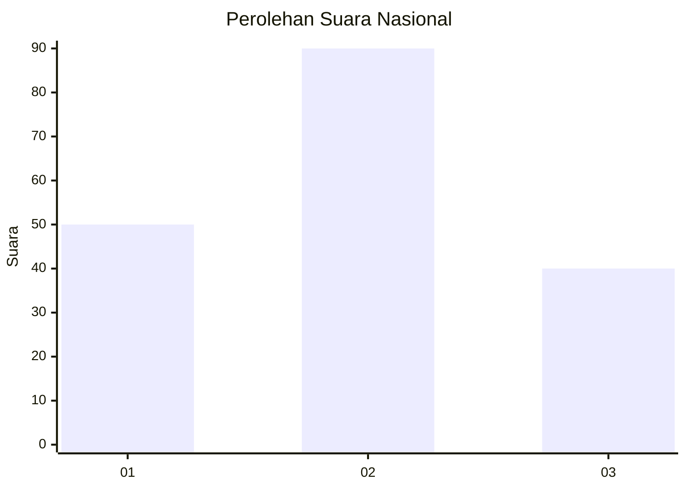
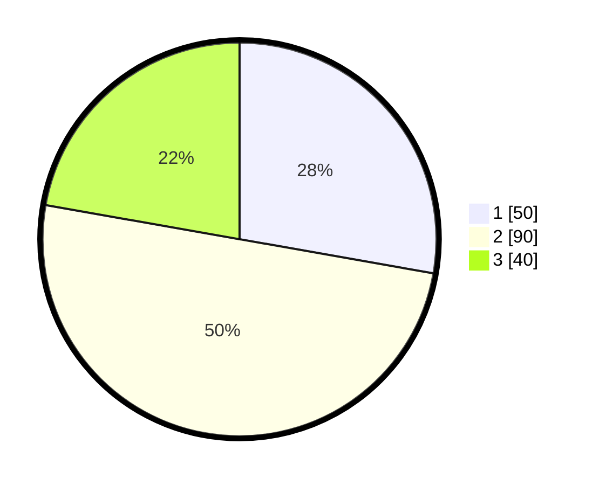

# Hasil

## Grafik

## Tabel

| No. | Nama Paslon    | Suara | Suara (raw) | Persentase |
|:--- |:-------------- | -----:| -----------:| ----------:|
| 1   | ANIES MUHAIMIN | 50    | [50][p-1]   | 27,78      |
| 2   | PRABOWO GIBRAN | 90    | [90][p-2]   | 50,00      |
| 3   | GANJAR MAHFUD  | 40    | [40][p-3]   | 22,22      |

[p-1]: https://github.com/gigit-pemilu/pemilu-2024/blob/main/pilpres/hitung-suara/sub/51-bali/sub/71-kota-denpasar/sub/03-denpasar-barat/sub/2009-tegal-kertha/sub/008-tps/sub/paslon-1.txt
[p-2]: https://github.com/gigit-pemilu/pemilu-2024/blob/main/pilpres/hitung-suara/sub/51-bali/sub/71-kota-denpasar/sub/03-denpasar-barat/sub/2009-tegal-kertha/sub/008-tps/sub/paslon-2.txt
[p-3]: https://github.com/gigit-pemilu/pemilu-2024/blob/main/pilpres/hitung-suara/sub/51-bali/sub/71-kota-denpasar/sub/03-denpasar-barat/sub/2009-tegal-kertha/sub/008-tps/sub/paslon-3.txt

## Foto C Plano

https://sirekap-obj-formc.kpu.go.id/5991/pemilu/ppwp/51/71/03/20/09/5171032009008-20240215-195401--c9b53e90-3820-43e1-9e9b-63b53c38033b.jpg

https://sirekap-obj-formc.kpu.go.id/5991/pemilu/ppwp/51/71/03/20/09/5171032009008-20240214-230053--0989f6e3-3083-41b4-919a-77047142df2c.jpg

https://sirekap-obj-formc.kpu.go.id/5991/pemilu/ppwp/51/71/03/20/09/5171032009008-20240214-230107--ca66bc50-8973-4c4f-b29d-64a2927dc23e.jpg

## Metadata

| Key        | Value               |
| ---------- | ------------------- |
| Time Stamp | 2024-02-19 18:00:00 |

