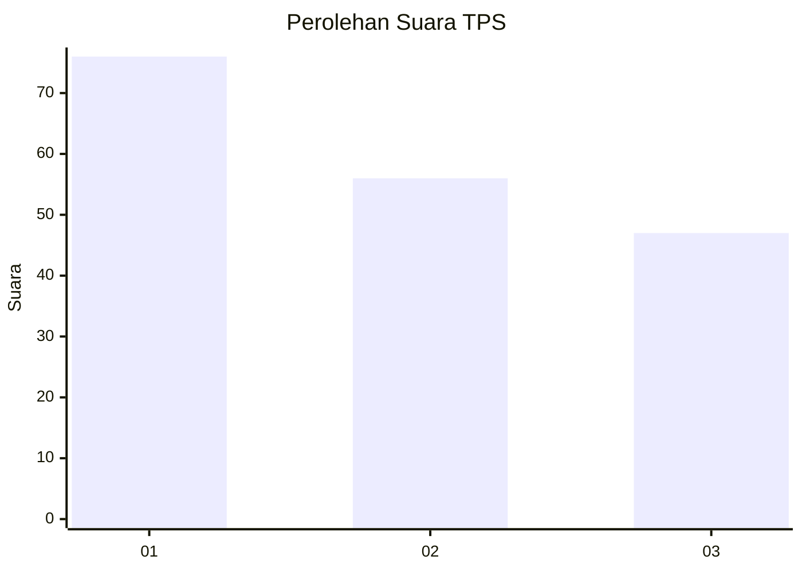
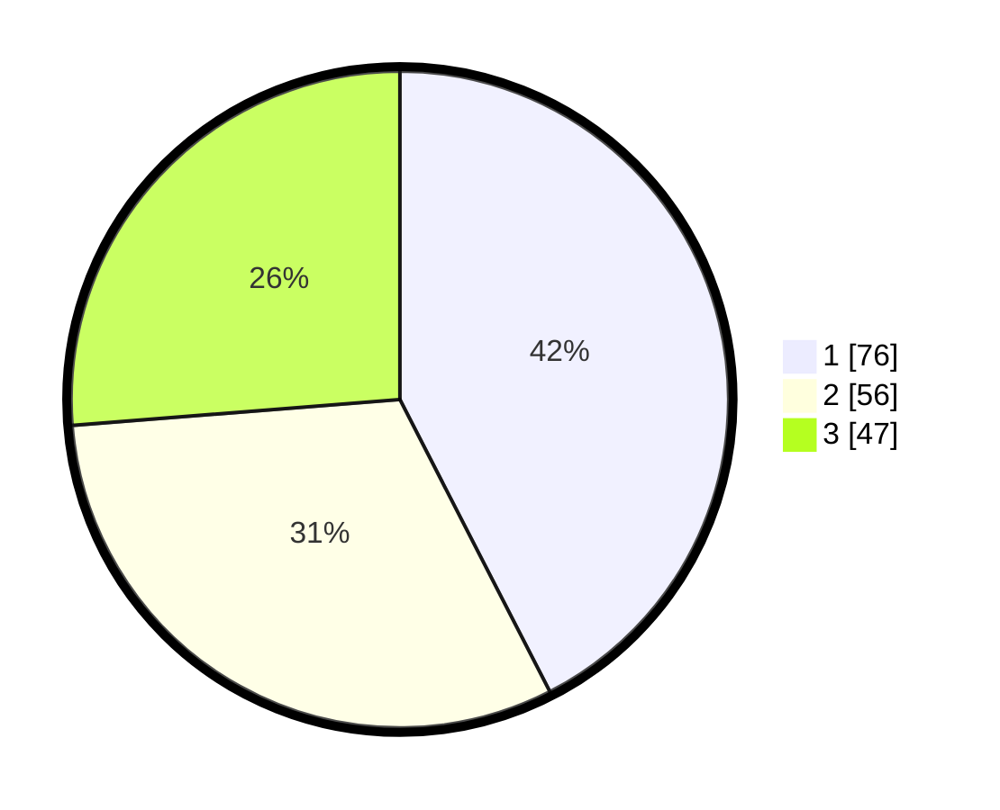

# Hasil

## Grafik

## Tabel

| No. | Nama Paslon    | Suara | Suara (raw) | Persentase |
|:--- |:-------------- | -----:| -----------:| ----------:|
| 1   | ANIES MUHAIMIN | 76    | [76][p-1]   | 42,46      |
| 2   | PRABOWO GIBRAN | 56    | [56][p-2]   | 31,28      |
| 3   | GANJAR MAHFUD  | 47    | [47][p-3]   | 26,26      |

[p-1]: https://github.com/gigit-pemilu/pemilu-2024-51-bali/blob/main/pilpres/hitung-suara/sub/51-bali/sub/71-kota-denpasar/sub/03-denpasar-barat/sub/2009-tegal-kertha/sub/010-tps/sub/paslon-1.txt
[p-2]: https://github.com/gigit-pemilu/pemilu-2024-51-bali/blob/main/pilpres/hitung-suara/sub/51-bali/sub/71-kota-denpasar/sub/03-denpasar-barat/sub/2009-tegal-kertha/sub/010-tps/sub/paslon-2.txt
[p-3]: https://github.com/gigit-pemilu/pemilu-2024-51-bali/blob/main/pilpres/hitung-suara/sub/51-bali/sub/71-kota-denpasar/sub/03-denpasar-barat/sub/2009-tegal-kertha/sub/010-tps/sub/paslon-3.txt

## Foto C Plano

https://sirekap-obj-formc.kpu.go.id/a9bc/pemilu/ppwp/51/71/03/20/09/5171032009010-20240214-223114--f3307ee8-048b-4adf-b6ad-ee557d63322f.jpg

https://sirekap-obj-formc.kpu.go.id/a9bc/pemilu/ppwp/51/71/03/20/09/5171032009010-20240214-223137--1eacbe02-0ffb-4026-9a44-8ee88cd34990.jpg

https://sirekap-obj-formc.kpu.go.id/a9bc/pemilu/ppwp/51/71/03/20/09/5171032009010-20240214-223153--5d890380-4644-4496-9bc6-f3b1e2fea2ee.jpg

## Metadata

| Key        | Value               |
| ---------- | ------------------- |
| Time Stamp | 2024-02-24 22:31:28 |

