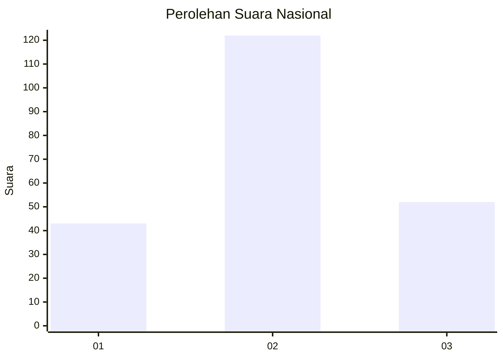
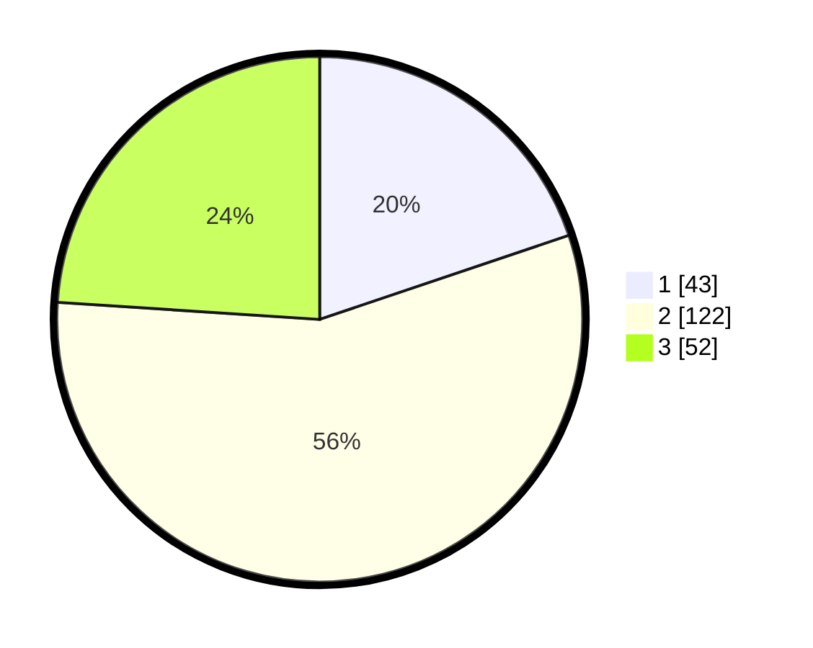

# Hasil

## Grafik

## Tabel

| No. | Nama Paslon    | Suara | Suara (raw) | Persentase |
|:--- |:-------------- | -----:| -----------:| ----------:|
| 1   | ANIES MUHAIMIN | 43    | [43][p-1]   | 19,82      |
| 2   | PRABOWO GIBRAN | 122   | [122][p-2]  | 56,22      |
| 3   | GANJAR MAHFUD  | 52    | [52][p-3]   | 23,96      |

[p-1]: https://github.com/gigit-pemilu/pemilu-2024/blob/main/pilpres/hitung-suara/sub/51-bali/sub/71-kota-denpasar/sub/03-denpasar-barat/sub/2009-tegal-kertha/sub/011-tps/sub/paslon-1.txt
[p-2]: https://github.com/gigit-pemilu/pemilu-2024/blob/main/pilpres/hitung-suara/sub/51-bali/sub/71-kota-denpasar/sub/03-denpasar-barat/sub/2009-tegal-kertha/sub/011-tps/sub/paslon-2.txt
[p-3]: https://github.com/gigit-pemilu/pemilu-2024/blob/main/pilpres/hitung-suara/sub/51-bali/sub/71-kota-denpasar/sub/03-denpasar-barat/sub/2009-tegal-kertha/sub/011-tps/sub/paslon-3.txt

## Foto C Plano

https://sirekap-obj-formc.kpu.go.id/5d24/pemilu/ppwp/51/71/03/20/09/5171032009011-20240215-060859--ed41fbd0-aec3-48b9-9b1e-969237590762.jpg

https://sirekap-obj-formc.kpu.go.id/5d24/pemilu/ppwp/51/71/03/20/09/5171032009011-20240215-060948--4a8fa157-aa12-42af-b81c-649fda571ac4.jpg

https://sirekap-obj-formc.kpu.go.id/5d24/pemilu/ppwp/51/71/03/20/09/5171032009011-20240215-061040--36a671d5-9ac0-4a2b-81ae-38152994a9f1.jpg

## Metadata

| Key        | Value               |
| ---------- | ------------------- |
| Time Stamp | 2024-02-25 13:00:00 |

