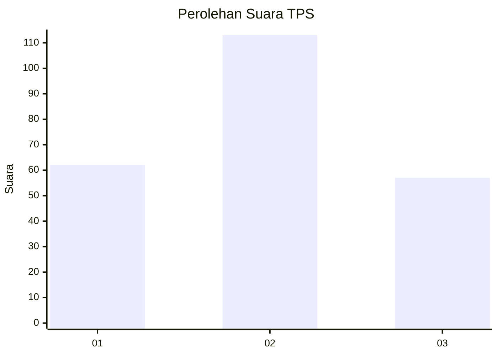
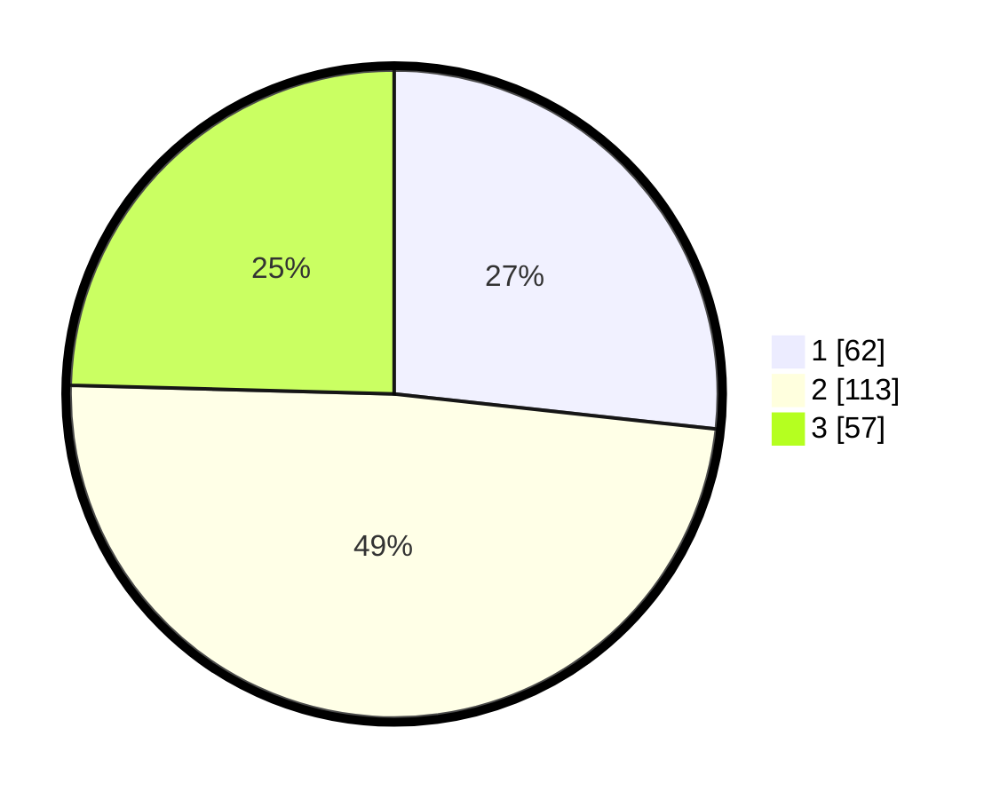

# Hasil

## Grafik

## Tabel

| No. | Nama Paslon    | Suara | Suara (raw) | Persentase |
|:--- |:-------------- | -----:| -----------:| ----------:|
| 1   | ANIES MUHAIMIN | 62    | [62][p-1]   | 26,72      |
| 2   | PRABOWO GIBRAN | 113   | [113][p-2]  | 48,71      |
| 3   | GANJAR MAHFUD  | 57    | [57][p-3]   | 24,57      |

[p-1]: https://github.com/gigit-pemilu/pemilu-2024-51-bali/blob/main/pilpres/hitung-suara/sub/51-bali/sub/71-kota-denpasar/sub/03-denpasar-barat/sub/2009-tegal-kertha/sub/012-tps/sub/paslon-1.txt
[p-2]: https://github.com/gigit-pemilu/pemilu-2024-51-bali/blob/main/pilpres/hitung-suara/sub/51-bali/sub/71-kota-denpasar/sub/03-denpasar-barat/sub/2009-tegal-kertha/sub/012-tps/sub/paslon-2.txt
[p-3]: https://github.com/gigit-pemilu/pemilu-2024-51-bali/blob/main/pilpres/hitung-suara/sub/51-bali/sub/71-kota-denpasar/sub/03-denpasar-barat/sub/2009-tegal-kertha/sub/012-tps/sub/paslon-3.txt

## Foto C Plano

https://sirekap-obj-formc.kpu.go.id/866e/pemilu/ppwp/51/71/03/20/09/5171032009012-20240214-210606--4f1cbbff-76a5-4c94-a669-d35a29044126.jpg

https://sirekap-obj-formc.kpu.go.id/866e/pemilu/ppwp/51/71/03/20/09/5171032009012-20240214-220255--37bc4941-102a-44c1-a3dd-6714bb2883e9.jpg

https://sirekap-obj-formc.kpu.go.id/866e/pemilu/ppwp/51/71/03/20/09/5171032009012-20240214-210900--e4ea9b10-54a0-4463-9323-8accb786d717.jpg

## Metadata

| Key        | Value               |
| ---------- | ------------------- |
| Time Stamp | 2024-02-25 12:00:00 |

