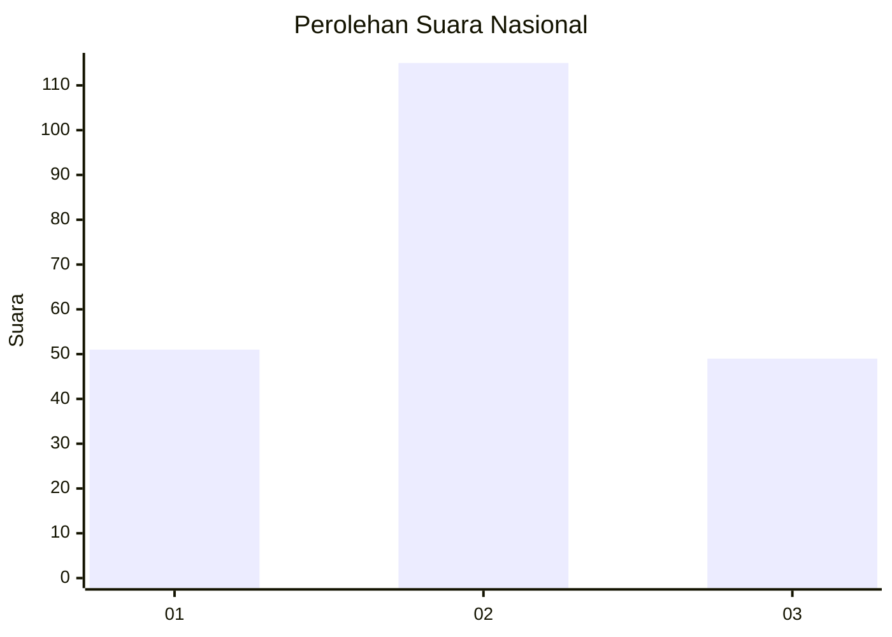
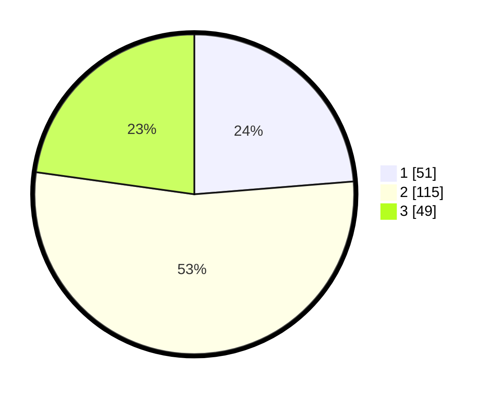

# Hasil

## Grafik

## Tabel

| No. | Nama Paslon    | Suara | Suara (raw) | Persentase |
|:--- |:-------------- | -----:| -----------:| ----------:|
| 1   | ANIES MUHAIMIN | 51    | [51][p-1]   | 23,72      |
| 2   | PRABOWO GIBRAN | 115   | [115][p-2]  | 53,49      |
| 3   | GANJAR MAHFUD  | 49    | [49][p-3]   | 22,79      |

[p-1]: https://github.com/gigit-pemilu/pemilu-2024/blob/main/pilpres/hitung-suara/sub/51-bali/sub/71-kota-denpasar/sub/03-denpasar-barat/sub/2009-tegal-kertha/sub/013-tps/sub/paslon-1.txt
[p-2]: https://github.com/gigit-pemilu/pemilu-2024/blob/main/pilpres/hitung-suara/sub/51-bali/sub/71-kota-denpasar/sub/03-denpasar-barat/sub/2009-tegal-kertha/sub/013-tps/sub/paslon-2.txt
[p-3]: https://github.com/gigit-pemilu/pemilu-2024/blob/main/pilpres/hitung-suara/sub/51-bali/sub/71-kota-denpasar/sub/03-denpasar-barat/sub/2009-tegal-kertha/sub/013-tps/sub/paslon-3.txt

## Foto C Plano

https://sirekap-obj-formc.kpu.go.id/ab02/pemilu/ppwp/51/71/03/20/09/5171032009013-20240214-213802--4aced102-68de-4a33-a698-378f54fe4598.jpg

https://sirekap-obj-formc.kpu.go.id/ab02/pemilu/ppwp/51/71/03/20/09/5171032009013-20240214-213912--4da1745e-beac-44b1-82a4-31c9b638105c.jpg

https://sirekap-obj-formc.kpu.go.id/ab02/pemilu/ppwp/51/71/03/20/09/5171032009013-20240214-214012--f1b155df-3565-4b4e-9120-e39349daecaa.jpg

## Metadata

| Key        | Value               |
| ---------- | ------------------- |
| Time Stamp | 2024-02-24 22:31:28 |

