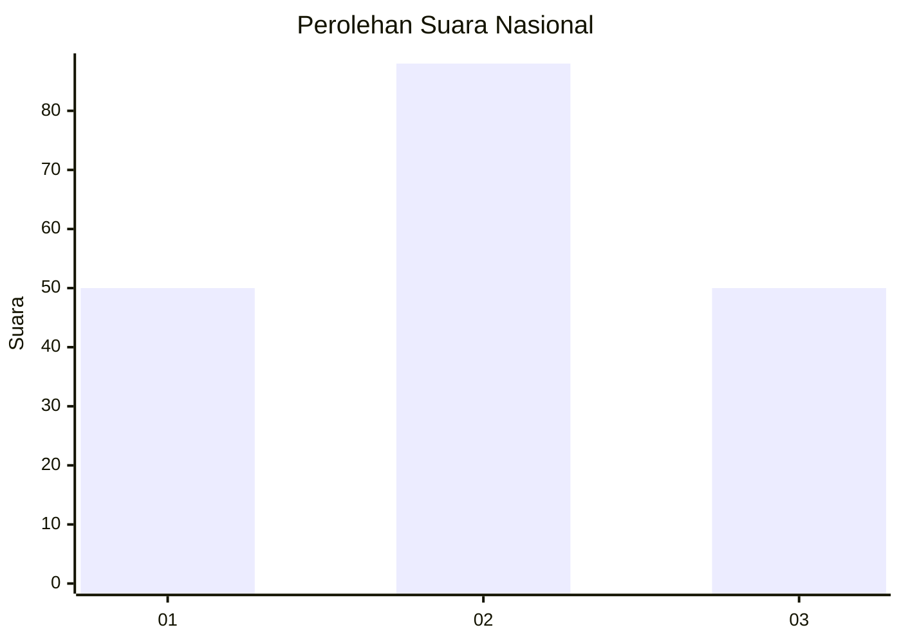
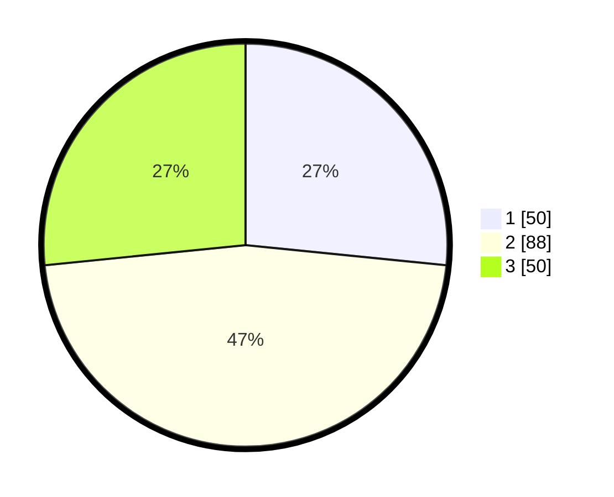

# Hasil

## Grafik

## Tabel

| No. | Nama Paslon    | Suara | Suara (raw) | Persentase |
|:--- |:-------------- | -----:| -----------:| ----------:|
| 1   | ANIES MUHAIMIN | 50    | [50][p-1]   | 26,60      |
| 2   | PRABOWO GIBRAN | 88    | [88][p-2]   | 46,81      |
| 3   | GANJAR MAHFUD  | 50    | [50][p-3]   | 26,60      |

[p-1]: https://github.com/gigit-pemilu/pemilu-2024/blob/main/pilpres/hitung-suara/sub/51-bali/sub/71-kota-denpasar/sub/03-denpasar-barat/sub/2009-tegal-kertha/sub/016-tps/sub/paslon-1.txt
[p-2]: https://github.com/gigit-pemilu/pemilu-2024/blob/main/pilpres/hitung-suara/sub/51-bali/sub/71-kota-denpasar/sub/03-denpasar-barat/sub/2009-tegal-kertha/sub/016-tps/sub/paslon-2.txt
[p-3]: https://github.com/gigit-pemilu/pemilu-2024/blob/main/pilpres/hitung-suara/sub/51-bali/sub/71-kota-denpasar/sub/03-denpasar-barat/sub/2009-tegal-kertha/sub/016-tps/sub/paslon-3.txt

## Foto C Plano

https://sirekap-obj-formc.kpu.go.id/7107/pemilu/ppwp/51/71/03/20/09/5171032009016-20240214-231318--0c8fb511-d70a-457a-967b-0183e2f5ea06.jpg

https://sirekap-obj-formc.kpu.go.id/7107/pemilu/ppwp/51/71/03/20/09/5171032009016-20240214-231442--d8aabf24-25ef-47d1-bbb6-72340e67e121.jpg

https://sirekap-obj-formc.kpu.go.id/7107/pemilu/ppwp/51/71/03/20/09/5171032009016-20240214-231547--7a73140a-ccfe-46f2-a69b-99ba79598a3c.jpg

## Metadata

| Key        | Value               |
| ---------- | ------------------- |
| Time Stamp | 2024-02-24 22:31:28 |

