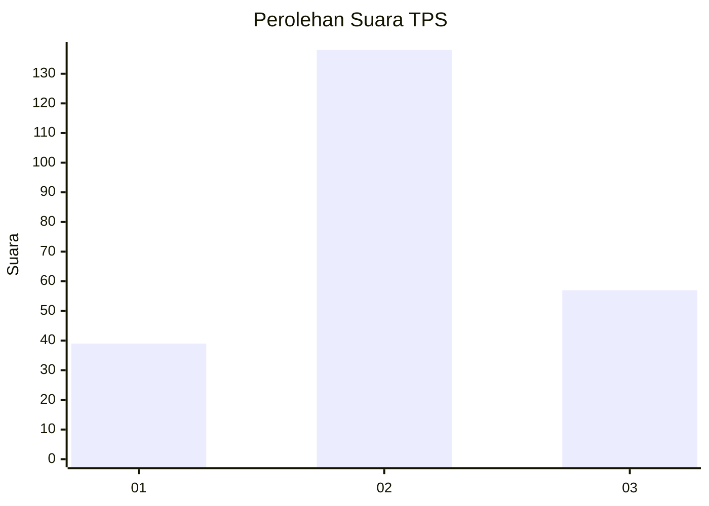
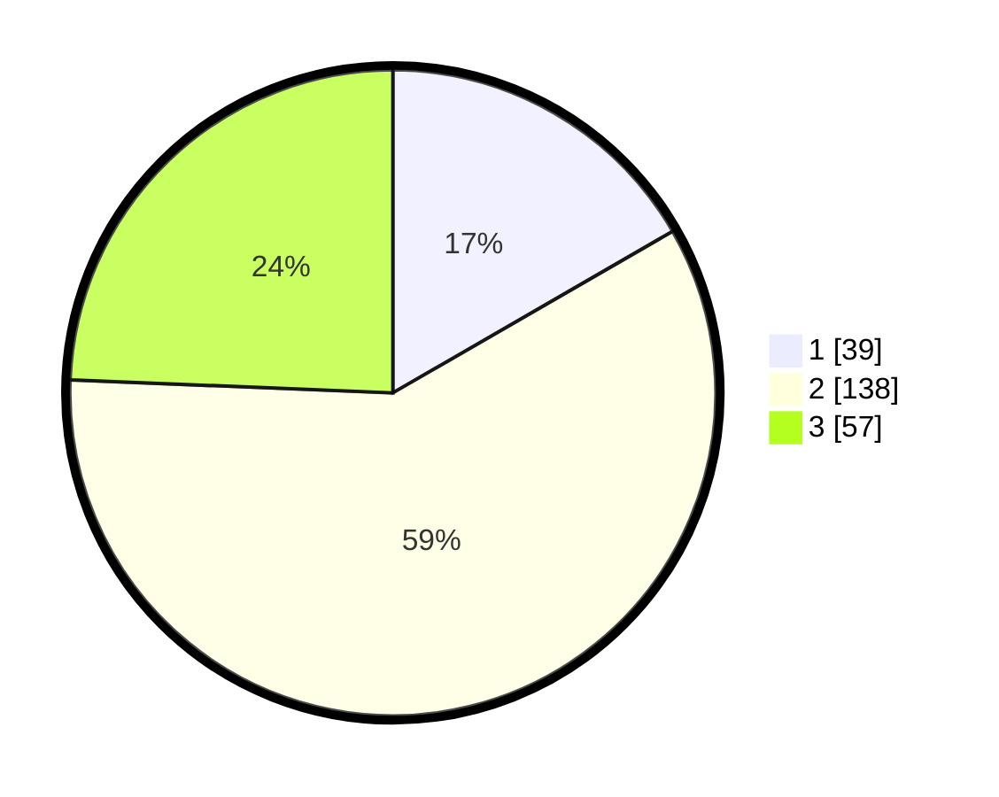

# Hasil

## Grafik

## Tabel

| No. | Nama Paslon    | Suara | Suara (raw) | Persentase |
|:--- |:-------------- | -----:| -----------:| ----------:|
| 1   | ANIES MUHAIMIN | 39    | [39][p-1]   | 16,67      |
| 2   | PRABOWO GIBRAN | 138   | [138][p-2]  | 58,97      |
| 3   | GANJAR MAHFUD  | 57    | [57][p-3]   | 24,36      |

[p-1]: https://github.com/gigit-pemilu/pemilu-2024-51-bali/blob/main/pilpres/hitung-suara/sub/51-bali/sub/71-kota-denpasar/sub/03-denpasar-barat/sub/2009-tegal-kertha/sub/017-tps/sub/paslon-1.txt
[p-2]: https://github.com/gigit-pemilu/pemilu-2024-51-bali/blob/main/pilpres/hitung-suara/sub/51-bali/sub/71-kota-denpasar/sub/03-denpasar-barat/sub/2009-tegal-kertha/sub/017-tps/sub/paslon-2.txt
[p-3]: https://github.com/gigit-pemilu/pemilu-2024-51-bali/blob/main/pilpres/hitung-suara/sub/51-bali/sub/71-kota-denpasar/sub/03-denpasar-barat/sub/2009-tegal-kertha/sub/017-tps/sub/paslon-3.txt

## Foto C Plano

https://sirekap-obj-formc.kpu.go.id/9aa3/pemilu/ppwp/51/71/03/20/09/5171032009017-20240214-141116--50e08033-83eb-4b10-b7b3-ba9b19c9a846.jpg

https://sirekap-obj-formc.kpu.go.id/9aa3/pemilu/ppwp/51/71/03/20/09/5171032009017-20240214-141309--bf6b5ef7-11af-4dff-974e-7a76f56ce892.jpg

https://sirekap-obj-formc.kpu.go.id/9aa3/pemilu/ppwp/51/71/03/20/09/5171032009017-20240214-141449--78584da9-2ce3-49b7-a8ef-3763e37df2a1.jpg

## Metadata

| Key        | Value               |
| ---------- | ------------------- |
| Time Stamp | 2024-02-16 23:45:47 |

## DATA PEMILIH TETAP

Jumlah pemilih dalam DPT: **268**.
 * L: **133**.
 * P: **137**.

## DATA PENGGUNA HAK PILIH

Jumlah pengguna hak pilih dalam DPT: **222**.
 * L: **106**.
 * P: **116**.

Jumlah pengguna hak pilih dalam DPTb: **0**.
 * L: **0**.
 * P: **0**.

Jumlah pengguna hak pilih dalam DPK: **14**.
 * L: **10**.
 * P: **4**.

Jumlah pengguna hak pilih: **236**.
 * L: **116**.
 * P: **120**.

## JUMLAH SUARA SAH DAN TIDAK SAH

JUMLAH SELURUH SUARA SAH: **234**.

JUMLAH SUARA TIDAK SAH: **2**.

JUMLAH SELURUH SUARA SAH DAN SUARA TIDAK SAH: **236**.

