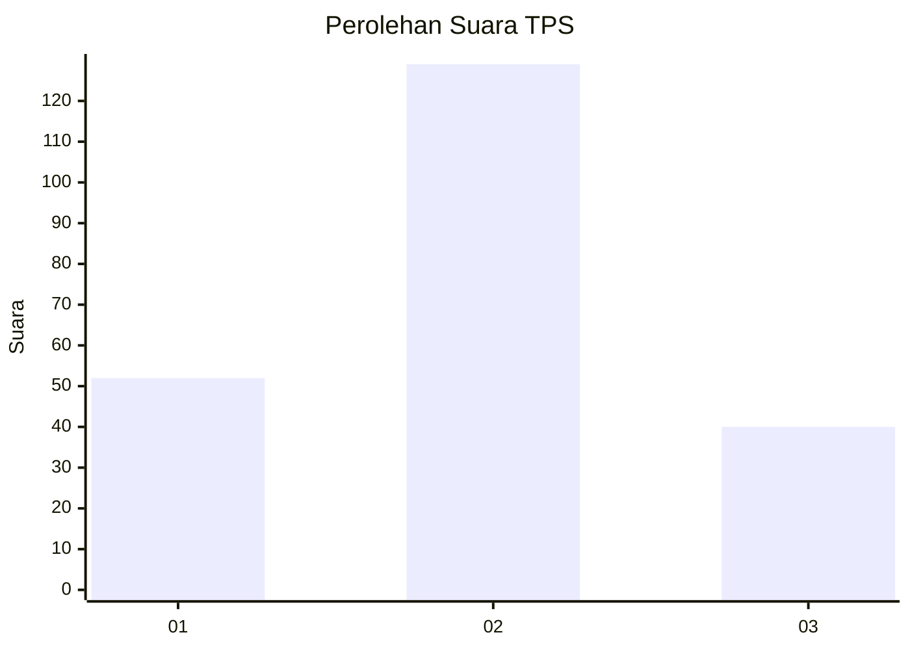
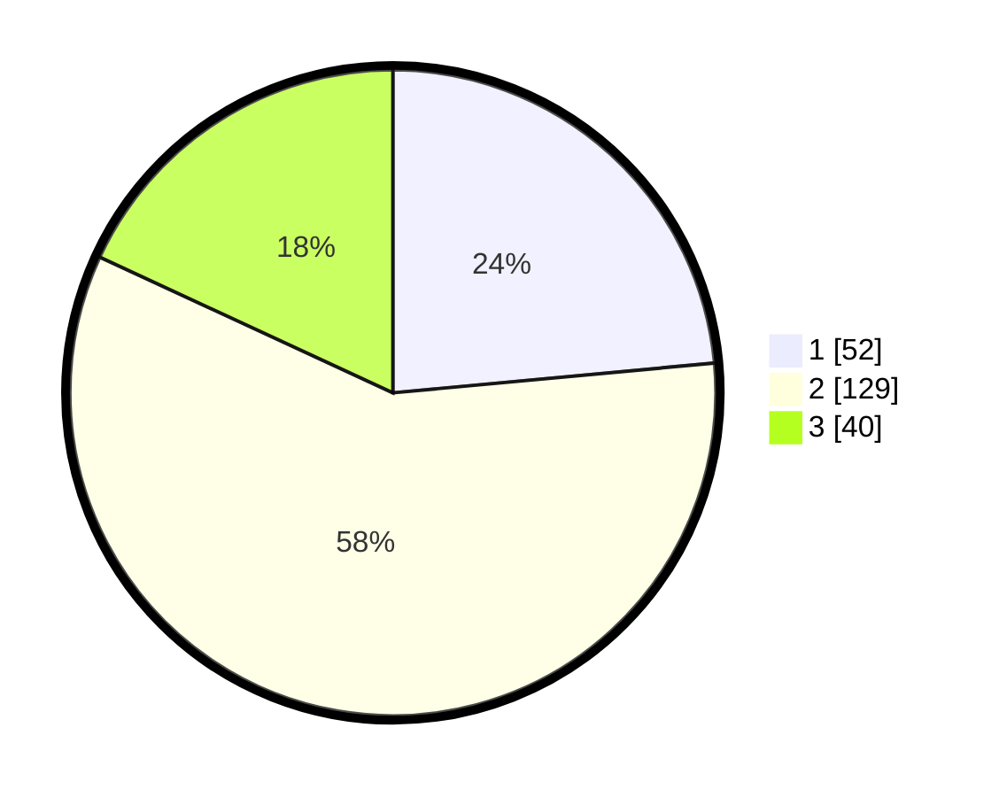

# Hasil

## Grafik

## Tabel

| No. | Nama Paslon    | Suara | Suara (raw) | Persentase |
|:--- |:-------------- | -----:| -----------:| ----------:|
| 1   | ANIES MUHAIMIN | 52    | [52][p-1]   | 23,53      |
| 2   | PRABOWO GIBRAN | 129   | [129][p-2]  | 58,37      |
| 3   | GANJAR MAHFUD  | 40    | [40][p-3]   | 18,10      |

[p-1]: https://github.com/gigit-pemilu/pemilu-2024-51-bali/blob/main/pilpres/hitung-suara/sub/51-bali/sub/71-kota-denpasar/sub/03-denpasar-barat/sub/2009-tegal-kertha/sub/018-tps/sub/paslon-1.txt
[p-2]: https://github.com/gigit-pemilu/pemilu-2024-51-bali/blob/main/pilpres/hitung-suara/sub/51-bali/sub/71-kota-denpasar/sub/03-denpasar-barat/sub/2009-tegal-kertha/sub/018-tps/sub/paslon-2.txt
[p-3]: https://github.com/gigit-pemilu/pemilu-2024-51-bali/blob/main/pilpres/hitung-suara/sub/51-bali/sub/71-kota-denpasar/sub/03-denpasar-barat/sub/2009-tegal-kertha/sub/018-tps/sub/paslon-3.txt

## Foto C Plano

https://sirekap-obj-formc.kpu.go.id/50a8/pemilu/ppwp/51/71/03/20/09/5171032009018-20240214-141146--a470b926-cb83-49bb-a727-36c3069965e1.jpg

https://sirekap-obj-formc.kpu.go.id/50a8/pemilu/ppwp/51/71/03/20/09/5171032009018-20240214-203645--fb999c8d-5014-45bf-8642-b0230bc64974.jpg

https://sirekap-obj-formc.kpu.go.id/50a8/pemilu/ppwp/51/71/03/20/09/5171032009018-20240214-141352--cd92c7be-163c-4bdf-a8f6-3ded7e468476.jpg

## Metadata

| Key        | Value               |
| ---------- | ------------------- |
| Time Stamp | 2024-02-15 00:41:44 |

