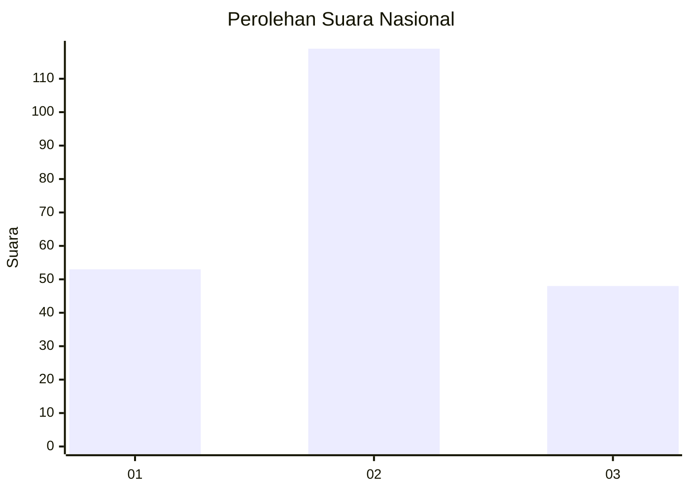
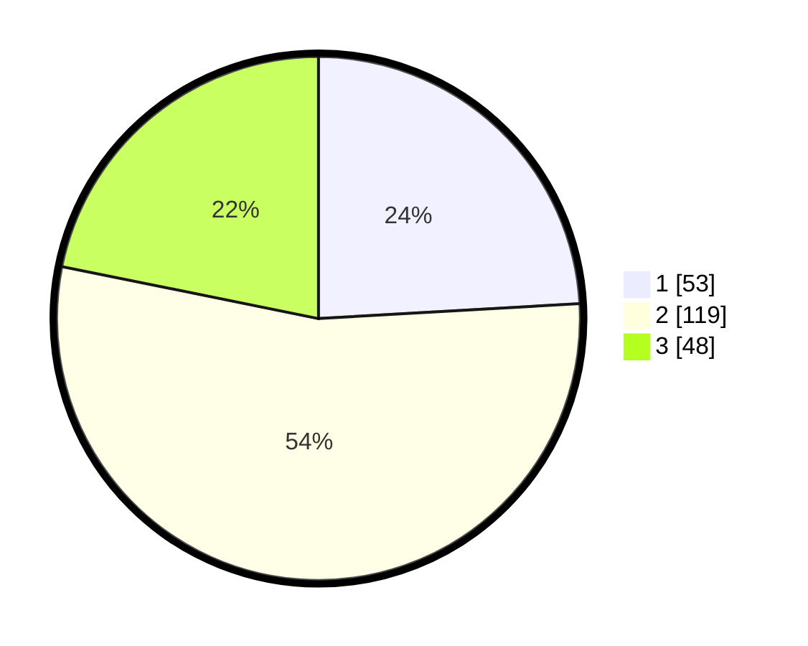

# Hasil

## Grafik

## Tabel

| No. | Nama Paslon    | Suara | Suara (raw) | Persentase |
|:--- |:-------------- | -----:| -----------:| ----------:|
| 1   | ANIES MUHAIMIN | 53    | [53][p-1]   | 24,09      |
| 2   | PRABOWO GIBRAN | 119   | [119][p-2]  | 54,09      |
| 3   | GANJAR MAHFUD  | 48    | [48][p-3]   | 21,82      |

[p-1]: https://github.com/gigit-pemilu/pemilu-2024/blob/main/pilpres/hitung-suara/sub/51-bali/sub/71-kota-denpasar/sub/03-denpasar-barat/sub/2009-tegal-kertha/sub/019-tps/sub/paslon-1.txt
[p-2]: https://github.com/gigit-pemilu/pemilu-2024/blob/main/pilpres/hitung-suara/sub/51-bali/sub/71-kota-denpasar/sub/03-denpasar-barat/sub/2009-tegal-kertha/sub/019-tps/sub/paslon-2.txt
[p-3]: https://github.com/gigit-pemilu/pemilu-2024/blob/main/pilpres/hitung-suara/sub/51-bali/sub/71-kota-denpasar/sub/03-denpasar-barat/sub/2009-tegal-kertha/sub/019-tps/sub/paslon-3.txt

## Foto C Plano

https://sirekap-obj-formc.kpu.go.id/7851/pemilu/ppwp/51/71/03/20/09/5171032009019-20240214-141728--6bcbefff-fcd5-4c5c-8ec8-0fc8a041aa90.jpg

https://sirekap-obj-formc.kpu.go.id/7851/pemilu/ppwp/51/71/03/20/09/5171032009019-20240214-141940--fb616716-a475-4ef9-b371-3433180003a7.jpg

https://sirekap-obj-formc.kpu.go.id/7851/pemilu/ppwp/51/71/03/20/09/5171032009019-20240214-141554--df650ce8-36e0-469e-b30e-7e750ae3abf5.jpg

## Metadata

| Key        | Value               |
| ---------- | ------------------- |
| Time Stamp | 2024-02-24 22:31:28 |

