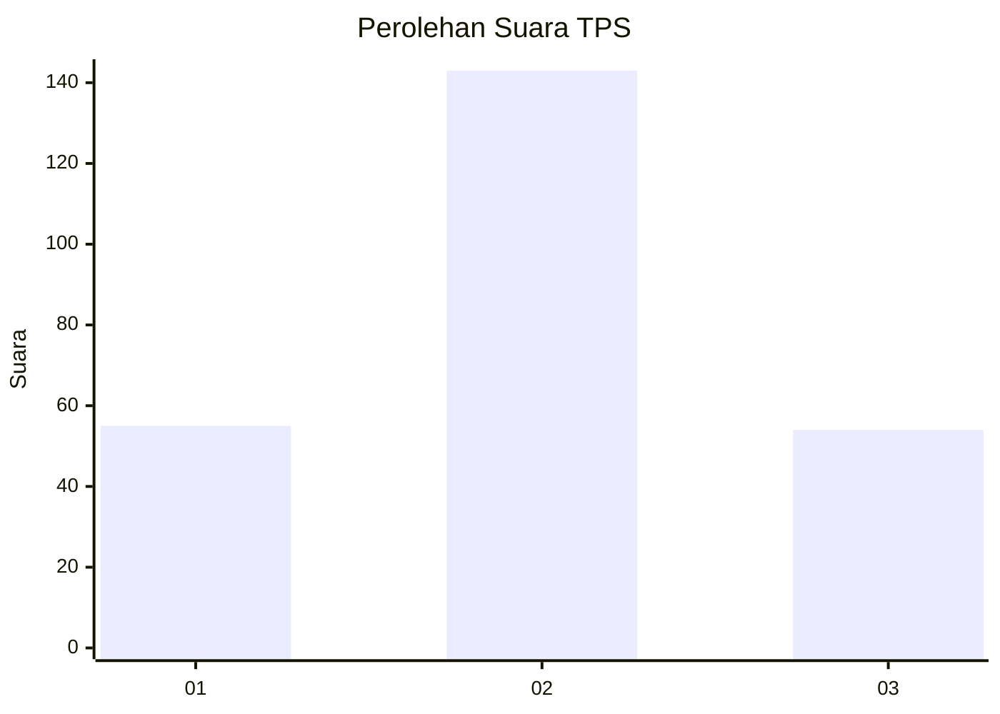
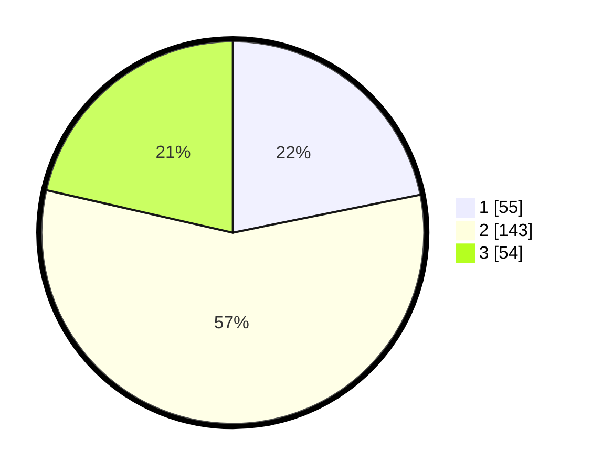

# Hasil

## Grafik

## Tabel

| No. | Nama Paslon    | Suara | Suara (raw) | Persentase |
|:--- |:-------------- | -----:| -----------:| ----------:|
| 1   | ANIES MUHAIMIN | 55    | [55][p-1]   | 21,83      |
| 2   | PRABOWO GIBRAN | 143   | [143][p-2]  | 56,75      |
| 3   | GANJAR MAHFUD  | 54    | [54][p-3]   | 21,43      |

[p-1]: https://github.com/gigit-pemilu/pemilu-2024-51-bali/blob/main/pilpres/hitung-suara/sub/51-bali/sub/71-kota-denpasar/sub/03-denpasar-barat/sub/2009-tegal-kertha/sub/020-tps/sub/paslon-1.txt
[p-2]: https://github.com/gigit-pemilu/pemilu-2024-51-bali/blob/main/pilpres/hitung-suara/sub/51-bali/sub/71-kota-denpasar/sub/03-denpasar-barat/sub/2009-tegal-kertha/sub/020-tps/sub/paslon-2.txt
[p-3]: https://github.com/gigit-pemilu/pemilu-2024-51-bali/blob/main/pilpres/hitung-suara/sub/51-bali/sub/71-kota-denpasar/sub/03-denpasar-barat/sub/2009-tegal-kertha/sub/020-tps/sub/paslon-3.txt

## Foto C Plano

https://sirekap-obj-formc.kpu.go.id/b96c/pemilu/ppwp/51/71/03/20/09/5171032009020-20240215-014013--5772714f-f107-4bdf-b162-d7ce5b9e0db0.jpg

https://sirekap-obj-formc.kpu.go.id/b96c/pemilu/ppwp/51/71/03/20/09/5171032009020-20240215-014115--e2f7f79f-e183-41b1-845a-2ba9f0d539cc.jpg

https://sirekap-obj-formc.kpu.go.id/b96c/pemilu/ppwp/51/71/03/20/09/5171032009020-20240215-014201--34e928cf-3a16-4a5c-9303-08100c3870db.jpg

## Metadata

| Key        | Value               |
| ---------- | ------------------- |
| Time Stamp | 2024-02-24 22:31:28 |

