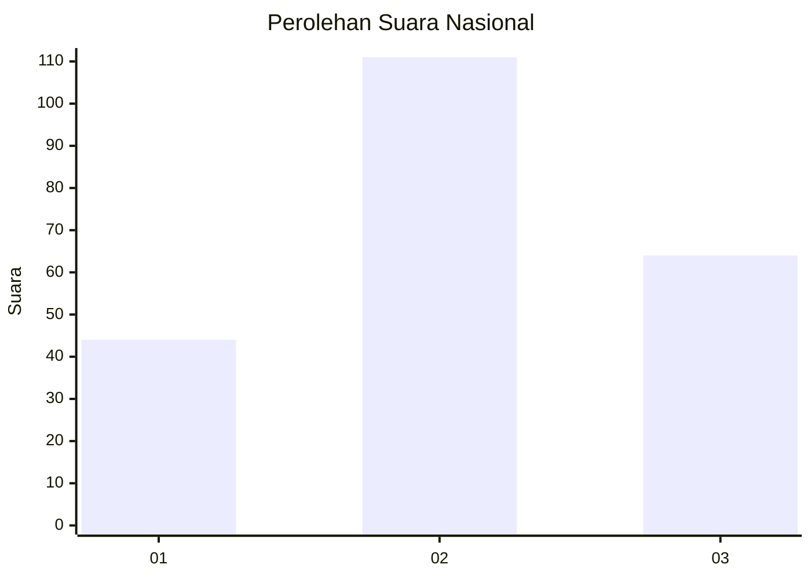
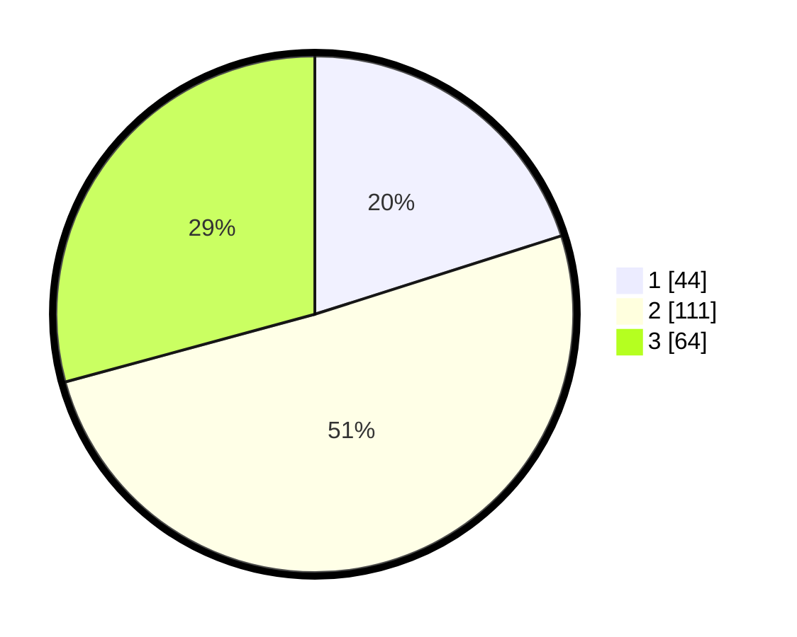

# Hasil

## Grafik

## Tabel

| No. | Nama Paslon    | Suara | Suara (raw) | Persentase |
|:--- |:-------------- | -----:| -----------:| ----------:|
| 1   | ANIES MUHAIMIN | 44    | [44][p-1]   | 20,09      |
| 2   | PRABOWO GIBRAN | 111   | [111][p-2]  | 50,68      |
| 3   | GANJAR MAHFUD  | 64    | [64][p-3]   | 29,22      |

[p-1]: https://github.com/gigit-pemilu/pemilu-2024/blob/main/pilpres/hitung-suara/sub/51-bali/sub/71-kota-denpasar/sub/03-denpasar-barat/sub/2009-tegal-kertha/sub/022-tps/sub/paslon-1.txt
[p-2]: https://github.com/gigit-pemilu/pemilu-2024/blob/main/pilpres/hitung-suara/sub/51-bali/sub/71-kota-denpasar/sub/03-denpasar-barat/sub/2009-tegal-kertha/sub/022-tps/sub/paslon-2.txt
[p-3]: https://github.com/gigit-pemilu/pemilu-2024/blob/main/pilpres/hitung-suara/sub/51-bali/sub/71-kota-denpasar/sub/03-denpasar-barat/sub/2009-tegal-kertha/sub/022-tps/sub/paslon-3.txt

## Foto C Plano

https://sirekap-obj-formc.kpu.go.id/7079/pemilu/ppwp/51/71/03/20/09/5171032009022-20240215-023918--23e02317-e2cc-4245-aae5-0ca3a996fddd.jpg

https://sirekap-obj-formc.kpu.go.id/7079/pemilu/ppwp/51/71/03/20/09/5171032009022-20240215-024022--e35a5102-d200-4d5b-ad2e-c8e06ef1705e.jpg

https://sirekap-obj-formc.kpu.go.id/7079/pemilu/ppwp/51/71/03/20/09/5171032009022-20240215-024114--89b16d40-c0f7-4d10-ae94-b7b8a63823cf.jpg

## Metadata

| Key        | Value               |
| ---------- | ------------------- |
| Time Stamp | 2024-02-24 22:31:28 |

