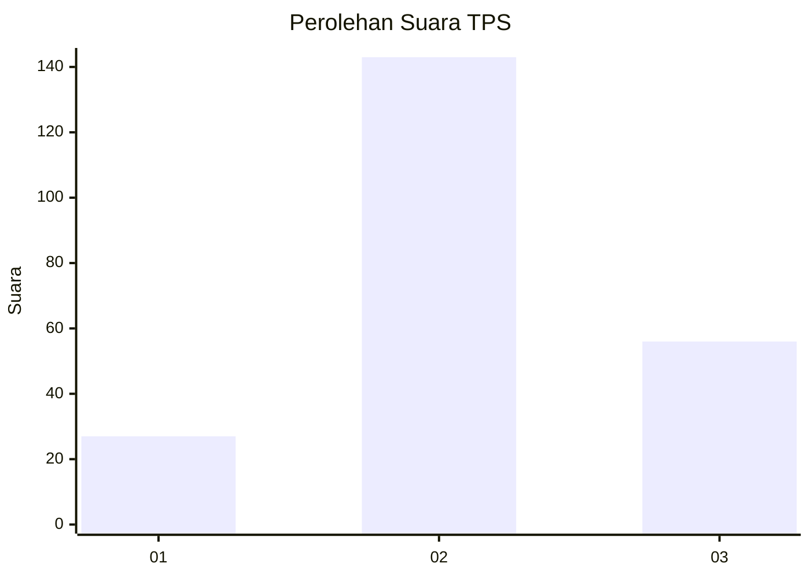
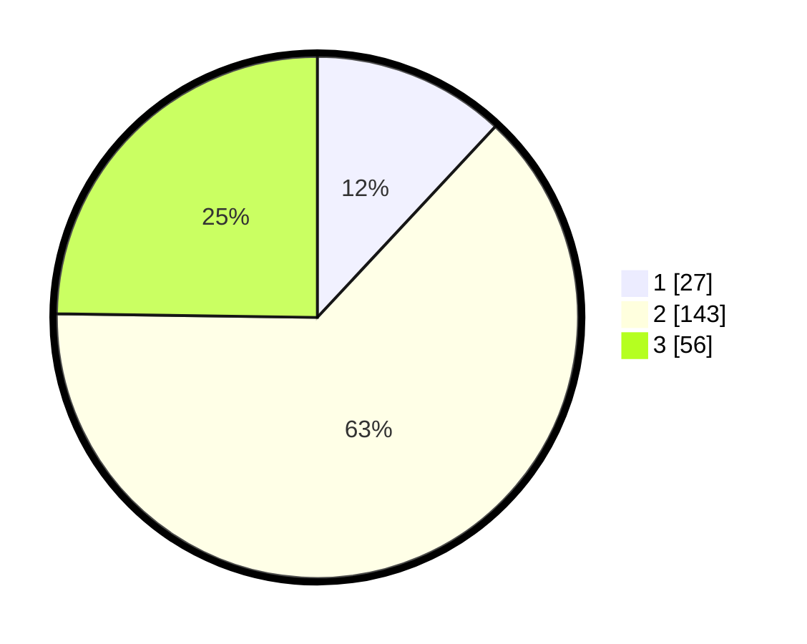

# Hasil

## Grafik

## Tabel

| No. | Nama Paslon    | Suara | Suara (raw) | Persentase |
|:--- |:-------------- | -----:| -----------:| ----------:|
| 1   | ANIES MUHAIMIN | 27    | [27][p-1]   | 11,95      |
| 2   | PRABOWO GIBRAN | 143   | [143][p-2]  | 63,27      |
| 3   | GANJAR MAHFUD  | 56    | [56][p-3]   | 24,78      |

[p-1]: https://github.com/gigit-pemilu/pemilu-2024-51-bali/blob/main/pilpres/hitung-suara/sub/51-bali/sub/71-kota-denpasar/sub/03-denpasar-barat/sub/2009-tegal-kertha/sub/026-tps/sub/paslon-1.txt
[p-2]: https://github.com/gigit-pemilu/pemilu-2024-51-bali/blob/main/pilpres/hitung-suara/sub/51-bali/sub/71-kota-denpasar/sub/03-denpasar-barat/sub/2009-tegal-kertha/sub/026-tps/sub/paslon-2.txt
[p-3]: https://github.com/gigit-pemilu/pemilu-2024-51-bali/blob/main/pilpres/hitung-suara/sub/51-bali/sub/71-kota-denpasar/sub/03-denpasar-barat/sub/2009-tegal-kertha/sub/026-tps/sub/paslon-3.txt

## Foto C Plano

https://sirekap-obj-formc.kpu.go.id/7732/pemilu/ppwp/51/71/03/20/09/5171032009026-20240214-195834--7a5c828d-7612-4221-905f-962258762ce6.jpg

https://sirekap-obj-formc.kpu.go.id/7732/pemilu/ppwp/51/71/03/20/09/5171032009026-20240214-195105--83dcb2e0-05e4-48f0-a83b-7508e62e8f0e.jpg

https://sirekap-obj-formc.kpu.go.id/7732/pemilu/ppwp/51/71/03/20/09/5171032009026-20240214-194931--9d7435ce-37a0-41ec-ac63-965bda6e7fdc.jpg

## Metadata

| Key        | Value               |
| ---------- | ------------------- |
| Time Stamp | 2024-02-24 22:31:28 |

