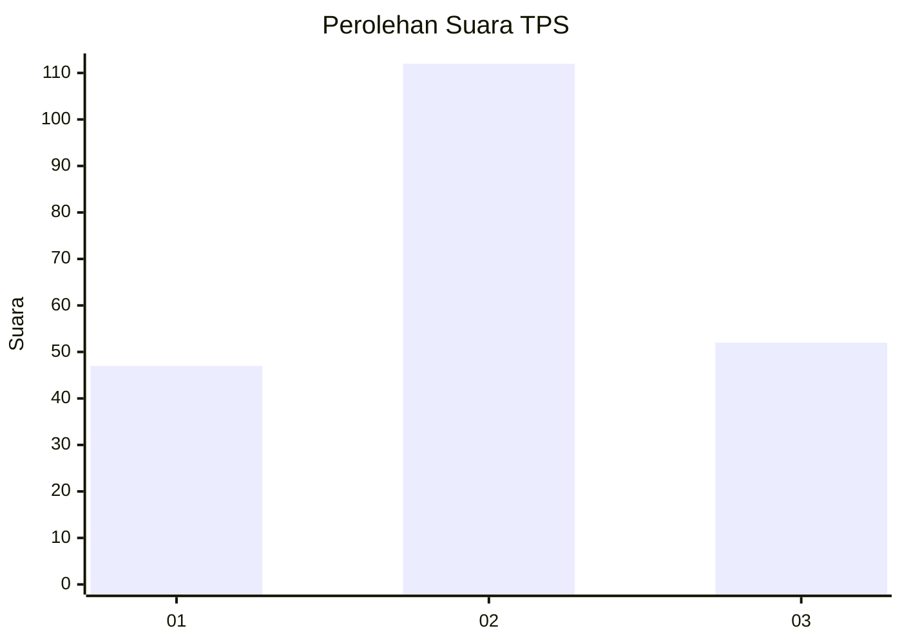
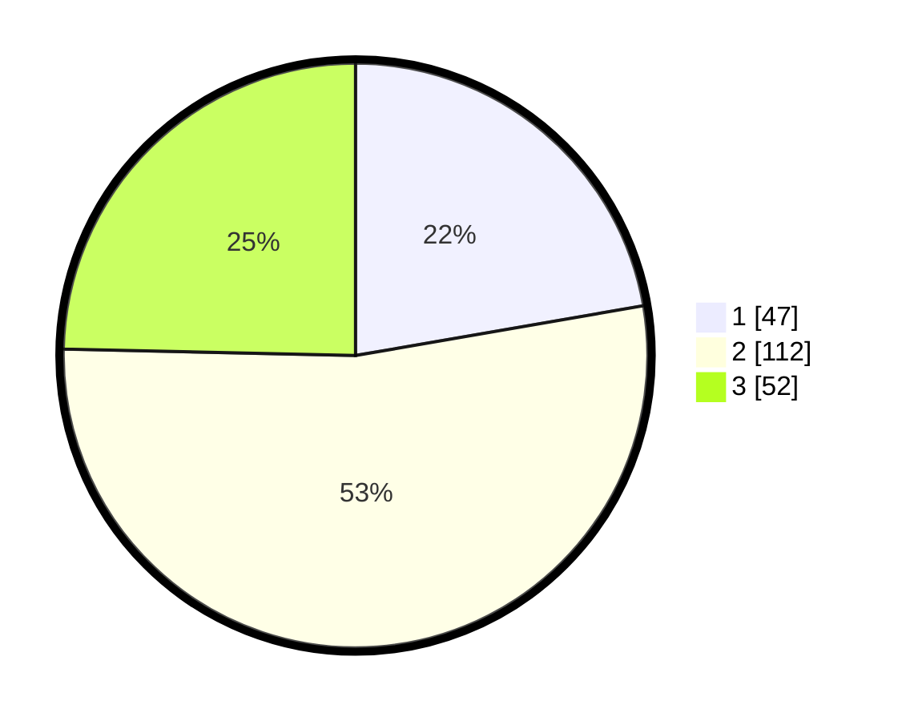

# Hasil

## Grafik

## Tabel

| No. | Nama Paslon    | Suara | Suara (raw) | Persentase |
|:--- |:-------------- | -----:| -----------:| ----------:|
| 1   | ANIES MUHAIMIN | 47    | [47][p-1]   | 22,27      |
| 2   | PRABOWO GIBRAN | 112   | [112][p-2]  | 53,08      |
| 3   | GANJAR MAHFUD  | 52    | [52][p-3]   | 24,64      |

[p-1]: https://github.com/gigit-pemilu/pemilu-2024-51-bali/blob/main/pilpres/hitung-suara/sub/51-bali/sub/71-kota-denpasar/sub/03-denpasar-barat/sub/2009-tegal-kertha/sub/036-tps/sub/paslon-1.txt
[p-2]: https://github.com/gigit-pemilu/pemilu-2024-51-bali/blob/main/pilpres/hitung-suara/sub/51-bali/sub/71-kota-denpasar/sub/03-denpasar-barat/sub/2009-tegal-kertha/sub/036-tps/sub/paslon-2.txt
[p-3]: https://github.com/gigit-pemilu/pemilu-2024-51-bali/blob/main/pilpres/hitung-suara/sub/51-bali/sub/71-kota-denpasar/sub/03-denpasar-barat/sub/2009-tegal-kertha/sub/036-tps/sub/paslon-3.txt

## Foto C Plano

https://sirekap-obj-formc.kpu.go.id/5c00/pemilu/ppwp/51/71/03/20/09/5171032009036-20240214-220120--e96721e5-7663-46af-b886-4557a3eb70f8.jpg

https://sirekap-obj-formc.kpu.go.id/5c00/pemilu/ppwp/51/71/03/20/09/5171032009036-20240214-220336--71e9d3b6-1966-4807-8e43-e0e73fa97886.jpg

https://sirekap-obj-formc.kpu.go.id/5c00/pemilu/ppwp/51/71/03/20/09/5171032009036-20240214-220456--0dfc735b-73bf-4b88-b3ae-cc6a56fddd5f.jpg

## Metadata

| Key        | Value               |
| ---------- | ------------------- |
| Time Stamp | 2024-02-24 22:31:28 |

