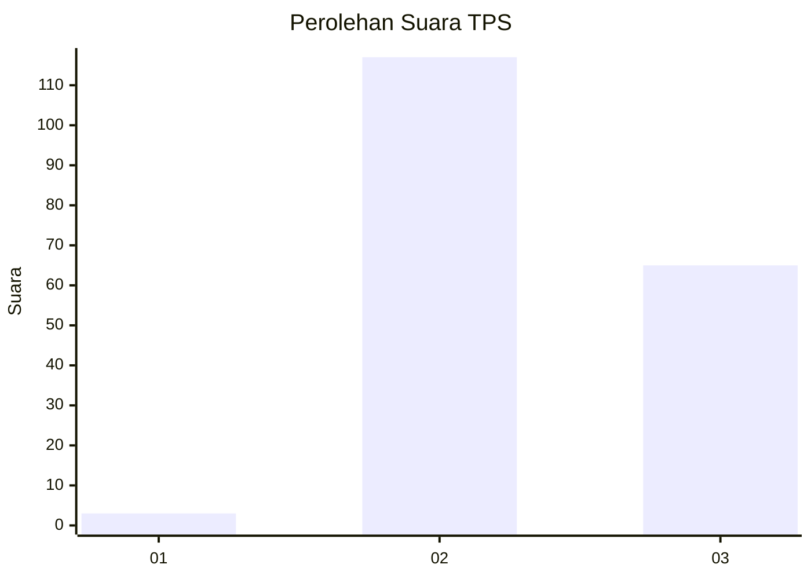
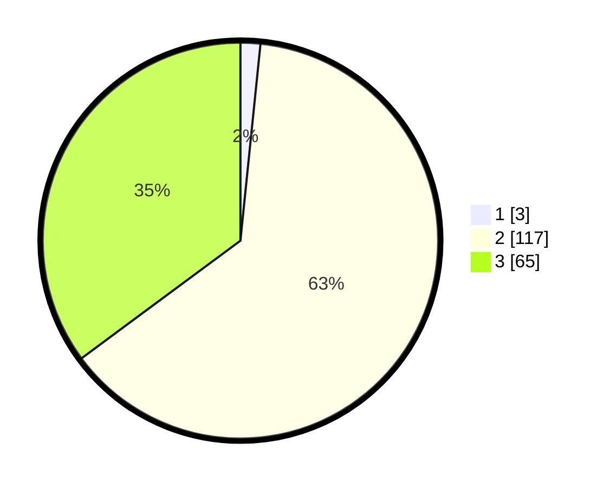

# Hasil

## Grafik

## Tabel

| No. | Nama Paslon    | Suara | Suara (raw) | Persentase |
|:--- |:-------------- | -----:| -----------:| ----------:|
| 1   | ANIES MUHAIMIN | 3     | [3][p-1]    | 1,62       |
| 2   | PRABOWO GIBRAN | 117   | [117][p-2]  | 63,24      |
| 3   | GANJAR MAHFUD  | 65    | [65][p-3]   | 35,14      |

[p-1]: https://github.com/gigit-pemilu/pemilu-2024-51-bali/blob/main/pilpres/hitung-suara/sub/51-bali/sub/71-kota-denpasar/sub/03-denpasar-barat/sub/2009-tegal-kertha/sub/039-tps/sub/paslon-1.txt
[p-2]: https://github.com/gigit-pemilu/pemilu-2024-51-bali/blob/main/pilpres/hitung-suara/sub/51-bali/sub/71-kota-denpasar/sub/03-denpasar-barat/sub/2009-tegal-kertha/sub/039-tps/sub/paslon-2.txt
[p-3]: https://github.com/gigit-pemilu/pemilu-2024-51-bali/blob/main/pilpres/hitung-suara/sub/51-bali/sub/71-kota-denpasar/sub/03-denpasar-barat/sub/2009-tegal-kertha/sub/039-tps/sub/paslon-3.txt

## Foto C Plano

https://sirekap-obj-formc.kpu.go.id/3dba/pemilu/ppwp/51/71/03/20/09/5171032009039-20240214-215357--cda22647-6815-4545-b19c-9ddd300833ba.jpg

https://sirekap-obj-formc.kpu.go.id/3dba/pemilu/ppwp/51/71/03/20/09/5171032009039-20240214-215454--395fec7e-c408-4d8c-986f-0e1c262a7a47.jpg

https://sirekap-obj-formc.kpu.go.id/3dba/pemilu/ppwp/51/71/03/20/09/5171032009039-20240214-215537--c03a7b44-2537-4c5a-b992-c7ecf2e1166a.jpg

## Metadata

| Key        | Value               |
| ---------- | ------------------- |
| Time Stamp | 2024-02-24 22:31:28 |

