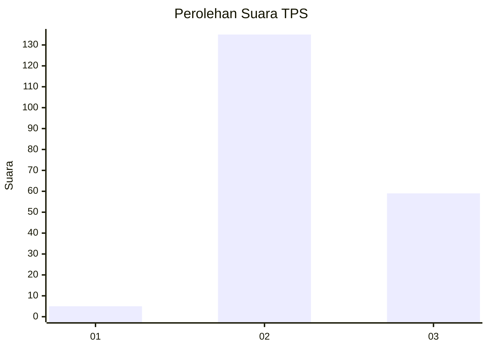

# Hasil

## Grafik

## Tabel

| No. | Nama Paslon    | Suara | Suara (raw) | Persentase |
|:--- |:-------------- | -----:| -----------:| ----------:|
| 1   | ANIES MUHAIMIN | 5     | [5][p-1]    | 2,51       |
| 2   | PRABOWO GIBRAN | 135   | [135][p-2]  | 67,84      |
| 3   | GANJAR MAHFUD  | 59    | [59][p-3]   | 29,65      |

[p-1]: https://github.com/gigit-pemilu/pemilu-2024-51-bali/blob/main/pilpres/hitung-suara/sub/51-bali/sub/71-kota-denpasar/sub/03-denpasar-barat/sub/2009-tegal-kertha/sub/044-tps/sub/paslon-1.txt
[p-2]: https://github.com/gigit-pemilu/pemilu-2024-51-bali/blob/main/pilpres/hitung-suara/sub/51-bali/sub/71-kota-denpasar/sub/03-denpasar-barat/sub/2009-tegal-kertha/sub/044-tps/sub/paslon-2.txt
[p-3]: https://github.com/gigit-pemilu/pemilu-2024-51-bali/blob/main/pilpres/hitung-suara/sub/51-bali/sub/71-kota-denpasar/sub/03-denpasar-barat/sub/2009-tegal-kertha/sub/044-tps/sub/paslon-3.txt

## Foto C Plano

https://sirekap-obj-formc.kpu.go.id/1818/pemilu/ppwp/51/71/03/20/09/5171032009044-20240215-134323--66bbd201-fbe6-4782-8d0b-55b266b3dc31.jpg

https://sirekap-obj-formc.kpu.go.id/1818/pemilu/ppwp/51/71/03/20/09/5171032009044-20240220-144921--c85f7442-4d17-43b5-bc0d-6515aedddad4.jpg

https://sirekap-obj-formc.kpu.go.id/1818/pemilu/ppwp/51/71/03/20/09/5171032009044-20240220-145044--3ff97b59-e1a9-4132-bf3e-76d14f0cf911.jpg

## Metadata

| Key        | Value               |
| ---------- | ------------------- |
| Time Stamp | 2024-02-24 22:31:28 |

