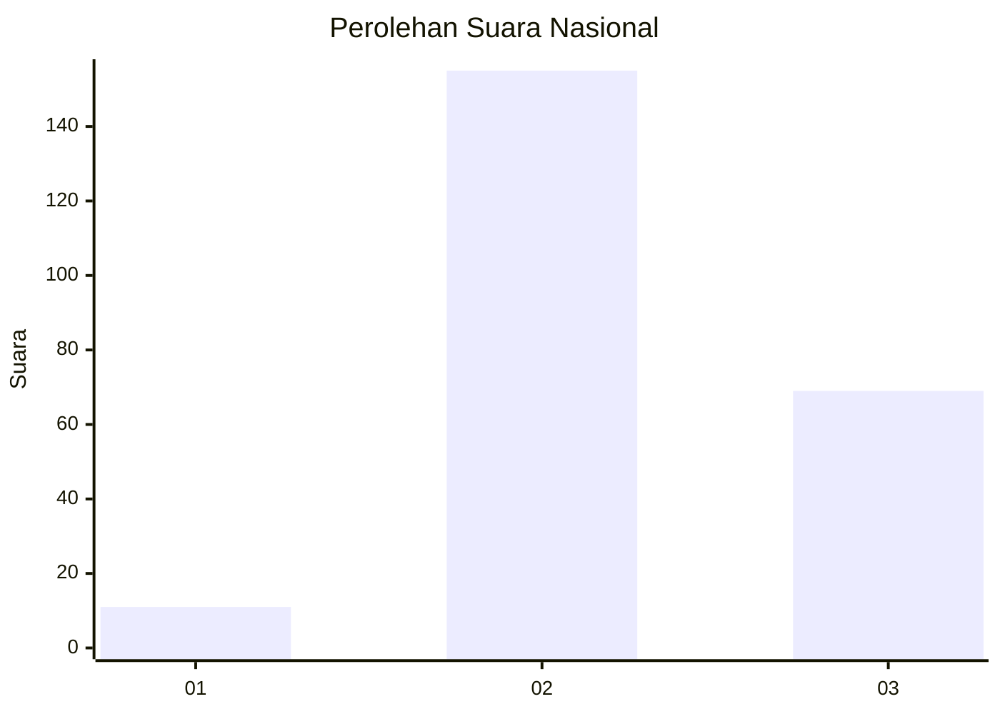

# Hasil

## Grafik

## Tabel

| No. | Nama Paslon    | Suara | Suara (raw) | Persentase |
|:--- |:-------------- | -----:| -----------:| ----------:|
| 1   | ANIES MUHAIMIN | 11    | [11][p-1]   | 4,68       |
| 2   | PRABOWO GIBRAN | 155   | [155][p-2]  | 65,96      |
| 3   | GANJAR MAHFUD  | 69    | [69][p-3]   | 29,36      |

[p-1]: https://github.com/gigit-pemilu/pemilu-2024/blob/main/pilpres/hitung-suara/sub/51-bali/sub/71-kota-denpasar/sub/03-denpasar-barat/sub/2011-padang-sambian-kaja/sub/002-tps/sub/paslon-1.txt
[p-2]: https://github.com/gigit-pemilu/pemilu-2024/blob/main/pilpres/hitung-suara/sub/51-bali/sub/71-kota-denpasar/sub/03-denpasar-barat/sub/2011-padang-sambian-kaja/sub/002-tps/sub/paslon-2.txt
[p-3]: https://github.com/gigit-pemilu/pemilu-2024/blob/main/pilpres/hitung-suara/sub/51-bali/sub/71-kota-denpasar/sub/03-denpasar-barat/sub/2011-padang-sambian-kaja/sub/002-tps/sub/paslon-3.txt

## Foto C Plano

https://sirekap-obj-formc.kpu.go.id/7263/pemilu/ppwp/51/71/03/20/11/5171032011002-20240215-102817--34dd4238-066e-45f4-8599-10a5a068778c.jpg

https://sirekap-obj-formc.kpu.go.id/7263/pemilu/ppwp/51/71/03/20/11/5171032011002-20240215-103008--443e9c56-db6d-4258-987a-58c80804b901.jpg

https://sirekap-obj-formc.kpu.go.id/7263/pemilu/ppwp/51/71/03/20/11/5171032011002-20240215-103131--27af8f03-b59a-46aa-82d8-e58f5139918e.jpg

## Metadata

| Key        | Value               |
| ---------- | ------------------- |
| Time Stamp | 2024-02-24 22:31:28 |

