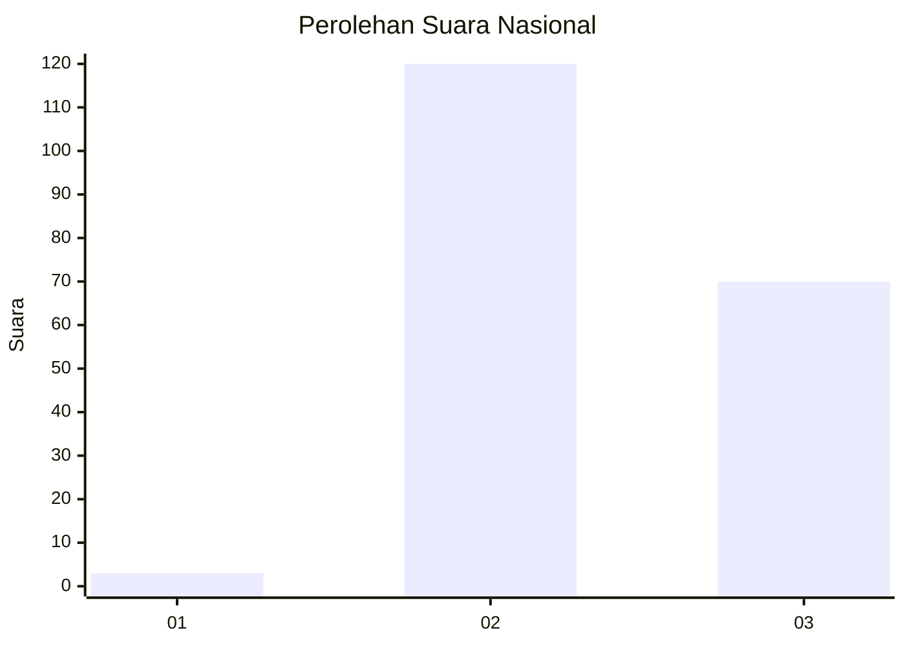
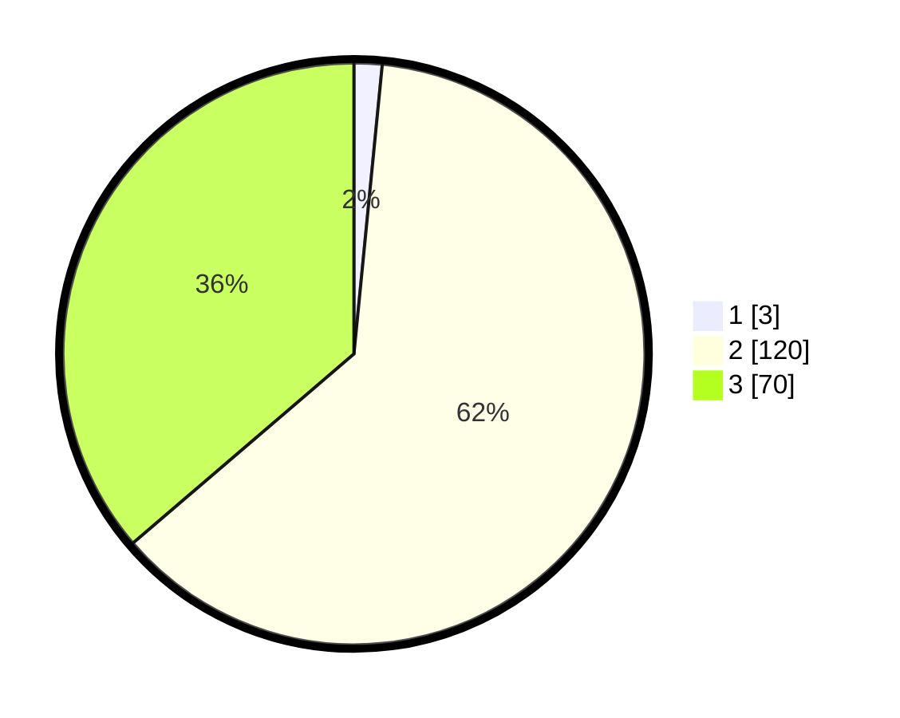

# Hasil

## Grafik

## Tabel

| No. | Nama Paslon    | Suara | Suara (raw) | Persentase |
|:--- |:-------------- | -----:| -----------:| ----------:|
| 1   | ANIES MUHAIMIN | 3     | [3][p-1]    | 1,55       |
| 2   | PRABOWO GIBRAN | 120   | [120][p-2]  | 62,18      |
| 3   | GANJAR MAHFUD  | 70    | [70][p-3]   | 36,27      |

[p-1]: https://github.com/gigit-pemilu/pemilu-2024/blob/main/pilpres/hitung-suara/sub/51-bali/sub/71-kota-denpasar/sub/03-denpasar-barat/sub/2011-padang-sambian-kaja/sub/006-tps/sub/paslon-1.txt
[p-2]: https://github.com/gigit-pemilu/pemilu-2024/blob/main/pilpres/hitung-suara/sub/51-bali/sub/71-kota-denpasar/sub/03-denpasar-barat/sub/2011-padang-sambian-kaja/sub/006-tps/sub/paslon-2.txt
[p-3]: https://github.com/gigit-pemilu/pemilu-2024/blob/main/pilpres/hitung-suara/sub/51-bali/sub/71-kota-denpasar/sub/03-denpasar-barat/sub/2011-padang-sambian-kaja/sub/006-tps/sub/paslon-3.txt

## Foto C Plano

https://sirekap-obj-formc.kpu.go.id/b39c/pemilu/ppwp/51/71/03/20/11/5171032011006-20240214-222125--160d9c87-c37d-4fc9-a867-b19b982681d2.jpg

https://sirekap-obj-formc.kpu.go.id/b39c/pemilu/ppwp/51/71/03/20/11/5171032011006-20240214-221818--f33eecca-09ec-4796-b12c-6f2755fec7be.jpg

https://sirekap-obj-formc.kpu.go.id/b39c/pemilu/ppwp/51/71/03/20/11/5171032011006-20240214-221956--03187b49-4949-4d2d-b08c-c96cebc8a204.jpg

## Metadata

| Key        | Value               |
| ---------- | ------------------- |
| Time Stamp | 2024-02-25 15:00:00 |

