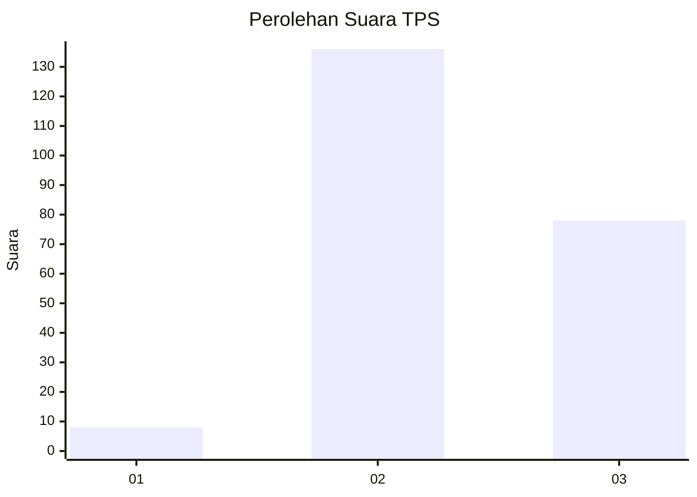
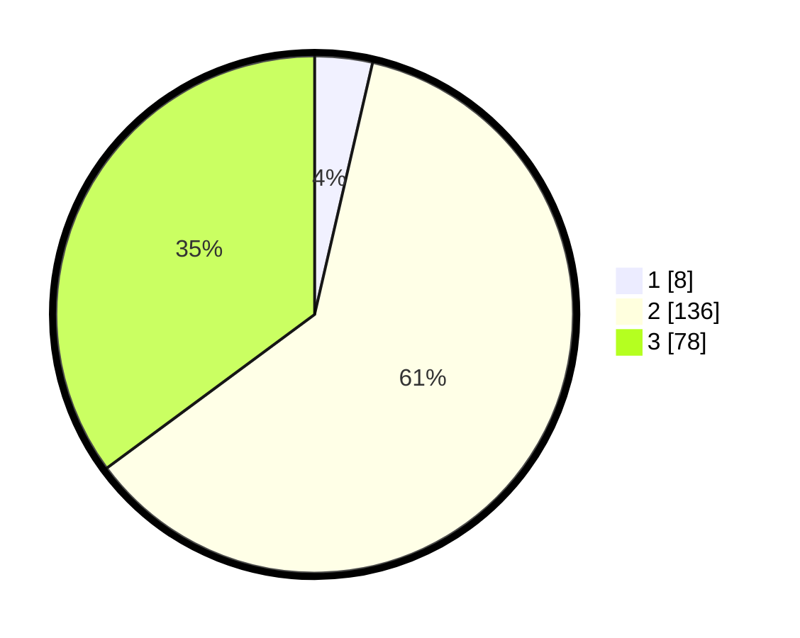

# Hasil

## Grafik

## Tabel

| No. | Nama Paslon    | Suara | Suara (raw) | Persentase |
|:--- |:-------------- | -----:| -----------:| ----------:|
| 1   | ANIES MUHAIMIN | 8     | [8][p-1]    | 3,60       |
| 2   | PRABOWO GIBRAN | 136   | [136][p-2]  | 61,26      |
| 3   | GANJAR MAHFUD  | 78    | [78][p-3]   | 35,14      |

[p-1]: https://github.com/gigit-pemilu/pemilu-2024-51-bali/blob/main/pilpres/hitung-suara/sub/51-bali/sub/71-kota-denpasar/sub/03-denpasar-barat/sub/2011-padang-sambian-kaja/sub/016-tps/sub/paslon-1.txt
[p-2]: https://github.com/gigit-pemilu/pemilu-2024-51-bali/blob/main/pilpres/hitung-suara/sub/51-bali/sub/71-kota-denpasar/sub/03-denpasar-barat/sub/2011-padang-sambian-kaja/sub/016-tps/sub/paslon-2.txt
[p-3]: https://github.com/gigit-pemilu/pemilu-2024-51-bali/blob/main/pilpres/hitung-suara/sub/51-bali/sub/71-kota-denpasar/sub/03-denpasar-barat/sub/2011-padang-sambian-kaja/sub/016-tps/sub/paslon-3.txt

## Foto C Plano

https://sirekap-obj-formc.kpu.go.id/46fb/pemilu/ppwp/51/71/03/20/11/5171032011016-20240215-012015--78932931-b0d5-4a7f-85b5-e33930b6731a.jpg

https://sirekap-obj-formc.kpu.go.id/46fb/pemilu/ppwp/51/71/03/20/11/5171032011016-20240215-012130--906dc271-0ccc-447f-b2b1-5eb48ee82347.jpg

https://sirekap-obj-formc.kpu.go.id/46fb/pemilu/ppwp/51/71/03/20/11/5171032011016-20240215-012316--9274aa93-481a-4eca-b02d-d3b2289589c1.jpg

## Metadata

| Key        | Value               |
| ---------- | ------------------- |
| Time Stamp | 2024-02-25 18:00:00 |

