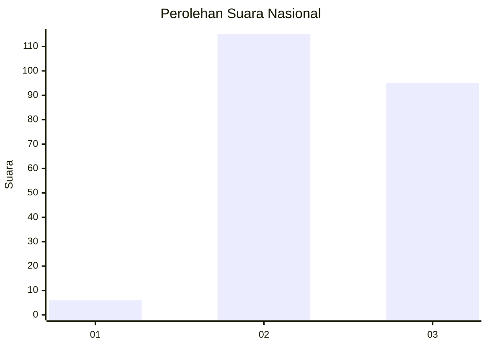
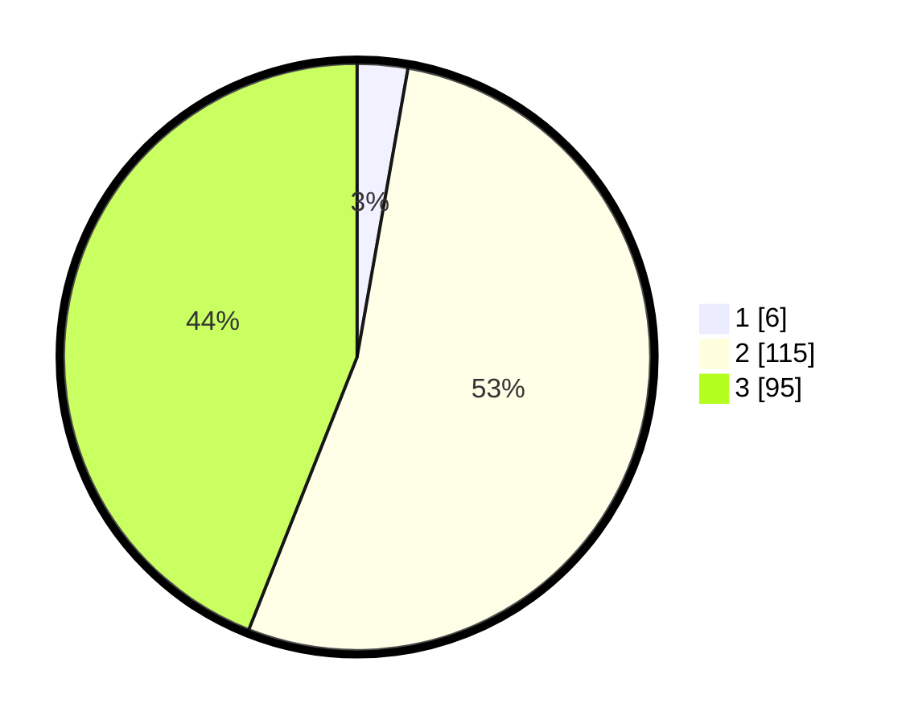

# Hasil

## Grafik

## Tabel

| No. | Nama Paslon    | Suara | Suara (raw) | Persentase |
|:--- |:-------------- | -----:| -----------:| ----------:|
| 1   | ANIES MUHAIMIN | 6     | [6][p-1]    | 2,78       |
| 2   | PRABOWO GIBRAN | 115   | [115][p-2]  | 53,24      |
| 3   | GANJAR MAHFUD  | 95    | [95][p-3]   | 43,98      |

[p-1]: https://github.com/gigit-pemilu/pemilu-2024/blob/main/pilpres/hitung-suara/sub/51-bali/sub/71-kota-denpasar/sub/03-denpasar-barat/sub/2011-padang-sambian-kaja/sub/017-tps/sub/paslon-1.txt
[p-2]: https://github.com/gigit-pemilu/pemilu-2024/blob/main/pilpres/hitung-suara/sub/51-bali/sub/71-kota-denpasar/sub/03-denpasar-barat/sub/2011-padang-sambian-kaja/sub/017-tps/sub/paslon-2.txt
[p-3]: https://github.com/gigit-pemilu/pemilu-2024/blob/main/pilpres/hitung-suara/sub/51-bali/sub/71-kota-denpasar/sub/03-denpasar-barat/sub/2011-padang-sambian-kaja/sub/017-tps/sub/paslon-3.txt

## Foto C Plano

https://sirekap-obj-formc.kpu.go.id/8f48/pemilu/ppwp/51/71/03/20/11/5171032011017-20240214-231341--ceb2dd59-9feb-47c7-b0f3-de5d133f8cab.jpg

https://sirekap-obj-formc.kpu.go.id/8f48/pemilu/ppwp/51/71/03/20/11/5171032011017-20240214-231509--fde232fc-4c3b-4ab2-8573-3f3c78c0580d.jpg

https://sirekap-obj-formc.kpu.go.id/8f48/pemilu/ppwp/51/71/03/20/11/5171032011017-20240214-231635--a9c90eeb-e876-4efd-8504-710c96c5d74f.jpg

## Metadata

| Key        | Value               |
| ---------- | ------------------- |
| Time Stamp | 2024-02-24 22:31:28 |

