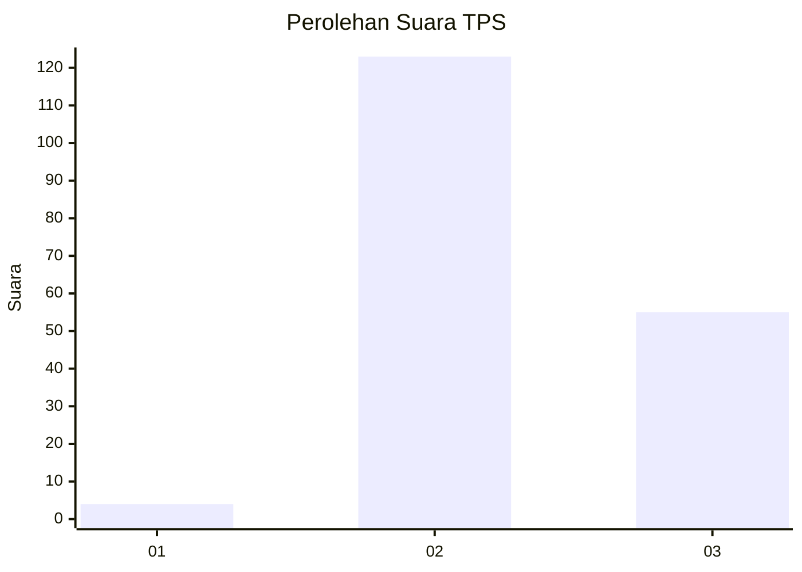

# Hasil

## Grafik

## Tabel

| No. | Nama Paslon    | Suara | Suara (raw) | Persentase |
|:--- |:-------------- | -----:| -----------:| ----------:|
| 1   | ANIES MUHAIMIN | 4     | [4][p-1]    | 2,20       |
| 2   | PRABOWO GIBRAN | 123   | [123][p-2]  | 67,58      |
| 3   | GANJAR MAHFUD  | 55    | [55][p-3]   | 30,22      |

[p-1]: https://github.com/gigit-pemilu/pemilu-2024-51-bali/blob/main/pilpres/hitung-suara/sub/51-bali/sub/71-kota-denpasar/sub/03-denpasar-barat/sub/2011-padang-sambian-kaja/sub/018-tps/sub/paslon-1.txt
[p-2]: https://github.com/gigit-pemilu/pemilu-2024-51-bali/blob/main/pilpres/hitung-suara/sub/51-bali/sub/71-kota-denpasar/sub/03-denpasar-barat/sub/2011-padang-sambian-kaja/sub/018-tps/sub/paslon-2.txt
[p-3]: https://github.com/gigit-pemilu/pemilu-2024-51-bali/blob/main/pilpres/hitung-suara/sub/51-bali/sub/71-kota-denpasar/sub/03-denpasar-barat/sub/2011-padang-sambian-kaja/sub/018-tps/sub/paslon-3.txt

## Foto C Plano

https://sirekap-obj-formc.kpu.go.id/48a3/pemilu/ppwp/51/71/03/20/11/5171032011018-20240214-195114--b0fc7b28-0948-4823-8aba-9ee9b9c6efe9.jpg

https://sirekap-obj-formc.kpu.go.id/48a3/pemilu/ppwp/51/71/03/20/11/5171032011018-20240214-205019--6ba0f1b7-d58b-4ea7-b4b5-a46987521073.jpg

https://sirekap-obj-formc.kpu.go.id/48a3/pemilu/ppwp/51/71/03/20/11/5171032011018-20240214-195710--45e5fbd5-2ef3-4108-a853-d5ffe8a8f78d.jpg

## Metadata

| Key        | Value               |
| ---------- | ------------------- |
| Time Stamp | 2024-02-15 00:46:45 |

## DATA PEMILIH TETAP

Jumlah pemilih dalam DPT: **273**.
 * L: **130**.
 * P: **143**.

## DATA PENGGUNA HAK PILIH

Jumlah pengguna hak pilih dalam DPT: **181**.
 * L: **90**.
 * P: **91**.

Jumlah pengguna hak pilih dalam DPTb: **3**.
 * L: **1**.
 * P: **2**.

Jumlah pengguna hak pilih dalam DPK: **1**.
 * L: **0**.
 * P: **1**.

Jumlah pengguna hak pilih: **185**.
 * L: **91**.
 * P: **94**.

## JUMLAH SUARA SAH DAN TIDAK SAH

JUMLAH SELURUH SUARA SAH: **182**.

JUMLAH SUARA TIDAK SAH: **3**.

JUMLAH SELURUH SUARA SAH DAN SUARA TIDAK SAH: **185**.

