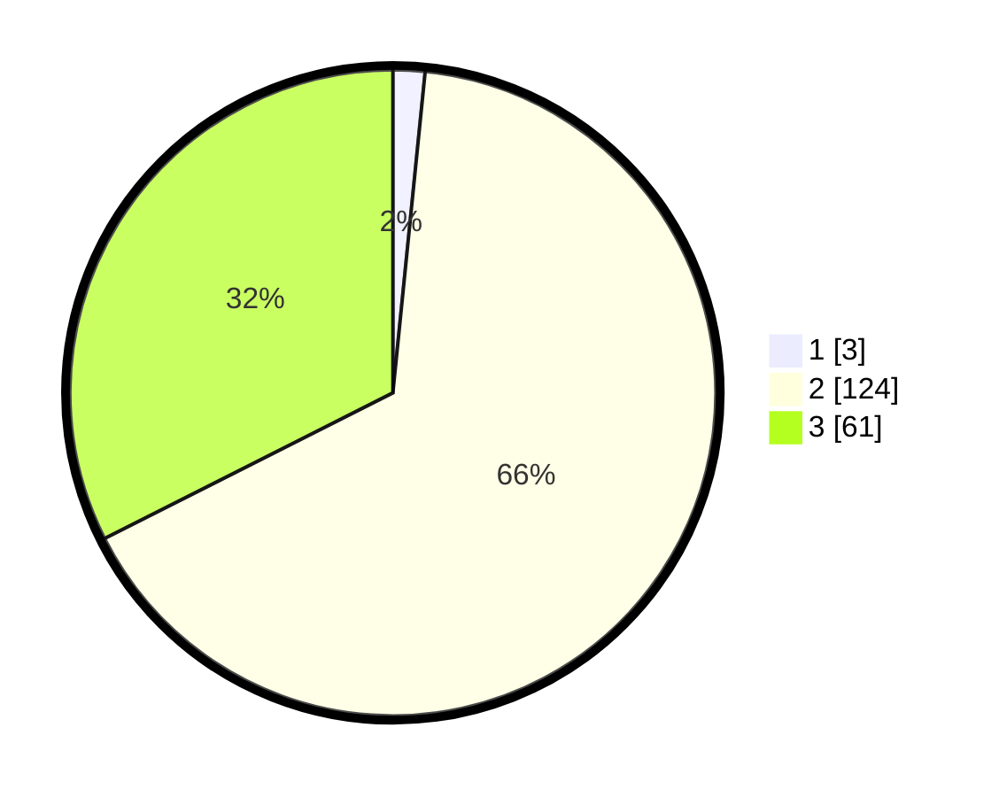

# Hasil

## Grafik

## Tabel

| No. | Nama Paslon    | Suara | Suara (raw) | Persentase |
|:--- |:-------------- | -----:| -----------:| ----------:|
| 1   | ANIES MUHAIMIN | 3     | [3][p-1]    | 1,60       |
| 2   | PRABOWO GIBRAN | 124   | [124][p-2]  | 65,96      |
| 3   | GANJAR MAHFUD  | 61    | [61][p-3]   | 32,45      |

[p-1]: https://github.com/gigit-pemilu/pemilu-2024-51-bali/blob/main/pilpres/hitung-suara/sub/51-bali/sub/71-kota-denpasar/sub/03-denpasar-barat/sub/2011-padang-sambian-kaja/sub/022-tps/sub/paslon-1.txt
[p-2]: https://github.com/gigit-pemilu/pemilu-2024-51-bali/blob/main/pilpres/hitung-suara/sub/51-bali/sub/71-kota-denpasar/sub/03-denpasar-barat/sub/2011-padang-sambian-kaja/sub/022-tps/sub/paslon-2.txt
[p-3]: https://github.com/gigit-pemilu/pemilu-2024-51-bali/blob/main/pilpres/hitung-suara/sub/51-bali/sub/71-kota-denpasar/sub/03-denpasar-barat/sub/2011-padang-sambian-kaja/sub/022-tps/sub/paslon-3.txt

## Foto C Plano

https://sirekap-obj-formc.kpu.go.id/2704/pemilu/ppwp/51/71/03/20/11/5171032011022-20240214-214530--d44cfc1b-0bee-4198-a21e-1389a70fe8bd.jpg

https://sirekap-obj-formc.kpu.go.id/2704/pemilu/ppwp/51/71/03/20/11/5171032011022-20240214-214640--739dd14d-982e-45a5-b842-07f7fb3222ab.jpg

https://sirekap-obj-formc.kpu.go.id/2704/pemilu/ppwp/51/71/03/20/11/5171032011022-20240214-214759--cf68c868-3a38-4a88-b1bd-b1e3fc74fce5.jpg

## Metadata

| Key        | Value               |
| ---------- | ------------------- |
| Time Stamp | 2024-02-25 15:00:00 |

