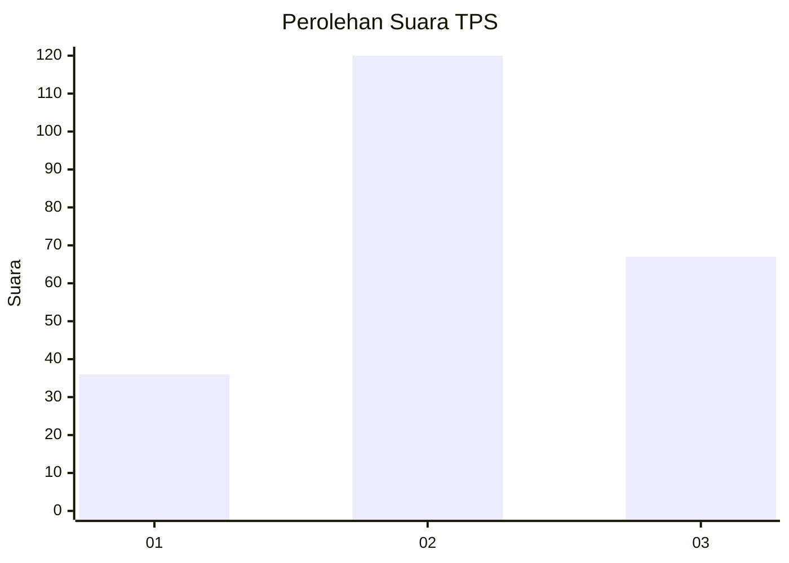
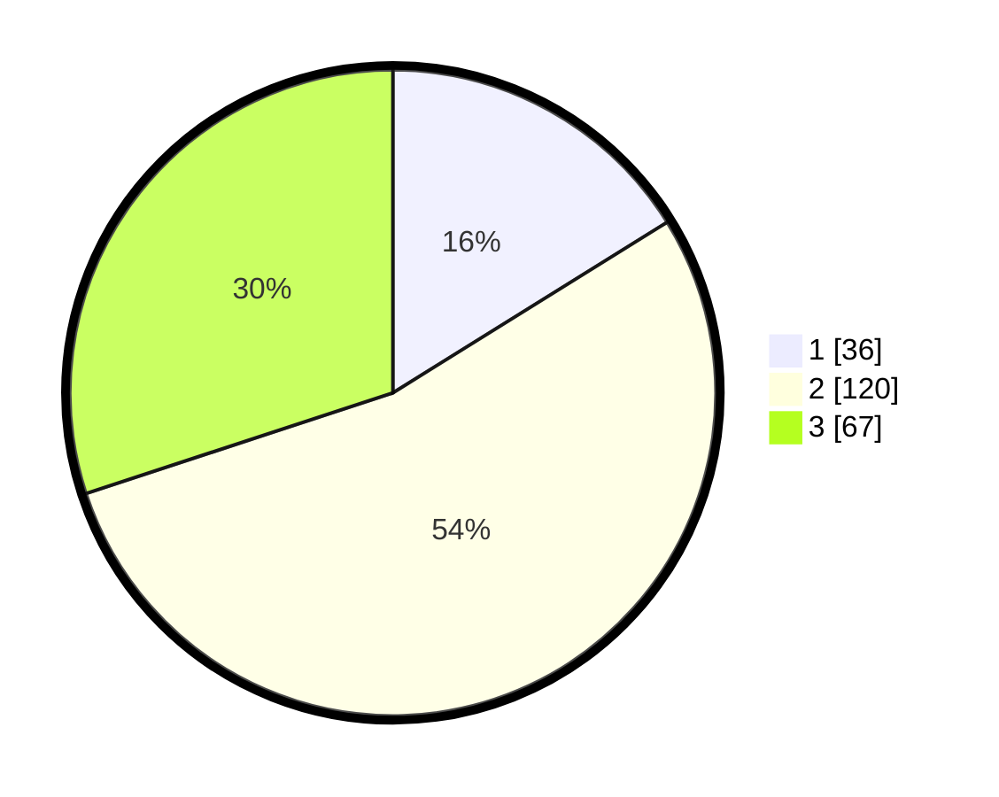

# Hasil

## Grafik

## Tabel

| No. | Nama Paslon    | Suara | Suara (raw) | Persentase |
|:--- |:-------------- | -----:| -----------:| ----------:|
| 1   | ANIES MUHAIMIN | 36    | [36][p-1]   | 16,14      |
| 2   | PRABOWO GIBRAN | 120   | [120][p-2]  | 53,81      |
| 3   | GANJAR MAHFUD  | 67    | [67][p-3]   | 30,04      |

[p-1]: https://github.com/gigit-pemilu/pemilu-2024-51-bali/blob/main/pilpres/hitung-suara/sub/51-bali/sub/71-kota-denpasar/sub/03-denpasar-barat/sub/2011-padang-sambian-kaja/sub/037-tps/sub/paslon-1.txt
[p-2]: https://github.com/gigit-pemilu/pemilu-2024-51-bali/blob/main/pilpres/hitung-suara/sub/51-bali/sub/71-kota-denpasar/sub/03-denpasar-barat/sub/2011-padang-sambian-kaja/sub/037-tps/sub/paslon-2.txt
[p-3]: https://github.com/gigit-pemilu/pemilu-2024-51-bali/blob/main/pilpres/hitung-suara/sub/51-bali/sub/71-kota-denpasar/sub/03-denpasar-barat/sub/2011-padang-sambian-kaja/sub/037-tps/sub/paslon-3.txt

## Foto C Plano

https://sirekap-obj-formc.kpu.go.id/98ac/pemilu/ppwp/51/71/03/20/11/5171032011037-20240214-234831--5a54b281-f056-4a1f-93da-61e3e718026b.jpg

https://sirekap-obj-formc.kpu.go.id/98ac/pemilu/ppwp/51/71/03/20/11/5171032011037-20240214-235404--ea0d7045-1ef0-46e1-be56-b43ef80f7f34.jpg

https://sirekap-obj-formc.kpu.go.id/98ac/pemilu/ppwp/51/71/03/20/11/5171032011037-20240214-235002--33e85040-9089-475b-8c0a-e87230bf0d3f.jpg

## Metadata

| Key        | Value               |
| ---------- | ------------------- |
| Time Stamp | 2024-02-24 22:31:28 |

