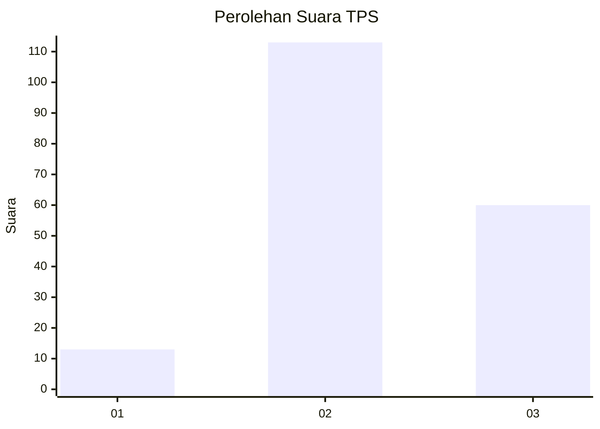
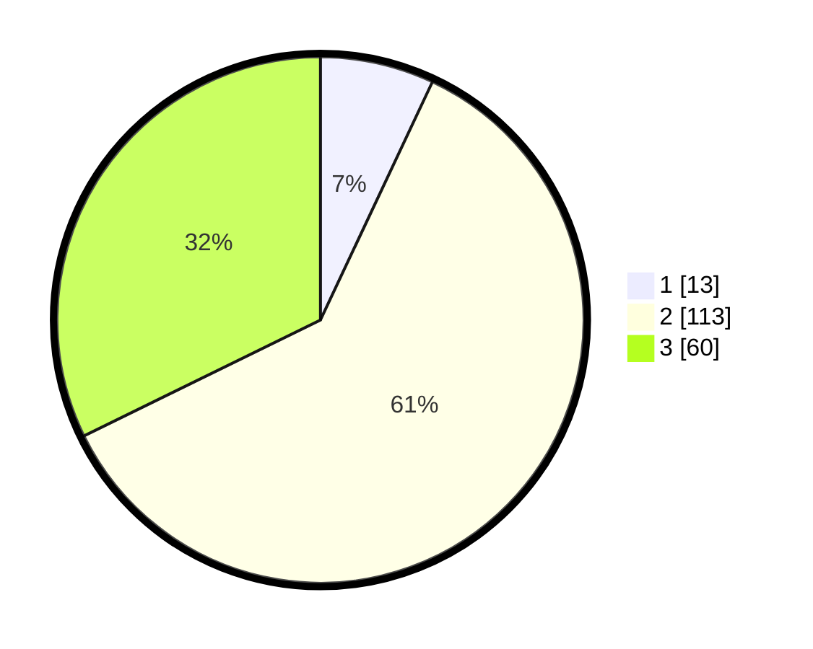

# Hasil

## Grafik

## Tabel

| No. | Nama Paslon    | Suara | Suara (raw) | Persentase |
|:--- |:-------------- | -----:| -----------:| ----------:|
| 1   | ANIES MUHAIMIN | 13    | [13][p-1]   | 6,99       |
| 2   | PRABOWO GIBRAN | 113   | [113][p-2]  | 60,75      |
| 3   | GANJAR MAHFUD  | 60    | [60][p-3]   | 32,26      |

[p-1]: https://github.com/gigit-pemilu/pemilu-2024-51-bali/blob/main/pilpres/hitung-suara/sub/51-bali/sub/71-kota-denpasar/sub/03-denpasar-barat/sub/2011-padang-sambian-kaja/sub/045-tps/sub/paslon-1.txt
[p-2]: https://github.com/gigit-pemilu/pemilu-2024-51-bali/blob/main/pilpres/hitung-suara/sub/51-bali/sub/71-kota-denpasar/sub/03-denpasar-barat/sub/2011-padang-sambian-kaja/sub/045-tps/sub/paslon-2.txt
[p-3]: https://github.com/gigit-pemilu/pemilu-2024-51-bali/blob/main/pilpres/hitung-suara/sub/51-bali/sub/71-kota-denpasar/sub/03-denpasar-barat/sub/2011-padang-sambian-kaja/sub/045-tps/sub/paslon-3.txt

## Foto C Plano

https://sirekap-obj-formc.kpu.go.id/183c/pemilu/ppwp/51/71/03/20/11/5171032011045-20240214-203114--7c4a7db7-ad6c-4488-b636-1590ac8b7e8b.jpg

https://sirekap-obj-formc.kpu.go.id/183c/pemilu/ppwp/51/71/03/20/11/5171032011045-20240214-203215--4eeb980e-c6c0-4a42-8e3b-769c1d4daf95.jpg

https://sirekap-obj-formc.kpu.go.id/183c/pemilu/ppwp/51/71/03/20/11/5171032011045-20240214-200107--44da91fe-82ec-4390-94cf-1e8fa2509fda.jpg

## Metadata

| Key        | Value               |
| ---------- | ------------------- |
| Time Stamp | 2024-03-01 18:00:00 |

