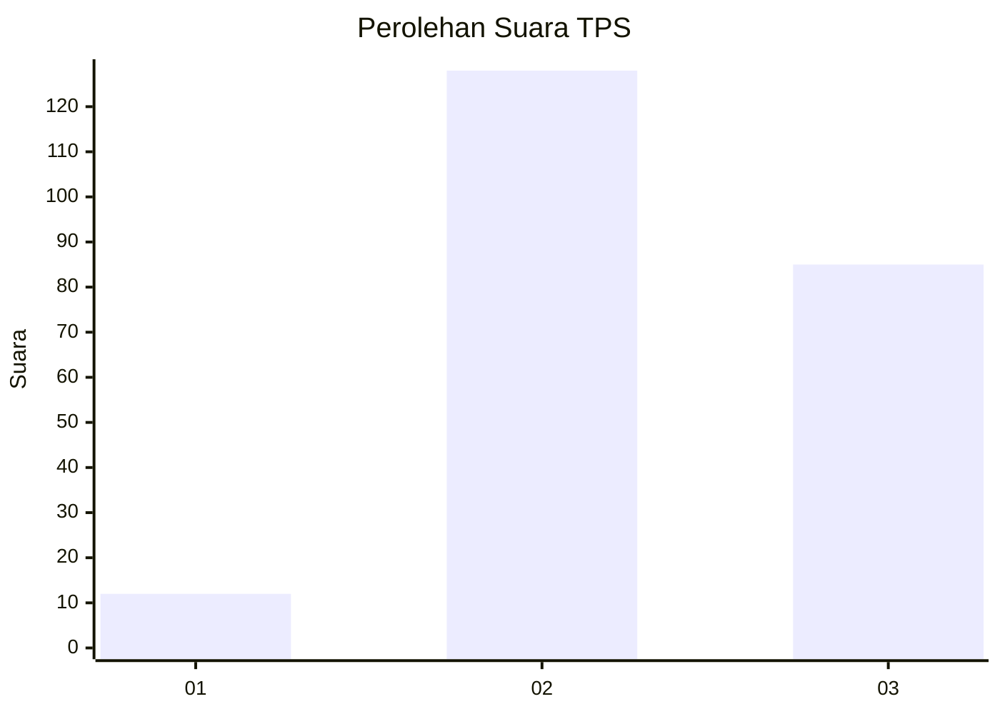
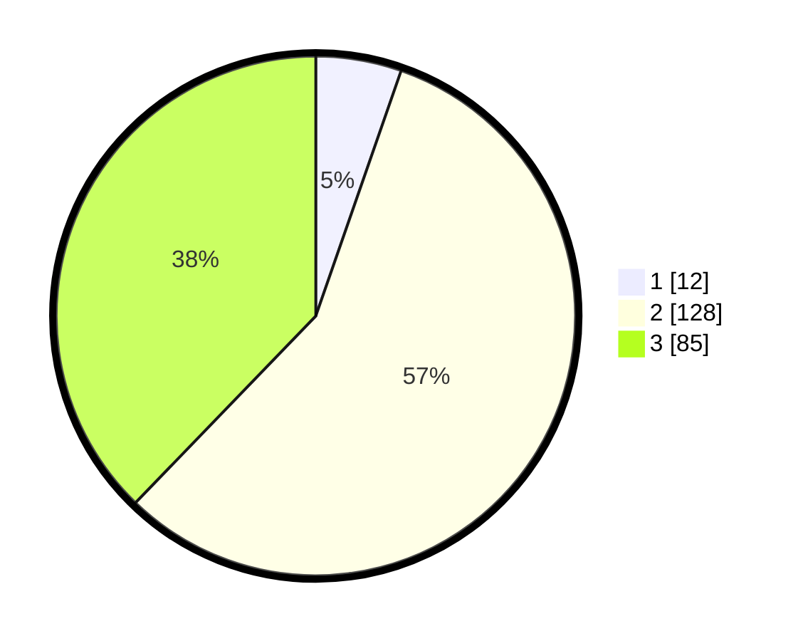

# Hasil

## Grafik

## Tabel

| No. | Nama Paslon    | Suara | Suara (raw) | Persentase |
|:--- |:-------------- | -----:| -----------:| ----------:|
| 1   | ANIES MUHAIMIN | 12    | [12][p-1]   | 5,33       |
| 2   | PRABOWO GIBRAN | 128   | [128][p-2]  | 56,89      |
| 3   | GANJAR MAHFUD  | 85    | [85][p-3]   | 37,78      |

[p-1]: https://github.com/gigit-pemilu/pemilu-2024-51-bali/blob/main/pilpres/hitung-suara/sub/51-bali/sub/71-kota-denpasar/sub/03-denpasar-barat/sub/2011-padang-sambian-kaja/sub/050-tps/sub/paslon-1.txt
[p-2]: https://github.com/gigit-pemilu/pemilu-2024-51-bali/blob/main/pilpres/hitung-suara/sub/51-bali/sub/71-kota-denpasar/sub/03-denpasar-barat/sub/2011-padang-sambian-kaja/sub/050-tps/sub/paslon-2.txt
[p-3]: https://github.com/gigit-pemilu/pemilu-2024-51-bali/blob/main/pilpres/hitung-suara/sub/51-bali/sub/71-kota-denpasar/sub/03-denpasar-barat/sub/2011-padang-sambian-kaja/sub/050-tps/sub/paslon-3.txt

## Foto C Plano

https://sirekap-obj-formc.kpu.go.id/da83/pemilu/ppwp/51/71/03/20/11/5171032011050-20240214-213937--feae746f-93fc-4a66-b11e-0a16bc966c0d.jpg

https://sirekap-obj-formc.kpu.go.id/da83/pemilu/ppwp/51/71/03/20/11/5171032011050-20240214-214613--31775c27-e4a7-4dd4-b70b-8ad4286e2e46.jpg

https://sirekap-obj-formc.kpu.go.id/da83/pemilu/ppwp/51/71/03/20/11/5171032011050-20240214-214312--ec85198d-aec4-434a-aeeb-6cc81e6fc2ca.jpg

## Metadata

| Key        | Value               |
| ---------- | ------------------- |
| Time Stamp | 2024-02-24 22:31:28 |

