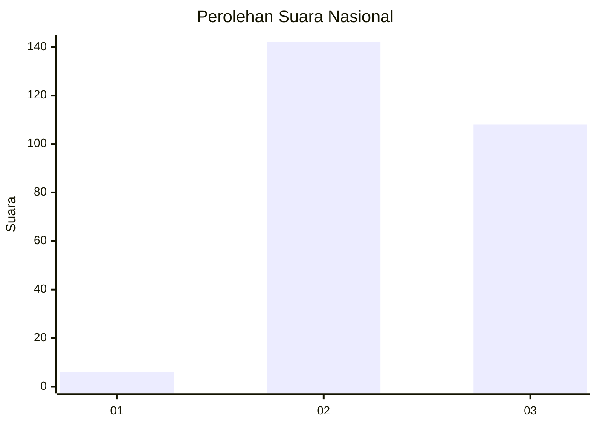
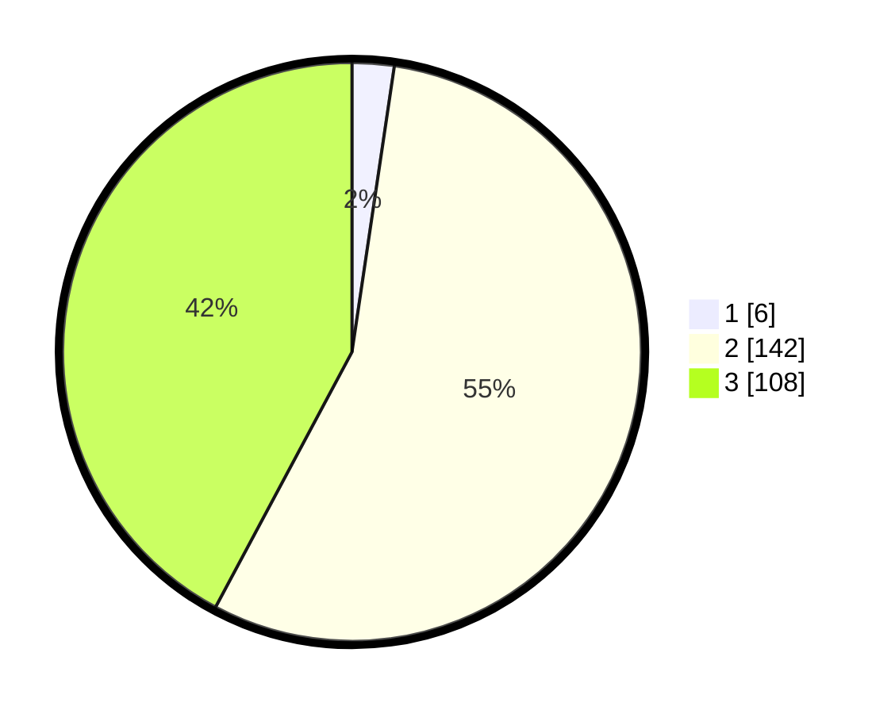

# Hasil

## Grafik

## Tabel

| No. | Nama Paslon    | Suara | Suara (raw) | Persentase |
|:--- |:-------------- | -----:| -----------:| ----------:|
| 1   | ANIES MUHAIMIN | 6     | [6][p-1]    | 2,34       |
| 2   | PRABOWO GIBRAN | 142   | [142][p-2]  | 55,47      |
| 3   | GANJAR MAHFUD  | 108   | [108][p-3]  | 42,19      |

[p-1]: https://github.com/gigit-pemilu/pemilu-2024/blob/main/pilpres/hitung-suara/sub/51-bali/sub/71-kota-denpasar/sub/04-denpasar-utara/sub/1004-tonja/sub/001-tps/sub/paslon-1.txt
[p-2]: https://github.com/gigit-pemilu/pemilu-2024/blob/main/pilpres/hitung-suara/sub/51-bali/sub/71-kota-denpasar/sub/04-denpasar-utara/sub/1004-tonja/sub/001-tps/sub/paslon-2.txt
[p-3]: https://github.com/gigit-pemilu/pemilu-2024/blob/main/pilpres/hitung-suara/sub/51-bali/sub/71-kota-denpasar/sub/04-denpasar-utara/sub/1004-tonja/sub/001-tps/sub/paslon-3.txt

## Foto C Plano

https://sirekap-obj-formc.kpu.go.id/b84a/pemilu/ppwp/51/71/04/10/04/5171041004001-20240214-223811--47e45878-dbb4-4afb-881f-9814e79ac6a7.jpg

https://sirekap-obj-formc.kpu.go.id/b84a/pemilu/ppwp/51/71/04/10/04/5171041004001-20240215-010116--4bd732ff-2a37-4c63-83d5-a7638524f935.jpg

https://sirekap-obj-formc.kpu.go.id/b84a/pemilu/ppwp/51/71/04/10/04/5171041004001-20240215-010247--5e1cc240-be54-43dc-bc32-2282611b2737.jpg

## Metadata

| Key        | Value               |
| ---------- | ------------------- |
| Time Stamp | 2024-02-15 23:29:50 |

