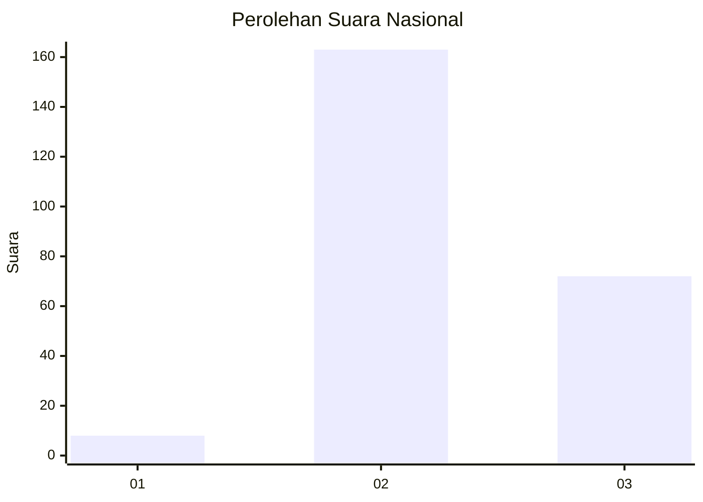

# Hasil

## Grafik

## Tabel

| No. | Nama Paslon    | Suara | Suara (raw) | Persentase |
|:--- |:-------------- | -----:| -----------:| ----------:|
| 1   | ANIES MUHAIMIN | 8     | [8][p-1]    | 3,29       |
| 2   | PRABOWO GIBRAN | 163   | [163][p-2]  | 67,08      |
| 3   | GANJAR MAHFUD  | 72    | [72][p-3]   | 29,63      |

[p-1]: https://github.com/gigit-pemilu/pemilu-2024/blob/main/pilpres/hitung-suara/sub/51-bali/sub/71-kota-denpasar/sub/04-denpasar-utara/sub/1004-tonja/sub/002-tps/sub/paslon-1.txt
[p-2]: https://github.com/gigit-pemilu/pemilu-2024/blob/main/pilpres/hitung-suara/sub/51-bali/sub/71-kota-denpasar/sub/04-denpasar-utara/sub/1004-tonja/sub/002-tps/sub/paslon-2.txt
[p-3]: https://github.com/gigit-pemilu/pemilu-2024/blob/main/pilpres/hitung-suara/sub/51-bali/sub/71-kota-denpasar/sub/04-denpasar-utara/sub/1004-tonja/sub/002-tps/sub/paslon-3.txt

## Foto C Plano

https://sirekap-obj-formc.kpu.go.id/1643/pemilu/ppwp/51/71/04/10/04/5171041004002-20240214-155116--4a782aab-8d6d-4bcf-8c0c-3f7501478ade.jpg

https://sirekap-obj-formc.kpu.go.id/1643/pemilu/ppwp/51/71/04/10/04/5171041004002-20240214-155306--470ba19a-5e9a-45af-8cdf-d87976b488ec.jpg

https://sirekap-obj-formc.kpu.go.id/1643/pemilu/ppwp/51/71/04/10/04/5171041004002-20240214-155452--b02b651a-4b7f-4860-a615-23d496d1ba73.jpg

## Metadata

| Key        | Value               |
| ---------- | ------------------- |
| Time Stamp | 2024-02-15 00:41:44 |

## DATA PEMILIH TETAP

Jumlah pemilih dalam DPT: **288**.
 * L: **141**.
 * P: **147**.

## DATA PENGGUNA HAK PILIH

Jumlah pengguna hak pilih dalam DPT: **245**.
 * L: **122**.
 * P: **123**.

Jumlah pengguna hak pilih dalam DPTb: **3**.
 * L: **2**.
 * P: **1**.

Jumlah pengguna hak pilih dalam DPK: **0**.
 * L: **0**.
 * P: **0**.

Jumlah pengguna hak pilih: **248**.
 * L: **124**.
 * P: **124**.

## JUMLAH SUARA SAH DAN TIDAK SAH

JUMLAH SELURUH SUARA SAH: **243**.

JUMLAH SUARA TIDAK SAH: **5**.

JUMLAH SELURUH SUARA SAH DAN SUARA TIDAK SAH: **248**.

