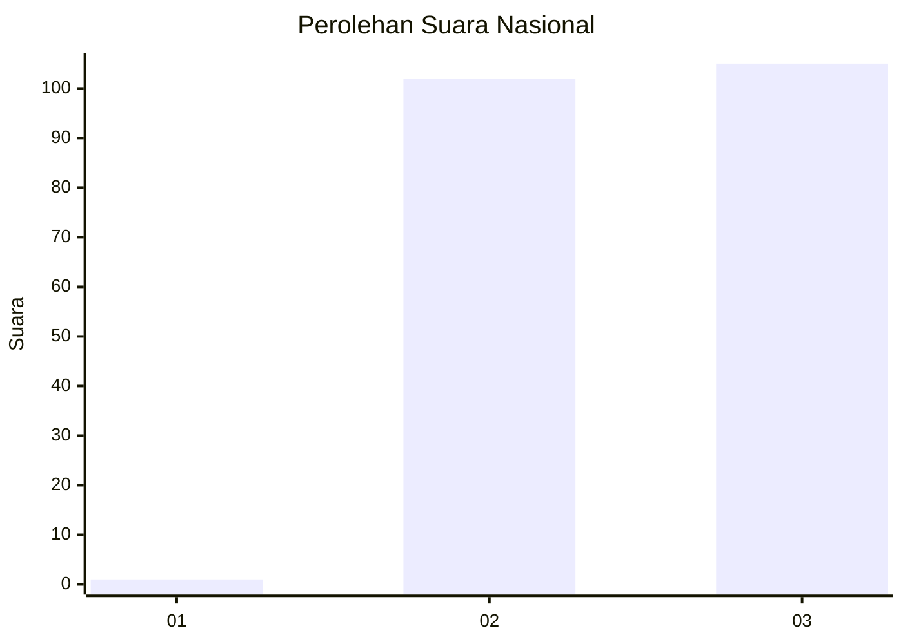
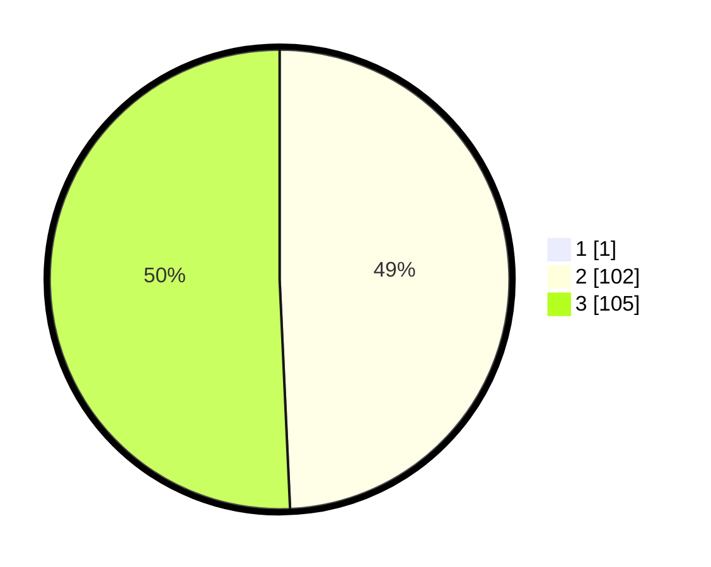

# Hasil

## Grafik

## Tabel

| No. | Nama Paslon    | Suara | Suara (raw) | Persentase |
|:--- |:-------------- | -----:| -----------:| ----------:|
| 1   | ANIES MUHAIMIN | 1     | [1][p-1]    | 0,48       |
| 2   | PRABOWO GIBRAN | 102   | [102][p-2]  | 49,04      |
| 3   | GANJAR MAHFUD  | 105   | [105][p-3]  | 50,48      |

[p-1]: https://github.com/gigit-pemilu/pemilu-2024/blob/main/pilpres/hitung-suara/sub/51-bali/sub/71-kota-denpasar/sub/04-denpasar-utara/sub/1004-tonja/sub/003-tps/sub/paslon-1.txt
[p-2]: https://github.com/gigit-pemilu/pemilu-2024/blob/main/pilpres/hitung-suara/sub/51-bali/sub/71-kota-denpasar/sub/04-denpasar-utara/sub/1004-tonja/sub/003-tps/sub/paslon-2.txt
[p-3]: https://github.com/gigit-pemilu/pemilu-2024/blob/main/pilpres/hitung-suara/sub/51-bali/sub/71-kota-denpasar/sub/04-denpasar-utara/sub/1004-tonja/sub/003-tps/sub/paslon-3.txt

## Foto C Plano

https://sirekap-obj-formc.kpu.go.id/f333/pemilu/ppwp/51/71/04/10/04/5171041004003-20240216-144540--3e8f27cf-86d1-4f47-aee6-2f82397f2a69.jpg

https://sirekap-obj-formc.kpu.go.id/f333/pemilu/ppwp/51/71/04/10/04/5171041004003-20240216-122200--14db0e10-7a96-463d-90b7-a0d4ebcc5aa1.jpg

https://sirekap-obj-formc.kpu.go.id/f333/pemilu/ppwp/51/71/04/10/04/5171041004003-20240216-122213--f256518f-3679-4052-8189-b6e28d65b8bc.jpg

## Metadata

| Key        | Value               |
| ---------- | ------------------- |
| Time Stamp | 2024-02-16 16:25:10 |

## DATA PEMILIH TETAP

Jumlah pemilih dalam DPT: **249**.
 * L: **132**.
 * P: **117**.

## DATA PENGGUNA HAK PILIH

Jumlah pengguna hak pilih dalam DPT: **206**.
 * L: **109**.
 * P: **97**.

Jumlah pengguna hak pilih dalam DPTb: **3**.
 * L: **2**.
 * P: **1**.

Jumlah pengguna hak pilih dalam DPK: **3**.
 * L: **2**.
 * P: **1**.

Jumlah pengguna hak pilih: **212**.
 * L: **113**.
 * P: **99**.

## JUMLAH SUARA SAH DAN TIDAK SAH

JUMLAH SELURUH SUARA SAH: **208**.

JUMLAH SUARA TIDAK SAH: **4**.

JUMLAH SELURUH SUARA SAH DAN SUARA TIDAK SAH: **212**.

