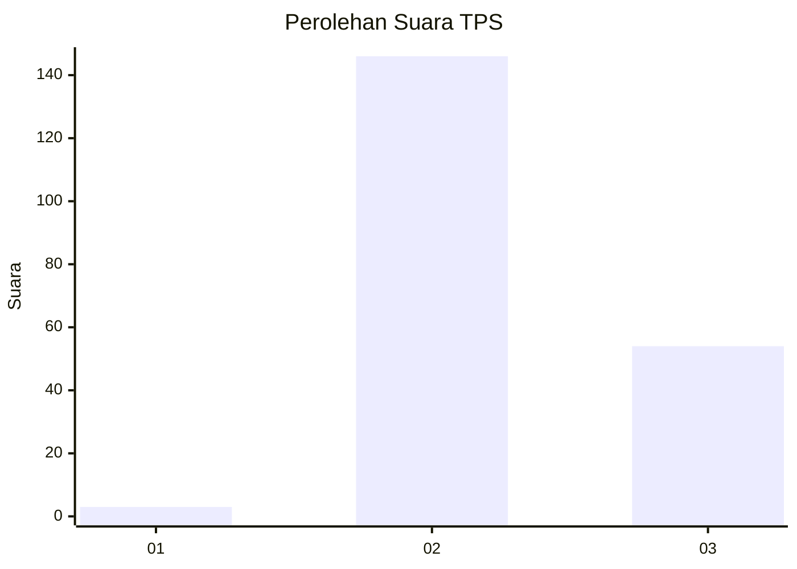
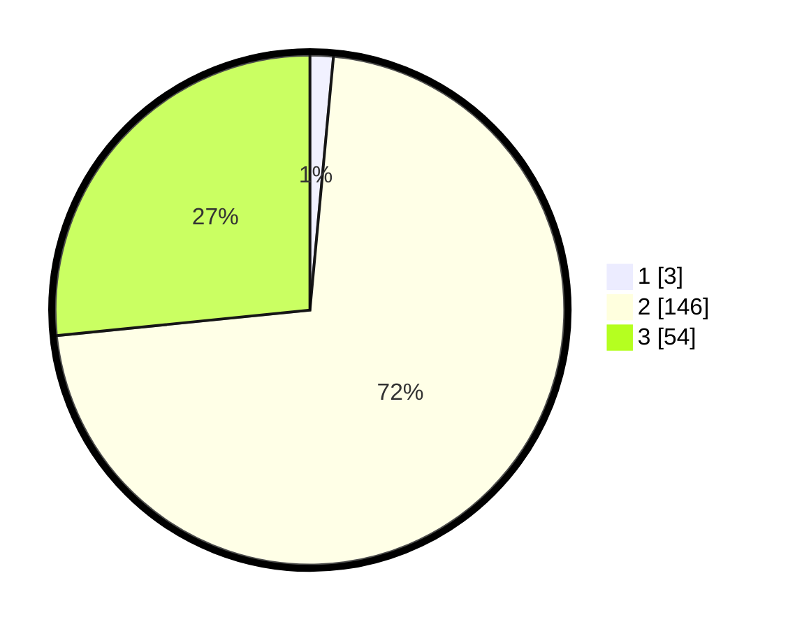

# Hasil

## Grafik

## Tabel

| No. | Nama Paslon    | Suara | Suara (raw) | Persentase |
|:--- |:-------------- | -----:| -----------:| ----------:|
| 1   | ANIES MUHAIMIN | 3     | [3][p-1]    | 1,48       |
| 2   | PRABOWO GIBRAN | 146   | [146][p-2]  | 71,92      |
| 3   | GANJAR MAHFUD  | 54    | [54][p-3]   | 26,60      |

[p-1]: https://github.com/gigit-pemilu/pemilu-2024-51-bali/blob/main/pilpres/hitung-suara/sub/51-bali/sub/71-kota-denpasar/sub/04-denpasar-utara/sub/1004-tonja/sub/008-tps/sub/paslon-1.txt
[p-2]: https://github.com/gigit-pemilu/pemilu-2024-51-bali/blob/main/pilpres/hitung-suara/sub/51-bali/sub/71-kota-denpasar/sub/04-denpasar-utara/sub/1004-tonja/sub/008-tps/sub/paslon-2.txt
[p-3]: https://github.com/gigit-pemilu/pemilu-2024-51-bali/blob/main/pilpres/hitung-suara/sub/51-bali/sub/71-kota-denpasar/sub/04-denpasar-utara/sub/1004-tonja/sub/008-tps/sub/paslon-3.txt

## Foto C Plano

https://sirekap-obj-formc.kpu.go.id/ab80/pemilu/ppwp/51/71/04/10/04/5171041004008-20240216-021646--4c46421b-6b35-48a3-8716-9f76d8d20570.jpg

https://sirekap-obj-formc.kpu.go.id/ab80/pemilu/ppwp/51/71/04/10/04/5171041004008-20240216-021659--4a4be493-2606-4e26-87c8-c6d0e20fd332.jpg

https://sirekap-obj-formc.kpu.go.id/ab80/pemilu/ppwp/51/71/04/10/04/5171041004008-20240216-021654--8dd818e0-69d7-49e5-b11e-dc7b4fd4a563.jpg

## Metadata

| Key        | Value               |
| ---------- | ------------------- |
| Time Stamp | 2024-02-16 10:30:29 |

## DATA PEMILIH TETAP

Jumlah pemilih dalam DPT: **271**.
 * L: **120**.
 * P: **151**.

## DATA PENGGUNA HAK PILIH

Jumlah pengguna hak pilih dalam DPT: **197**.
 * L: **88**.
 * P: **109**.

Jumlah pengguna hak pilih dalam DPTb: **7**.
 * L: **3**.
 * P: **4**.

Jumlah pengguna hak pilih dalam DPK: **0**.
 * L: **0**.
 * P: **0**.

Jumlah pengguna hak pilih: **204**.
 * L: **91**.
 * P: **113**.

## JUMLAH SUARA SAH DAN TIDAK SAH

JUMLAH SELURUH SUARA SAH: **203**.

JUMLAH SUARA TIDAK SAH: **1**.

JUMLAH SELURUH SUARA SAH DAN SUARA TIDAK SAH: **204**.

