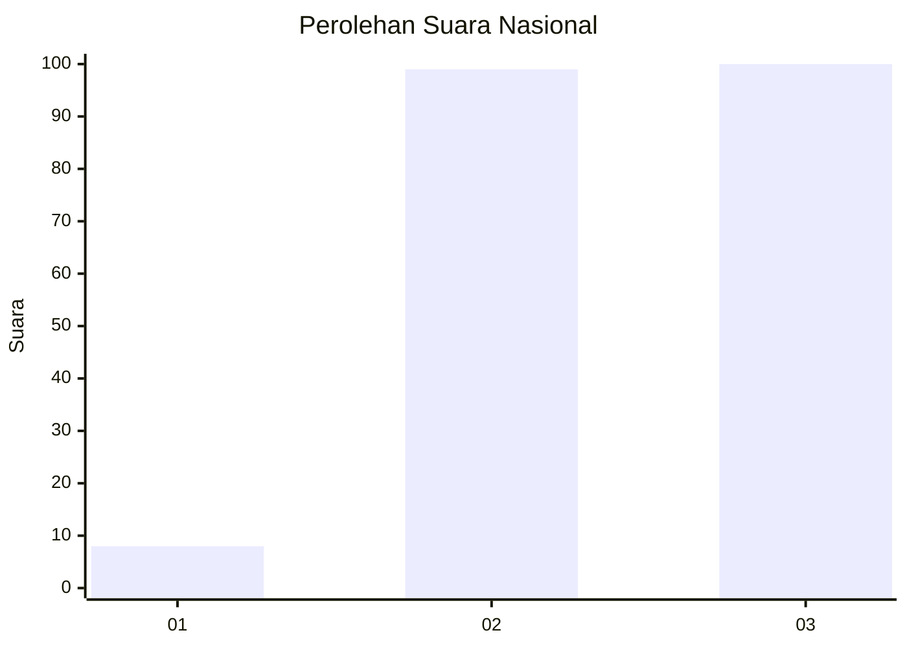
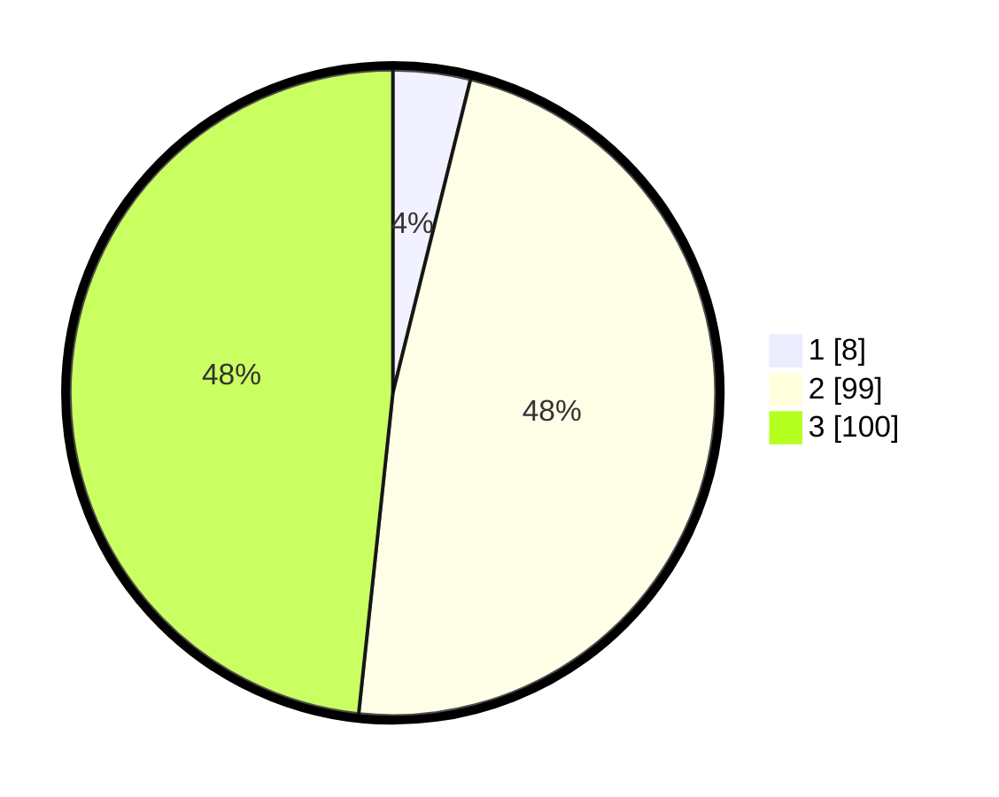

# Hasil

## Grafik

## Tabel

| No. | Nama Paslon    | Suara | Suara (raw) | Persentase |
|:--- |:-------------- | -----:| -----------:| ----------:|
| 1   | ANIES MUHAIMIN | 8     | [8][p-1]    | 3,86       |
| 2   | PRABOWO GIBRAN | 99    | [99][p-2]   | 47,83      |
| 3   | GANJAR MAHFUD  | 100   | [100][p-3]  | 48,31      |

[p-1]: https://github.com/gigit-pemilu/pemilu-2024/blob/main/pilpres/hitung-suara/sub/51-bali/sub/71-kota-denpasar/sub/04-denpasar-utara/sub/1004-tonja/sub/010-tps/sub/paslon-1.txt
[p-2]: https://github.com/gigit-pemilu/pemilu-2024/blob/main/pilpres/hitung-suara/sub/51-bali/sub/71-kota-denpasar/sub/04-denpasar-utara/sub/1004-tonja/sub/010-tps/sub/paslon-2.txt
[p-3]: https://github.com/gigit-pemilu/pemilu-2024/blob/main/pilpres/hitung-suara/sub/51-bali/sub/71-kota-denpasar/sub/04-denpasar-utara/sub/1004-tonja/sub/010-tps/sub/paslon-3.txt

## Foto C Plano

https://sirekap-obj-formc.kpu.go.id/d1a0/pemilu/ppwp/51/71/04/10/04/5171041004010-20240216-123923--c5a36c5a-87af-46d3-8407-2def37f96376.jpg

https://sirekap-obj-formc.kpu.go.id/d1a0/pemilu/ppwp/51/71/04/10/04/5171041004010-20240216-123926--e211b97b-0ec6-4cc8-86b8-13b9e3e92bc2.jpg

https://sirekap-obj-formc.kpu.go.id/d1a0/pemilu/ppwp/51/71/04/10/04/5171041004010-20240216-123925--35cf72c5-f9eb-48a6-aaf8-1ca1e5194c25.jpg

## Metadata

| Key        | Value               |
| ---------- | ------------------- |
| Time Stamp | 2024-02-16 14:30:33 |

## DATA PEMILIH TETAP

Jumlah pemilih dalam DPT: **273**.
 * L: **130**.
 * P: **143**.

## DATA PENGGUNA HAK PILIH

Jumlah pengguna hak pilih dalam DPT: **210**.
 * L: **107**.
 * P: **103**.

Jumlah pengguna hak pilih dalam DPTb: **4**.
 * L: **1**.
 * P: **3**.

Jumlah pengguna hak pilih dalam DPK: **0**.
 * L: **0**.
 * P: **0**.

Jumlah pengguna hak pilih: **214**.
 * L: **108**.
 * P: **106**.

## JUMLAH SUARA SAH DAN TIDAK SAH

JUMLAH SELURUH SUARA SAH: **207**.

JUMLAH SUARA TIDAK SAH: **7**.

JUMLAH SELURUH SUARA SAH DAN SUARA TIDAK SAH: **214**.

