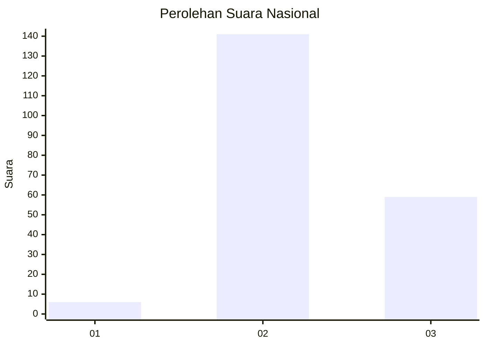
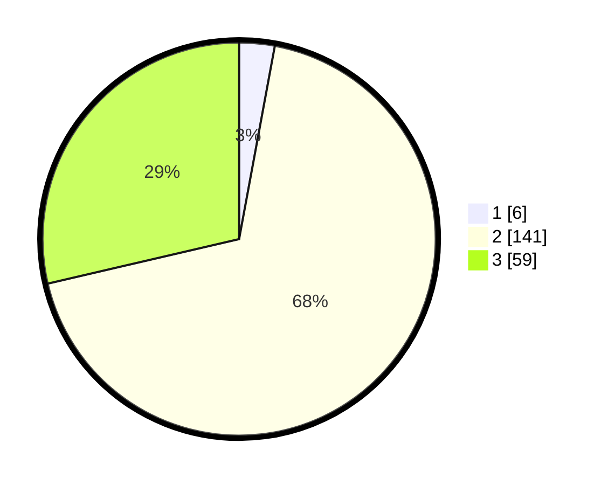

# Hasil

## Grafik

## Tabel

| No. | Nama Paslon    | Suara | Suara (raw) | Persentase |
|:--- |:-------------- | -----:| -----------:| ----------:|
| 1   | ANIES MUHAIMIN | 6     | [6][p-1]    | 2,91       |
| 2   | PRABOWO GIBRAN | 141   | [141][p-2]  | 68,45      |
| 3   | GANJAR MAHFUD  | 59    | [59][p-3]   | 28,64      |

[p-1]: https://github.com/gigit-pemilu/pemilu-2024/blob/main/pilpres/hitung-suara/sub/51-bali/sub/71-kota-denpasar/sub/04-denpasar-utara/sub/1004-tonja/sub/013-tps/sub/paslon-1.txt
[p-2]: https://github.com/gigit-pemilu/pemilu-2024/blob/main/pilpres/hitung-suara/sub/51-bali/sub/71-kota-denpasar/sub/04-denpasar-utara/sub/1004-tonja/sub/013-tps/sub/paslon-2.txt
[p-3]: https://github.com/gigit-pemilu/pemilu-2024/blob/main/pilpres/hitung-suara/sub/51-bali/sub/71-kota-denpasar/sub/04-denpasar-utara/sub/1004-tonja/sub/013-tps/sub/paslon-3.txt

## Foto C Plano

https://sirekap-obj-formc.kpu.go.id/0d01/pemilu/ppwp/51/71/04/10/04/5171041004013-20240214-213136--ee47ac80-d04d-490c-8b74-1e0eab70d5b4.jpg

https://sirekap-obj-formc.kpu.go.id/0d01/pemilu/ppwp/51/71/04/10/04/5171041004013-20240214-213244--e9652e6d-2bfd-4d78-9220-65be3c621724.jpg

https://sirekap-obj-formc.kpu.go.id/0d01/pemilu/ppwp/51/71/04/10/04/5171041004013-20240214-213352--d864e2ae-0376-4c64-ae05-213c7600aaed.jpg

## Metadata

| Key        | Value               |
| ---------- | ------------------- |
| Time Stamp | 2024-02-15 19:30:26 |

