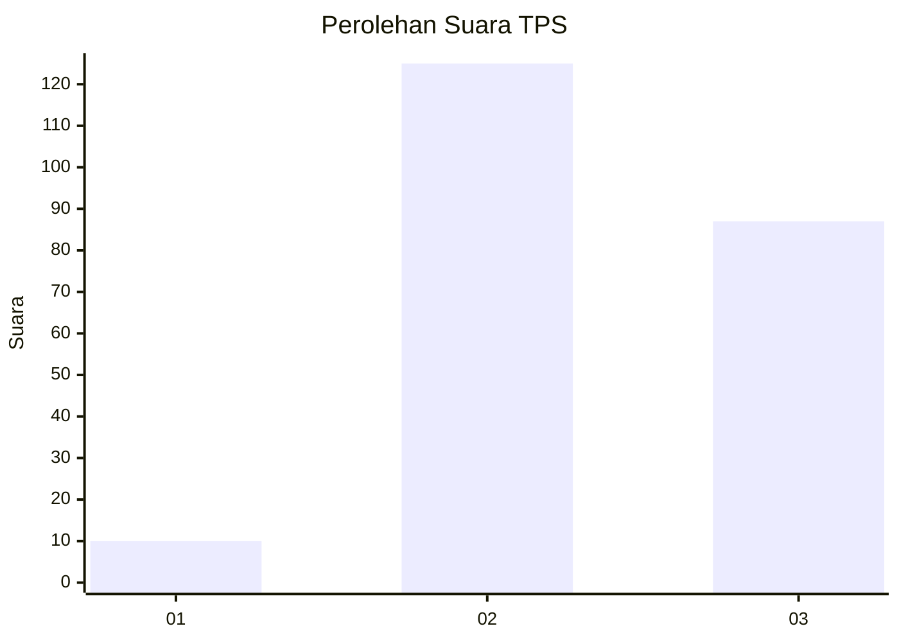
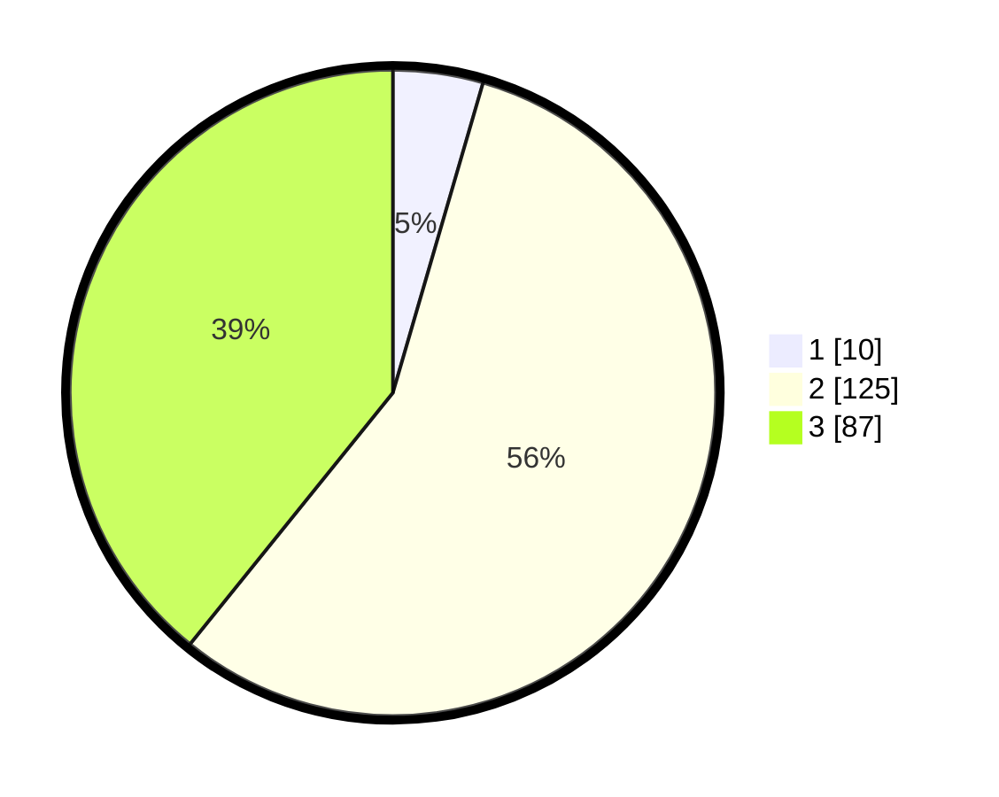

# Hasil

## Grafik

## Tabel

| No. | Nama Paslon    | Suara | Suara (raw) | Persentase |
|:--- |:-------------- | -----:| -----------:| ----------:|
| 1   | ANIES MUHAIMIN | 10    | [10][p-1]   | 4,50       |
| 2   | PRABOWO GIBRAN | 125   | [125][p-2]  | 56,31      |
| 3   | GANJAR MAHFUD  | 87    | [87][p-3]   | 39,19      |

[p-1]: https://github.com/gigit-pemilu/pemilu-2024-51-bali/blob/main/pilpres/hitung-suara/sub/51-bali/sub/71-kota-denpasar/sub/04-denpasar-utara/sub/1004-tonja/sub/035-tps/sub/paslon-1.txt
[p-2]: https://github.com/gigit-pemilu/pemilu-2024-51-bali/blob/main/pilpres/hitung-suara/sub/51-bali/sub/71-kota-denpasar/sub/04-denpasar-utara/sub/1004-tonja/sub/035-tps/sub/paslon-2.txt
[p-3]: https://github.com/gigit-pemilu/pemilu-2024-51-bali/blob/main/pilpres/hitung-suara/sub/51-bali/sub/71-kota-denpasar/sub/04-denpasar-utara/sub/1004-tonja/sub/035-tps/sub/paslon-3.txt

## Foto C Plano

https://sirekap-obj-formc.kpu.go.id/b08c/pemilu/ppwp/51/71/04/10/04/5171041004035-20240215-171302--3c226bb2-19bb-4ebe-ae13-e4105e1c9b19.jpg

https://sirekap-obj-formc.kpu.go.id/b08c/pemilu/ppwp/51/71/04/10/04/5171041004035-20240215-171324--83de02b8-b69c-4bc5-b404-3e33c4853860.jpg

https://sirekap-obj-formc.kpu.go.id/b08c/pemilu/ppwp/51/71/04/10/04/5171041004035-20240215-171343--ee452383-4b70-437c-91d3-b935dc05aa9f.jpg

## Metadata

| Key        | Value               |
| ---------- | ------------------- |
| Time Stamp | 2024-02-24 22:31:28 |

