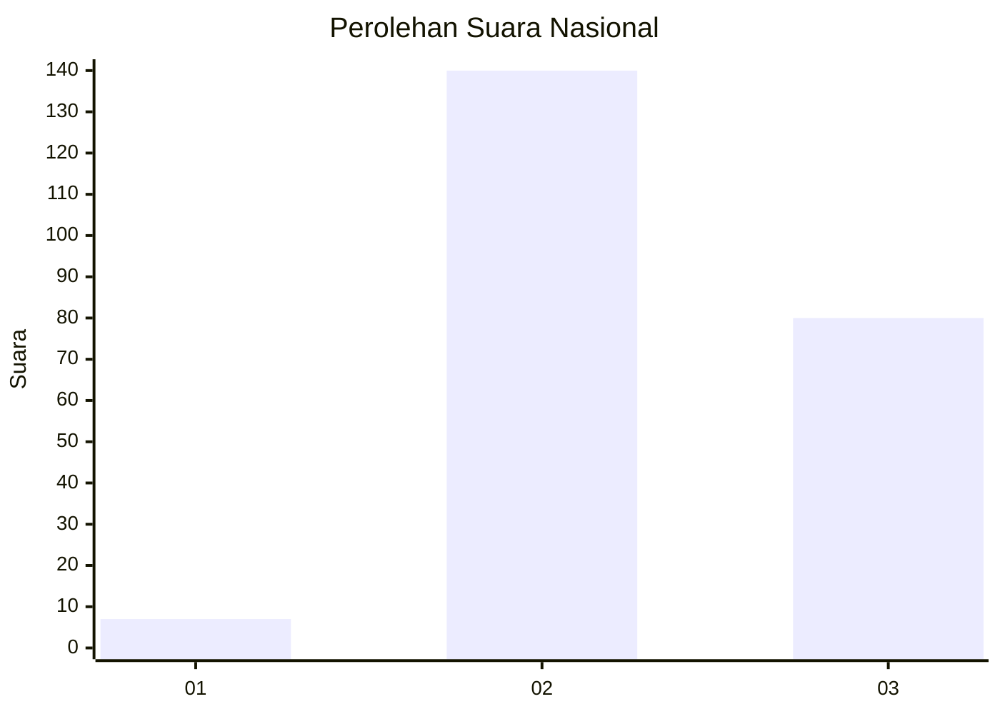
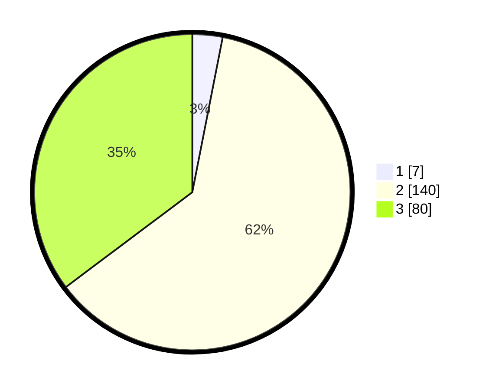

# Hasil

## Grafik

## Tabel

| No. | Nama Paslon    | Suara | Suara (raw) | Persentase |
|:--- |:-------------- | -----:| -----------:| ----------:|
| 1   | ANIES MUHAIMIN | 7     | [7][p-1]    | 3,08       |
| 2   | PRABOWO GIBRAN | 140   | [140][p-2]  | 61,67      |
| 3   | GANJAR MAHFUD  | 80    | [80][p-3]   | 35,24      |

[p-1]: https://github.com/gigit-pemilu/pemilu-2024/blob/main/pilpres/hitung-suara/sub/51-bali/sub/71-kota-denpasar/sub/04-denpasar-utara/sub/1004-tonja/sub/036-tps/sub/paslon-1.txt
[p-2]: https://github.com/gigit-pemilu/pemilu-2024/blob/main/pilpres/hitung-suara/sub/51-bali/sub/71-kota-denpasar/sub/04-denpasar-utara/sub/1004-tonja/sub/036-tps/sub/paslon-2.txt
[p-3]: https://github.com/gigit-pemilu/pemilu-2024/blob/main/pilpres/hitung-suara/sub/51-bali/sub/71-kota-denpasar/sub/04-denpasar-utara/sub/1004-tonja/sub/036-tps/sub/paslon-3.txt

## Foto C Plano

https://sirekap-obj-formc.kpu.go.id/bca0/pemilu/ppwp/51/71/04/10/04/5171041004036-20240214-192548--1f011e2a-bb9d-43fd-893e-26a62e67f8ec.jpg

https://sirekap-obj-formc.kpu.go.id/bca0/pemilu/ppwp/51/71/04/10/04/5171041004036-20240214-192603--e65df9f1-eb18-46f3-95fe-4bc7bcdaa836.jpg

https://sirekap-obj-formc.kpu.go.id/bca0/pemilu/ppwp/51/71/04/10/04/5171041004036-20240214-192617--1d367b15-415b-43a7-9101-5961d7103585.jpg

## Metadata

| Key        | Value               |
| ---------- | ------------------- |
| Time Stamp | 2024-02-15 00:41:44 |

## DATA PEMILIH TETAP

Jumlah pemilih dalam DPT: **277**.
 * L: **136**.
 * P: **141**.

## DATA PENGGUNA HAK PILIH

Jumlah pengguna hak pilih dalam DPT: **218**.
 * L: **109**.
 * P: **109**.

Jumlah pengguna hak pilih dalam DPTb: **805**.
 * L: **7**.
 * P: **4**.

Jumlah pengguna hak pilih dalam DPK: **7**.
 * L: **2**.
 * P: **85**.

Jumlah pengguna hak pilih: **230**.
 * L: **112**.
 * P: **118**.

## JUMLAH SUARA SAH DAN TIDAK SAH

JUMLAH SELURUH SUARA SAH: **227**.

JUMLAH SUARA TIDAK SAH: **3**.

JUMLAH SELURUH SUARA SAH DAN SUARA TIDAK SAH: **230**.

