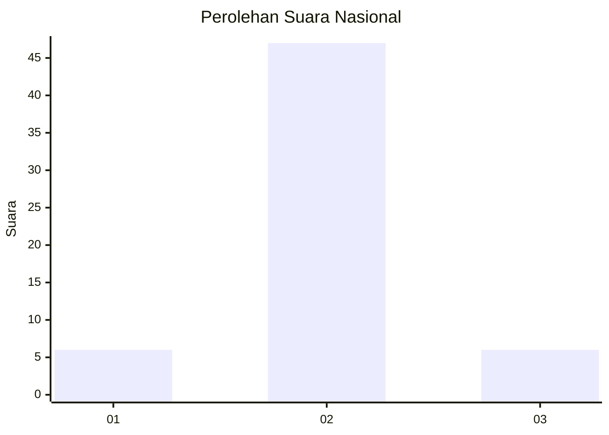
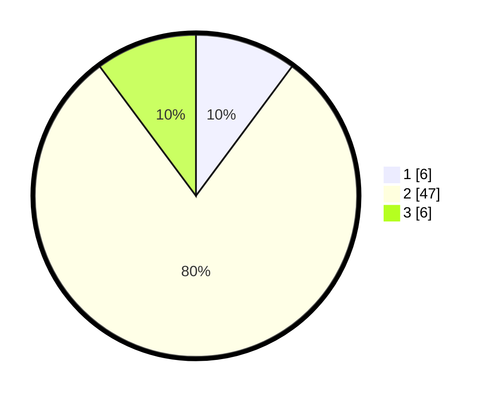

# Hasil

## Grafik

## Tabel

| No. | Nama Paslon    | Suara | Suara (raw) | Persentase |
|:--- |:-------------- | -----:| -----------:| ----------:|
| 1   | ANIES MUHAIMIN | 6     | [6][p-1]    | 10,17      |
| 2   | PRABOWO GIBRAN | 47    | [47][p-2]   | 79,66      |
| 3   | GANJAR MAHFUD  | 6     | [6][p-3]    | 10,17      |

[p-1]: https://github.com/gigit-pemilu/pemilu-2024/blob/main/pilpres/hitung-suara/sub/51-bali/sub/71-kota-denpasar/sub/04-denpasar-utara/sub/1007-ubung/sub/001-tps/sub/paslon-1.txt
[p-2]: https://github.com/gigit-pemilu/pemilu-2024/blob/main/pilpres/hitung-suara/sub/51-bali/sub/71-kota-denpasar/sub/04-denpasar-utara/sub/1007-ubung/sub/001-tps/sub/paslon-2.txt
[p-3]: https://github.com/gigit-pemilu/pemilu-2024/blob/main/pilpres/hitung-suara/sub/51-bali/sub/71-kota-denpasar/sub/04-denpasar-utara/sub/1007-ubung/sub/001-tps/sub/paslon-3.txt

## Foto C Plano

https://sirekap-obj-formc.kpu.go.id/286e/pemilu/ppwp/51/71/04/10/07/5171041007001-20240217-091138--6fd68830-8cad-432f-b902-abb09cc43560.jpg

https://sirekap-obj-formc.kpu.go.id/286e/pemilu/ppwp/51/71/04/10/07/5171041007001-20240217-091151--ea39970d-8d9d-4e7e-a172-c21b2e1e98fa.jpg

https://sirekap-obj-formc.kpu.go.id/286e/pemilu/ppwp/51/71/04/10/07/5171041007001-20240217-091320--39ba4152-ac90-4e1f-b288-68b30d35ba64.jpg

## Metadata

| Key        | Value               |
| ---------- | ------------------- |
| Time Stamp | 2024-02-24 22:31:28 |

