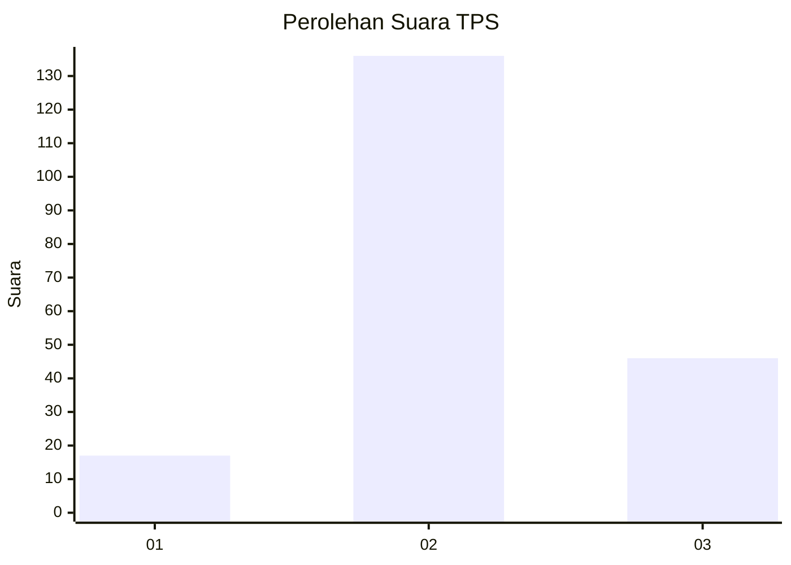
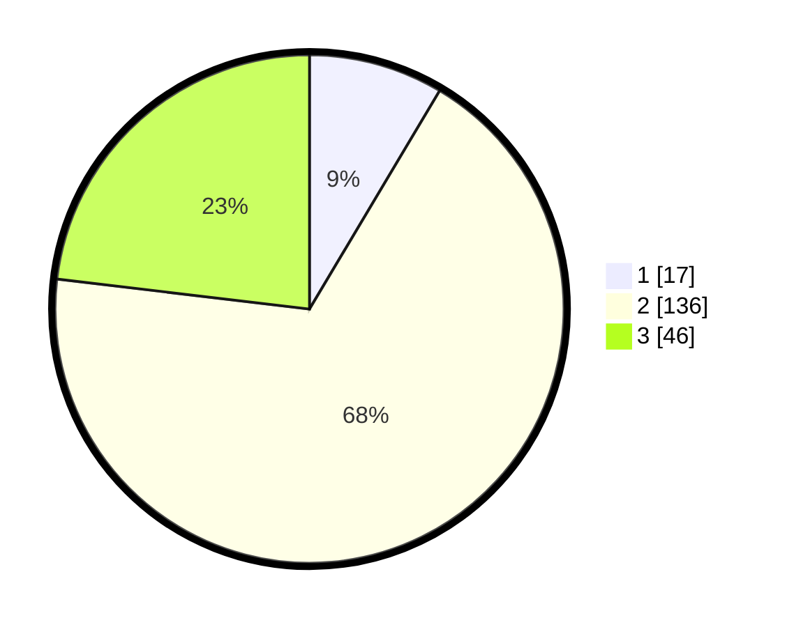

# Hasil

## Grafik

## Tabel

| No. | Nama Paslon    | Suara | Suara (raw) | Persentase |
|:--- |:-------------- | -----:| -----------:| ----------:|
| 1   | ANIES MUHAIMIN | 17    | [17][p-1]   | 8,54       |
| 2   | PRABOWO GIBRAN | 136   | [136][p-2]  | 68,34      |
| 3   | GANJAR MAHFUD  | 46    | [46][p-3]   | 23,12      |

[p-1]: https://github.com/gigit-pemilu/pemilu-2024-51-bali/blob/main/pilpres/hitung-suara/sub/51-bali/sub/71-kota-denpasar/sub/04-denpasar-utara/sub/1007-ubung/sub/004-tps/sub/paslon-1.txt
[p-2]: https://github.com/gigit-pemilu/pemilu-2024-51-bali/blob/main/pilpres/hitung-suara/sub/51-bali/sub/71-kota-denpasar/sub/04-denpasar-utara/sub/1007-ubung/sub/004-tps/sub/paslon-2.txt
[p-3]: https://github.com/gigit-pemilu/pemilu-2024-51-bali/blob/main/pilpres/hitung-suara/sub/51-bali/sub/71-kota-denpasar/sub/04-denpasar-utara/sub/1007-ubung/sub/004-tps/sub/paslon-3.txt

## Foto C Plano

https://sirekap-obj-formc.kpu.go.id/d04d/pemilu/ppwp/51/71/04/10/07/5171041007004-20240214-210031--13cc694b-9979-4c3f-8f05-8a9fc21fb8d4.jpg

https://sirekap-obj-formc.kpu.go.id/d04d/pemilu/ppwp/51/71/04/10/07/5171041007004-20240214-210055--737cbb25-e673-499e-a27f-7dbd93c0f203.jpg

https://sirekap-obj-formc.kpu.go.id/d04d/pemilu/ppwp/51/71/04/10/07/5171041007004-20240214-210127--4a41493e-0171-4a6b-a787-33da07a02889.jpg

## Metadata

| Key        | Value               |
| ---------- | ------------------- |
| Time Stamp | 2024-02-24 23:00:00 |

