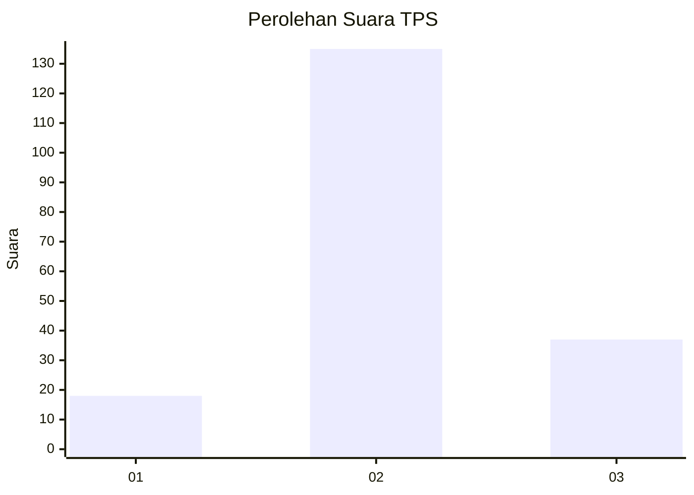
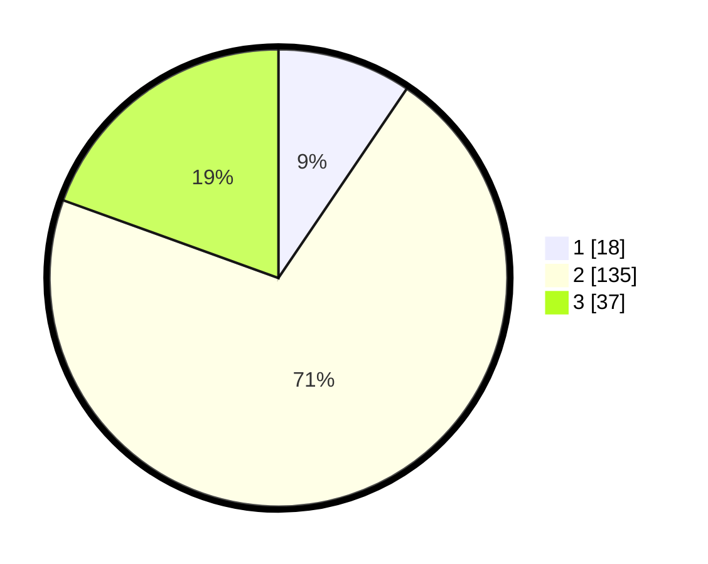

# Hasil

## Grafik

## Tabel

| No. | Nama Paslon    | Suara | Suara (raw) | Persentase |
|:--- |:-------------- | -----:| -----------:| ----------:|
| 1   | ANIES MUHAIMIN | 18    | [18][p-1]   | 9,47       |
| 2   | PRABOWO GIBRAN | 135   | [135][p-2]  | 71,05      |
| 3   | GANJAR MAHFUD  | 37    | [37][p-3]   | 19,47      |

[p-1]: https://github.com/gigit-pemilu/pemilu-2024-51-bali/blob/main/pilpres/hitung-suara/sub/51-bali/sub/71-kota-denpasar/sub/04-denpasar-utara/sub/1007-ubung/sub/005-tps/sub/paslon-1.txt
[p-2]: https://github.com/gigit-pemilu/pemilu-2024-51-bali/blob/main/pilpres/hitung-suara/sub/51-bali/sub/71-kota-denpasar/sub/04-denpasar-utara/sub/1007-ubung/sub/005-tps/sub/paslon-2.txt
[p-3]: https://github.com/gigit-pemilu/pemilu-2024-51-bali/blob/main/pilpres/hitung-suara/sub/51-bali/sub/71-kota-denpasar/sub/04-denpasar-utara/sub/1007-ubung/sub/005-tps/sub/paslon-3.txt

## Foto C Plano

https://sirekap-obj-formc.kpu.go.id/22d7/pemilu/ppwp/51/71/04/10/07/5171041007005-20240214-141837--88324065-678e-49b4-b8bf-f35402eb8dc8.jpg

https://sirekap-obj-formc.kpu.go.id/22d7/pemilu/ppwp/51/71/04/10/07/5171041007005-20240215-062900--9bc73939-3136-4b0b-8762-630c292f0ff6.jpg

## Metadata

| Key        | Value               |
| ---------- | ------------------- |
| Time Stamp | 2024-02-24 22:31:28 |

