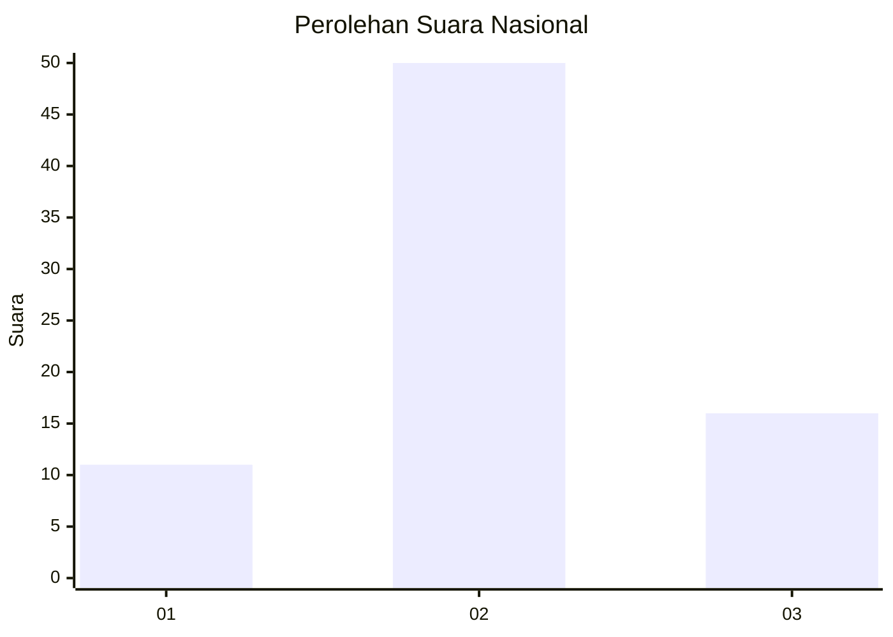
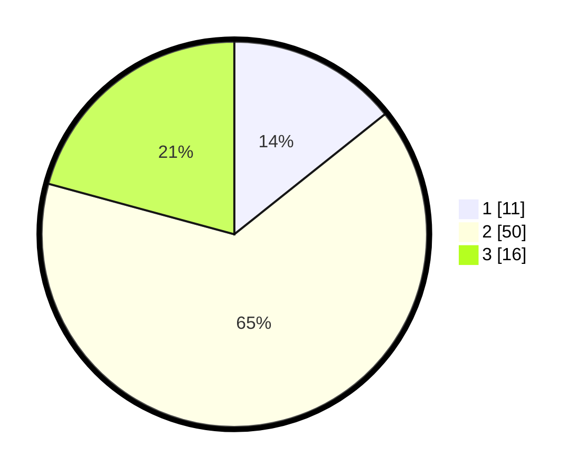

# Hasil

## Grafik

## Tabel

| No. | Nama Paslon    | Suara | Suara (raw) | Persentase |
|:--- |:-------------- | -----:| -----------:| ----------:|
| 1   | ANIES MUHAIMIN | 11    | [11][p-1]   | 14,29      |
| 2   | PRABOWO GIBRAN | 50    | [50][p-2]   | 64,94      |
| 3   | GANJAR MAHFUD  | 16    | [16][p-3]   | 20,78      |

[p-1]: https://github.com/gigit-pemilu/pemilu-2024/blob/main/pilpres/hitung-suara/sub/51-bali/sub/71-kota-denpasar/sub/04-denpasar-utara/sub/1007-ubung/sub/007-tps/sub/paslon-1.txt
[p-2]: https://github.com/gigit-pemilu/pemilu-2024/blob/main/pilpres/hitung-suara/sub/51-bali/sub/71-kota-denpasar/sub/04-denpasar-utara/sub/1007-ubung/sub/007-tps/sub/paslon-2.txt
[p-3]: https://github.com/gigit-pemilu/pemilu-2024/blob/main/pilpres/hitung-suara/sub/51-bali/sub/71-kota-denpasar/sub/04-denpasar-utara/sub/1007-ubung/sub/007-tps/sub/paslon-3.txt

## Foto C Plano

https://sirekap-obj-formc.kpu.go.id/85d7/pemilu/ppwp/51/71/04/10/07/5171041007007-20240216-084948--4e1a681b-a6aa-4b34-85d8-57581ce2e601.jpg

https://sirekap-obj-formc.kpu.go.id/85d7/pemilu/ppwp/51/71/04/10/07/5171041007007-20240216-091602--c821313b-6443-431f-8810-729974c33c0b.jpg

https://sirekap-obj-formc.kpu.go.id/85d7/pemilu/ppwp/51/71/04/10/07/5171041007007-20240215-194640--8e0ea52f-c7f6-4074-a06c-53826a07f3e7.jpg

## Metadata

| Key        | Value               |
| ---------- | ------------------- |
| Time Stamp | 2024-02-16 12:51:22 |

## DATA PEMILIH TETAP

Jumlah pemilih dalam DPT: **277**.
 * L: **150**.
 * P: **127**.

## DATA PENGGUNA HAK PILIH

Jumlah pengguna hak pilih dalam DPT: **69**.
 * L: **36**.
 * P: **33**.

Jumlah pengguna hak pilih dalam DPTb: **8**.
 * L: **5**.
 * P: **3**.

Jumlah pengguna hak pilih dalam DPK: **0**.
 * L: **0**.
 * P: **0**.

Jumlah pengguna hak pilih: **77**.
 * L: **41**.
 * P: **36**.

## JUMLAH SUARA SAH DAN TIDAK SAH

JUMLAH SELURUH SUARA SAH: **77**.

JUMLAH SUARA TIDAK SAH: **0**.

JUMLAH SELURUH SUARA SAH DAN SUARA TIDAK SAH: **77**.

