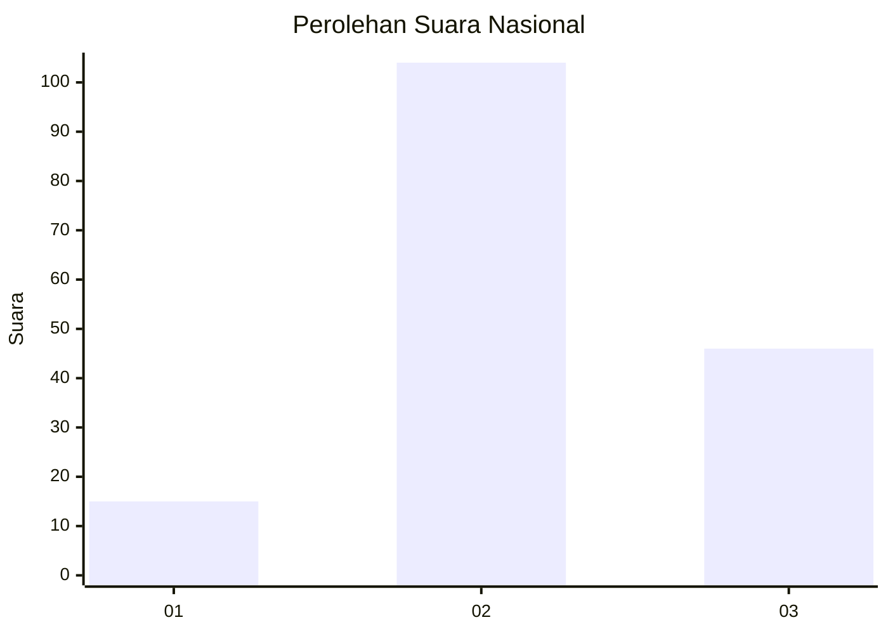
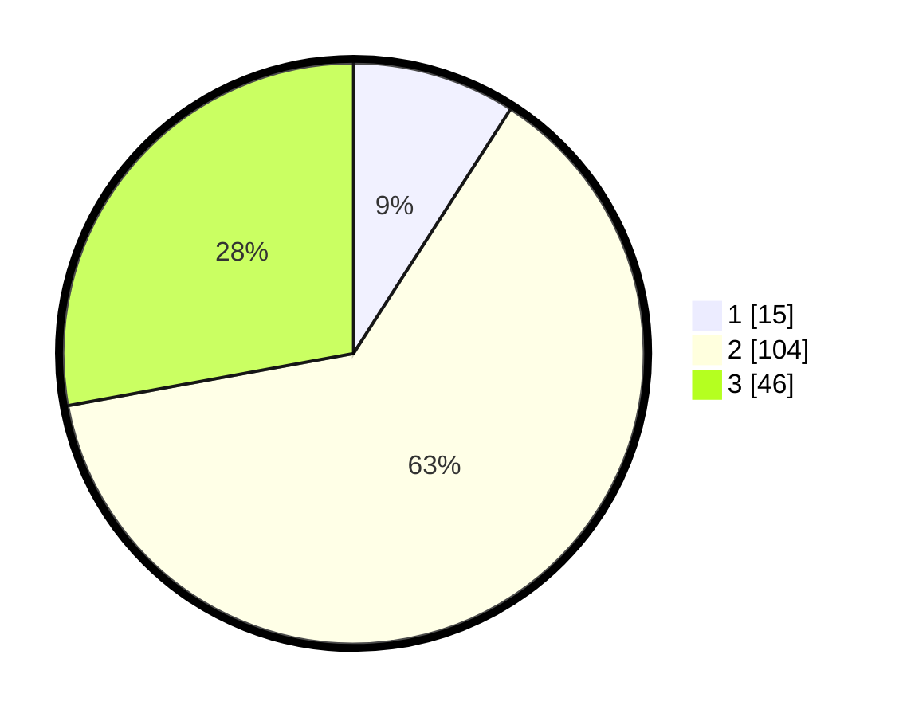

# Hasil

## Grafik

## Tabel

| No. | Nama Paslon    | Suara | Suara (raw) | Persentase |
|:--- |:-------------- | -----:| -----------:| ----------:|
| 1   | ANIES MUHAIMIN | 15    | [15][p-1]   | 9,09       |
| 2   | PRABOWO GIBRAN | 104   | [104][p-2]  | 63,03      |
| 3   | GANJAR MAHFUD  | 46    | [46][p-3]   | 27,88      |

[p-1]: https://github.com/gigit-pemilu/pemilu-2024/blob/main/pilpres/hitung-suara/sub/51-bali/sub/71-kota-denpasar/sub/04-denpasar-utara/sub/1007-ubung/sub/008-tps/sub/paslon-1.txt
[p-2]: https://github.com/gigit-pemilu/pemilu-2024/blob/main/pilpres/hitung-suara/sub/51-bali/sub/71-kota-denpasar/sub/04-denpasar-utara/sub/1007-ubung/sub/008-tps/sub/paslon-2.txt
[p-3]: https://github.com/gigit-pemilu/pemilu-2024/blob/main/pilpres/hitung-suara/sub/51-bali/sub/71-kota-denpasar/sub/04-denpasar-utara/sub/1007-ubung/sub/008-tps/sub/paslon-3.txt

## Foto C Plano

https://sirekap-obj-formc.kpu.go.id/2dd0/pemilu/ppwp/51/71/04/10/07/5171041007008-20240214-141815--2278c1a8-0909-4cdf-b064-bd8b3969e1d4.jpg

https://sirekap-obj-formc.kpu.go.id/2dd0/pemilu/ppwp/51/71/04/10/07/5171041007008-20240214-141233--46ead4c0-2cde-4c02-88e4-785c65c0ad44.jpg

https://sirekap-obj-formc.kpu.go.id/2dd0/pemilu/ppwp/51/71/04/10/07/5171041007008-20240214-141619--a82362cb-dc7e-4794-918b-1a0c638d9583.jpg

## Metadata

| Key        | Value               |
| ---------- | ------------------- |
| Time Stamp | 2024-02-17 08:30:03 |

## DATA PEMILIH TETAP

Jumlah pemilih dalam DPT: **278**.
 * L: **151**.
 * P: **127**.

## DATA PENGGUNA HAK PILIH

Jumlah pengguna hak pilih dalam DPT: **167**.
 * L: **84**.
 * P: **83**.

Jumlah pengguna hak pilih dalam DPTb: **4**.
 * L: **2**.
 * P: **2**.

Jumlah pengguna hak pilih dalam DPK: **0**.
 * L: **0**.
 * P: **0**.

Jumlah pengguna hak pilih: **271**.
 * L: **86**.
 * P: **85**.

## JUMLAH SUARA SAH DAN TIDAK SAH

JUMLAH SELURUH SUARA SAH: **165**.

JUMLAH SUARA TIDAK SAH: **6**.

JUMLAH SELURUH SUARA SAH DAN SUARA TIDAK SAH: **171**.

