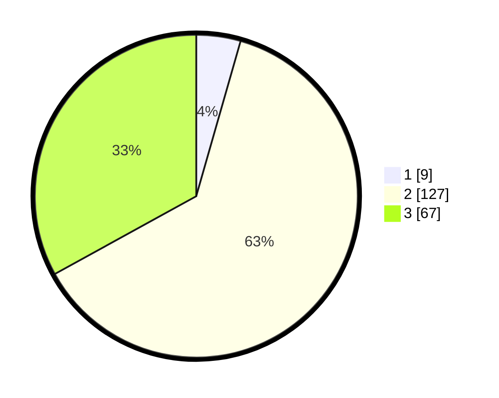

# Hasil

## Grafik

## Tabel

| No. | Nama Paslon    | Suara | Suara (raw) | Persentase |
|:--- |:-------------- | -----:| -----------:| ----------:|
| 1   | ANIES MUHAIMIN | 9     | [9][p-1]    | 4,43       |
| 2   | PRABOWO GIBRAN | 127   | [127][p-2]  | 62,56      |
| 3   | GANJAR MAHFUD  | 67    | [67][p-3]   | 33,00      |

[p-1]: https://github.com/gigit-pemilu/pemilu-2024-51-bali/blob/main/pilpres/hitung-suara/sub/51-bali/sub/71-kota-denpasar/sub/04-denpasar-utara/sub/1007-ubung/sub/012-tps/sub/paslon-1.txt
[p-2]: https://github.com/gigit-pemilu/pemilu-2024-51-bali/blob/main/pilpres/hitung-suara/sub/51-bali/sub/71-kota-denpasar/sub/04-denpasar-utara/sub/1007-ubung/sub/012-tps/sub/paslon-2.txt
[p-3]: https://github.com/gigit-pemilu/pemilu-2024-51-bali/blob/main/pilpres/hitung-suara/sub/51-bali/sub/71-kota-denpasar/sub/04-denpasar-utara/sub/1007-ubung/sub/012-tps/sub/paslon-3.txt

## Foto C Plano

https://sirekap-obj-formc.kpu.go.id/f6cc/pemilu/ppwp/51/71/04/10/07/5171041007012-20240214-141200--d1e7be8b-3f53-436b-a463-3a42fd8c95b1.jpg

https://sirekap-obj-formc.kpu.go.id/f6cc/pemilu/ppwp/51/71/04/10/07/5171041007012-20240214-141700--6d0b3f5a-ec16-436c-ad21-3d40b726f72b.jpg

https://sirekap-obj-formc.kpu.go.id/f6cc/pemilu/ppwp/51/71/04/10/07/5171041007012-20240214-141759--bf6eacb6-3e8e-42bd-836e-f6ca97e5d85e.jpg

## Metadata

| Key        | Value               |
| ---------- | ------------------- |
| Time Stamp | 2024-02-24 22:31:28 |

