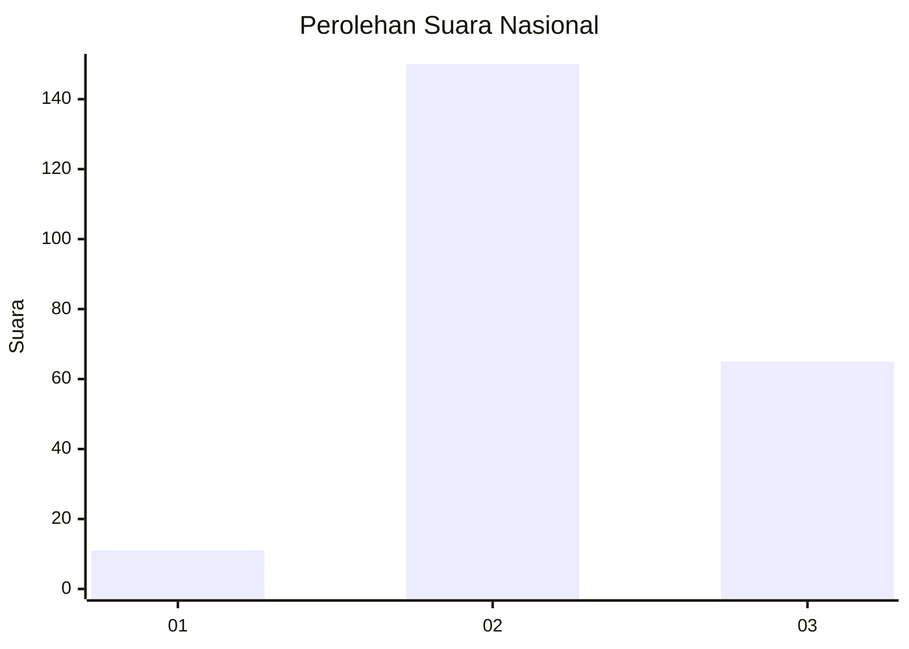
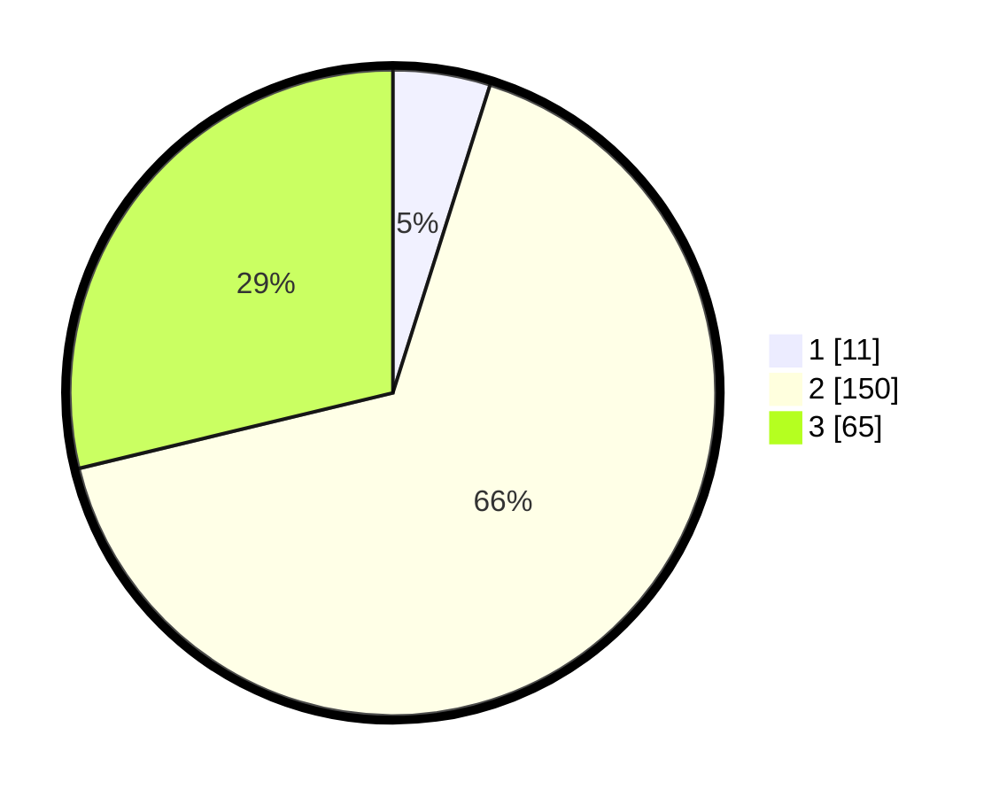

# Hasil

## Grafik

## Tabel

| No. | Nama Paslon    | Suara | Suara (raw) | Persentase |
|:--- |:-------------- | -----:| -----------:| ----------:|
| 1   | ANIES MUHAIMIN | 11    | [11][p-1]   | 4,87       |
| 2   | PRABOWO GIBRAN | 150   | [150][p-2]  | 66,37      |
| 3   | GANJAR MAHFUD  | 65    | [65][p-3]   | 28,76      |

[p-1]: https://github.com/gigit-pemilu/pemilu-2024/blob/main/pilpres/hitung-suara/sub/51-bali/sub/71-kota-denpasar/sub/04-denpasar-utara/sub/1007-ubung/sub/019-tps/sub/paslon-1.txt
[p-2]: https://github.com/gigit-pemilu/pemilu-2024/blob/main/pilpres/hitung-suara/sub/51-bali/sub/71-kota-denpasar/sub/04-denpasar-utara/sub/1007-ubung/sub/019-tps/sub/paslon-2.txt
[p-3]: https://github.com/gigit-pemilu/pemilu-2024/blob/main/pilpres/hitung-suara/sub/51-bali/sub/71-kota-denpasar/sub/04-denpasar-utara/sub/1007-ubung/sub/019-tps/sub/paslon-3.txt

## Foto C Plano

https://sirekap-obj-formc.kpu.go.id/adbc/pemilu/ppwp/51/71/04/10/07/5171041007019-20240214-221920--8022f3dc-e6e2-4632-bfc9-27a8a8c1138f.jpg

https://sirekap-obj-formc.kpu.go.id/adbc/pemilu/ppwp/51/71/04/10/07/5171041007019-20240214-141820--ee8c6ee1-a1c3-4da7-9b8d-ea894ea5e520.jpg

https://sirekap-obj-formc.kpu.go.id/adbc/pemilu/ppwp/51/71/04/10/07/5171041007019-20240214-141919--500c9d5b-4ada-44dc-a2ae-e652f983603c.jpg

## Metadata

| Key        | Value               |
| ---------- | ------------------- |
| Time Stamp | 2024-02-15 19:30:26 |

