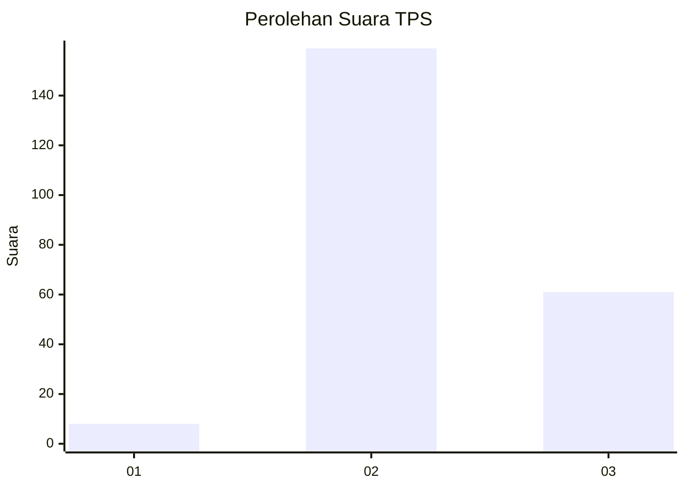

# Hasil

## Grafik

## Tabel

| No. | Nama Paslon    | Suara | Suara (raw) | Persentase |
|:--- |:-------------- | -----:| -----------:| ----------:|
| 1   | ANIES MUHAIMIN | 8     | [8][p-1]    | 3,51       |
| 2   | PRABOWO GIBRAN | 159   | [159][p-2]  | 69,74      |
| 3   | GANJAR MAHFUD  | 61    | [61][p-3]   | 26,75      |

[p-1]: https://github.com/gigit-pemilu/pemilu-2024-51-bali/blob/main/pilpres/hitung-suara/sub/51-bali/sub/71-kota-denpasar/sub/04-denpasar-utara/sub/1007-ubung/sub/021-tps/sub/paslon-1.txt
[p-2]: https://github.com/gigit-pemilu/pemilu-2024-51-bali/blob/main/pilpres/hitung-suara/sub/51-bali/sub/71-kota-denpasar/sub/04-denpasar-utara/sub/1007-ubung/sub/021-tps/sub/paslon-2.txt
[p-3]: https://github.com/gigit-pemilu/pemilu-2024-51-bali/blob/main/pilpres/hitung-suara/sub/51-bali/sub/71-kota-denpasar/sub/04-denpasar-utara/sub/1007-ubung/sub/021-tps/sub/paslon-3.txt

## Foto C Plano

https://sirekap-obj-formc.kpu.go.id/f76a/pemilu/ppwp/51/71/04/10/07/5171041007021-20240214-195052--a38f90bf-62ea-4cac-87b6-7f300d624cdc.jpg

https://sirekap-obj-formc.kpu.go.id/f76a/pemilu/ppwp/51/71/04/10/07/5171041007021-20240214-195500--cfa73ac2-94d7-4345-b2f6-696174e704c6.jpg

https://sirekap-obj-formc.kpu.go.id/f76a/pemilu/ppwp/51/71/04/10/07/5171041007021-20240214-195612--1d18fcff-3387-4a44-adb0-b8a0c68abf33.jpg

## Metadata

| Key        | Value               |
| ---------- | ------------------- |
| Time Stamp | 2024-02-24 22:31:28 |

