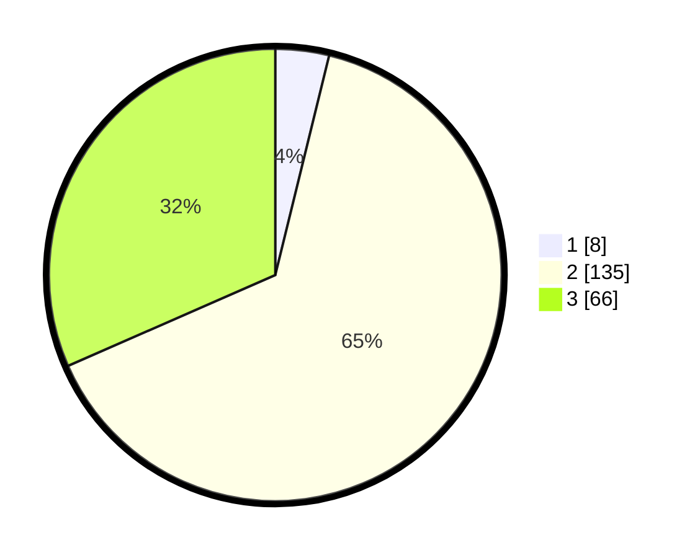

# Hasil

## Grafik

## Tabel

| No. | Nama Paslon    | Suara | Suara (raw) | Persentase |
|:--- |:-------------- | -----:| -----------:| ----------:|
| 1   | ANIES MUHAIMIN | 8     | [8][p-1]    | 3,83       |
| 2   | PRABOWO GIBRAN | 135   | [135][p-2]  | 64,59      |
| 3   | GANJAR MAHFUD  | 66    | [66][p-3]   | 31,58      |

[p-1]: https://github.com/gigit-pemilu/pemilu-2024-51-bali/blob/main/pilpres/hitung-suara/sub/51-bali/sub/71-kota-denpasar/sub/04-denpasar-utara/sub/2001-dangin-puri-kangin/sub/004-tps/sub/paslon-1.txt
[p-2]: https://github.com/gigit-pemilu/pemilu-2024-51-bali/blob/main/pilpres/hitung-suara/sub/51-bali/sub/71-kota-denpasar/sub/04-denpasar-utara/sub/2001-dangin-puri-kangin/sub/004-tps/sub/paslon-2.txt
[p-3]: https://github.com/gigit-pemilu/pemilu-2024-51-bali/blob/main/pilpres/hitung-suara/sub/51-bali/sub/71-kota-denpasar/sub/04-denpasar-utara/sub/2001-dangin-puri-kangin/sub/004-tps/sub/paslon-3.txt

## Foto C Plano

https://sirekap-obj-formc.kpu.go.id/33d5/pemilu/ppwp/51/71/04/20/01/5171042001004-20240216-140031--a6e9df59-5744-453c-b042-c04586d729b3.jpg

https://sirekap-obj-formc.kpu.go.id/33d5/pemilu/ppwp/51/71/04/20/01/5171042001004-20240216-140032--13ff055f-3237-486d-a274-aa847ba143d7.jpg

https://sirekap-obj-formc.kpu.go.id/33d5/pemilu/ppwp/51/71/04/20/01/5171042001004-20240216-140031--e8386bc4-95a2-423d-be19-58578684b9ab.jpg

## Metadata

| Key        | Value               |
| ---------- | ------------------- |
| Time Stamp | 2024-02-16 14:30:33 |

## DATA PEMILIH TETAP

Jumlah pemilih dalam DPT: **252**.
 * L: **120**.
 * P: **132**.

## DATA PENGGUNA HAK PILIH

Jumlah pengguna hak pilih dalam DPT: **195**.
 * L: **91**.
 * P: **104**.

Jumlah pengguna hak pilih dalam DPTb: **12**.
 * L: **6**.
 * P: **6**.

Jumlah pengguna hak pilih dalam DPK: **3**.
 * L: **2**.
 * P: **1**.

Jumlah pengguna hak pilih: **210**.
 * L: **99**.
 * P: **111**.

## JUMLAH SUARA SAH DAN TIDAK SAH

JUMLAH SELURUH SUARA SAH: **209**.

JUMLAH SUARA TIDAK SAH: **1**.

JUMLAH SELURUH SUARA SAH DAN SUARA TIDAK SAH: **210**.

