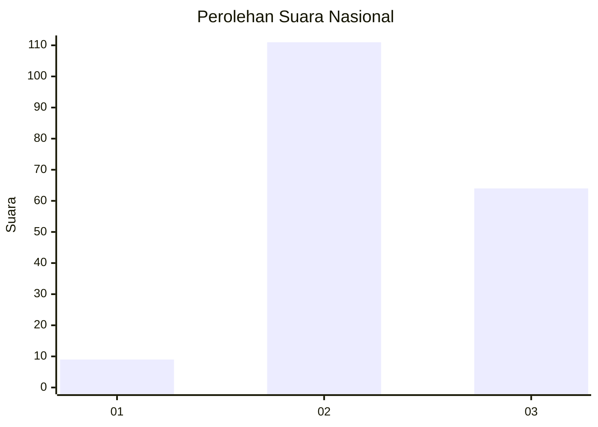
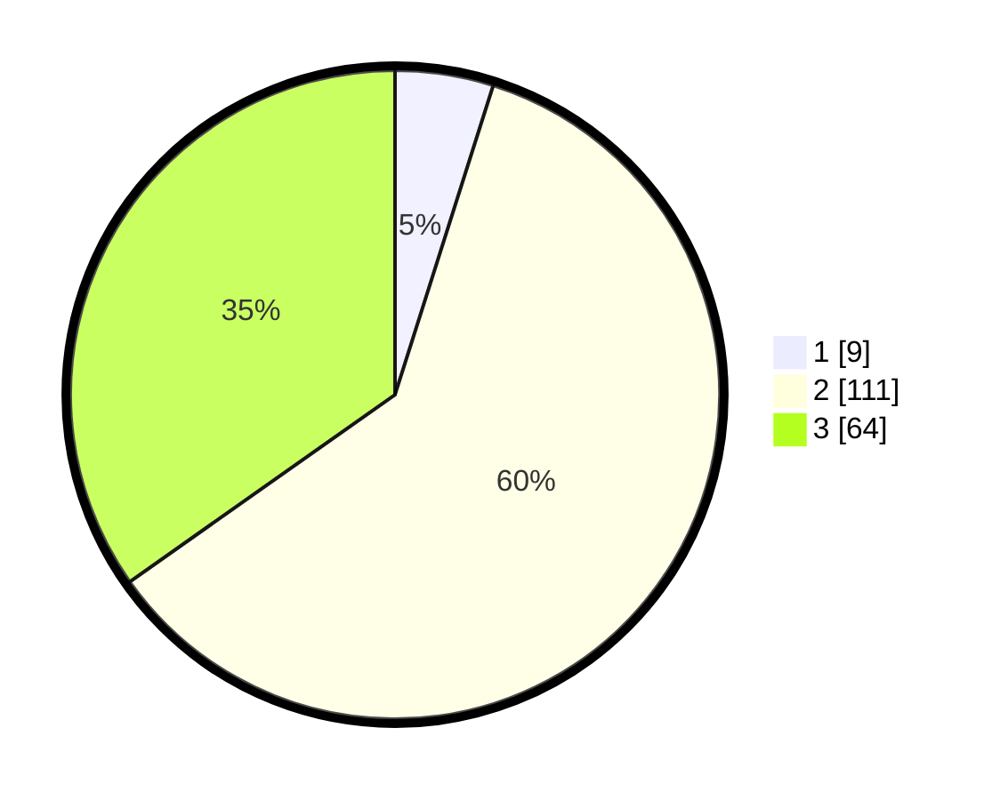

# Hasil

## Grafik

## Tabel

| No. | Nama Paslon    | Suara | Suara (raw) | Persentase |
|:--- |:-------------- | -----:| -----------:| ----------:|
| 1   | ANIES MUHAIMIN | 9     | [9][p-1]    | 4,89       |
| 2   | PRABOWO GIBRAN | 111   | [111][p-2]  | 60,33      |
| 3   | GANJAR MAHFUD  | 64    | [64][p-3]   | 34,78      |

[p-1]: https://github.com/gigit-pemilu/pemilu-2024/blob/main/pilpres/hitung-suara/sub/51-bali/sub/71-kota-denpasar/sub/04-denpasar-utara/sub/2001-dangin-puri-kangin/sub/005-tps/sub/paslon-1.txt
[p-2]: https://github.com/gigit-pemilu/pemilu-2024/blob/main/pilpres/hitung-suara/sub/51-bali/sub/71-kota-denpasar/sub/04-denpasar-utara/sub/2001-dangin-puri-kangin/sub/005-tps/sub/paslon-2.txt
[p-3]: https://github.com/gigit-pemilu/pemilu-2024/blob/main/pilpres/hitung-suara/sub/51-bali/sub/71-kota-denpasar/sub/04-denpasar-utara/sub/2001-dangin-puri-kangin/sub/005-tps/sub/paslon-3.txt

## Foto C Plano

https://sirekap-obj-formc.kpu.go.id/99d5/pemilu/ppwp/51/71/04/20/01/5171042001005-20240216-021205--0739633c-2d29-4406-b44b-ecffcb4ca64d.jpg

https://sirekap-obj-formc.kpu.go.id/99d5/pemilu/ppwp/51/71/04/20/01/5171042001005-20240216-021207--4f8f970d-b19f-439d-9c24-a0b24443712f.jpg

https://sirekap-obj-formc.kpu.go.id/99d5/pemilu/ppwp/51/71/04/20/01/5171042001005-20240216-021206--23fea2e9-73d3-4947-a262-8a27768b39b9.jpg

## Metadata

| Key        | Value               |
| ---------- | ------------------- |
| Time Stamp | 2024-02-16 12:51:22 |

## DATA PEMILIH TETAP

Jumlah pemilih dalam DPT: **204**.
 * L: **106**.
 * P: **98**.

## DATA PENGGUNA HAK PILIH

Jumlah pengguna hak pilih dalam DPT: **175**.
 * L: **86**.
 * P: **89**.

Jumlah pengguna hak pilih dalam DPTb: **10**.
 * L: **5**.
 * P: **5**.

Jumlah pengguna hak pilih dalam DPK: **2**.
 * L: **2**.
 * P: **0**.

Jumlah pengguna hak pilih: **187**.
 * L: **93**.
 * P: **94**.

## JUMLAH SUARA SAH DAN TIDAK SAH

JUMLAH SELURUH SUARA SAH: **184**.

JUMLAH SUARA TIDAK SAH: **3**.

JUMLAH SELURUH SUARA SAH DAN SUARA TIDAK SAH: **187**.

