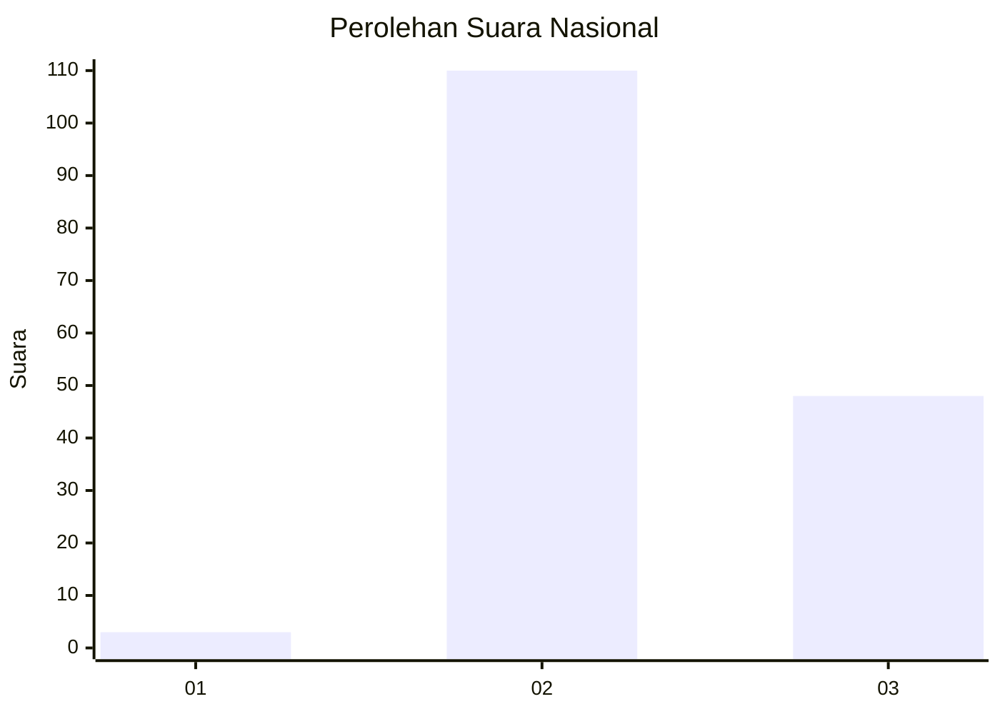

# Hasil

## Grafik

## Tabel

| No. | Nama Paslon    | Suara | Suara (raw) | Persentase |
|:--- |:-------------- | -----:| -----------:| ----------:|
| 1   | ANIES MUHAIMIN | 3     | [3][p-1]    | 1,86       |
| 2   | PRABOWO GIBRAN | 110   | [110][p-2]  | 68,32      |
| 3   | GANJAR MAHFUD  | 48    | [48][p-3]   | 29,81      |

[p-1]: https://github.com/gigit-pemilu/pemilu-2024/blob/main/pilpres/hitung-suara/sub/51-bali/sub/71-kota-denpasar/sub/04-denpasar-utara/sub/2001-dangin-puri-kangin/sub/006-tps/sub/paslon-1.txt
[p-2]: https://github.com/gigit-pemilu/pemilu-2024/blob/main/pilpres/hitung-suara/sub/51-bali/sub/71-kota-denpasar/sub/04-denpasar-utara/sub/2001-dangin-puri-kangin/sub/006-tps/sub/paslon-2.txt
[p-3]: https://github.com/gigit-pemilu/pemilu-2024/blob/main/pilpres/hitung-suara/sub/51-bali/sub/71-kota-denpasar/sub/04-denpasar-utara/sub/2001-dangin-puri-kangin/sub/006-tps/sub/paslon-3.txt

## Foto C Plano

https://sirekap-obj-formc.kpu.go.id/c6b3/pemilu/ppwp/51/71/04/20/01/5171042001006-20240216-000438--6c34cb34-4657-448a-b293-5c4acddbfde8.jpg

https://sirekap-obj-formc.kpu.go.id/c6b3/pemilu/ppwp/51/71/04/20/01/5171042001006-20240216-000442--6c0be4bb-1370-4a0a-85ef-155e02b611bd.jpg

https://sirekap-obj-formc.kpu.go.id/c6b3/pemilu/ppwp/51/71/04/20/01/5171042001006-20240216-000440--282ff03d-61dc-4629-a91e-f72b468c6507.jpg

## Metadata

| Key        | Value               |
| ---------- | ------------------- |
| Time Stamp | 2024-02-16 12:51:22 |

## DATA PEMILIH TETAP

Jumlah pemilih dalam DPT: **207**.
 * L: **101**.
 * P: **106**.

## DATA PENGGUNA HAK PILIH

Jumlah pengguna hak pilih dalam DPT: **148**.
 * L: **74**.
 * P: **74**.

Jumlah pengguna hak pilih dalam DPTb: **10**.
 * L: **4**.
 * P: **6**.

Jumlah pengguna hak pilih dalam DPK: **4**.
 * L: **2**.
 * P: **2**.

Jumlah pengguna hak pilih: **162**.
 * L: **80**.
 * P: **82**.

## JUMLAH SUARA SAH DAN TIDAK SAH

JUMLAH SELURUH SUARA SAH: **161**.

JUMLAH SUARA TIDAK SAH: **1**.

JUMLAH SELURUH SUARA SAH DAN SUARA TIDAK SAH: **162**.

