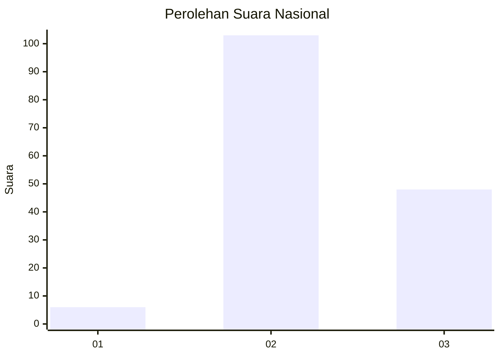

# Hasil

## Grafik

## Tabel

| No. | Nama Paslon    | Suara | Suara (raw) | Persentase |
|:--- |:-------------- | -----:| -----------:| ----------:|
| 1   | ANIES MUHAIMIN | 6     | [6][p-1]    | 3,82       |
| 2   | PRABOWO GIBRAN | 103   | [103][p-2]  | 65,61      |
| 3   | GANJAR MAHFUD  | 48    | [48][p-3]   | 30,57      |

[p-1]: https://github.com/gigit-pemilu/pemilu-2024/blob/main/pilpres/hitung-suara/sub/51-bali/sub/71-kota-denpasar/sub/04-denpasar-utara/sub/2001-dangin-puri-kangin/sub/007-tps/sub/paslon-1.txt
[p-2]: https://github.com/gigit-pemilu/pemilu-2024/blob/main/pilpres/hitung-suara/sub/51-bali/sub/71-kota-denpasar/sub/04-denpasar-utara/sub/2001-dangin-puri-kangin/sub/007-tps/sub/paslon-2.txt
[p-3]: https://github.com/gigit-pemilu/pemilu-2024/blob/main/pilpres/hitung-suara/sub/51-bali/sub/71-kota-denpasar/sub/04-denpasar-utara/sub/2001-dangin-puri-kangin/sub/007-tps/sub/paslon-3.txt

## Foto C Plano

https://sirekap-obj-formc.kpu.go.id/fe7e/pemilu/ppwp/51/71/04/20/01/5171042001007-20240216-010739--7731cde5-b586-4e4d-8965-79eca4f70970.jpg

https://sirekap-obj-formc.kpu.go.id/fe7e/pemilu/ppwp/51/71/04/20/01/5171042001007-20240216-010742--7086318e-b703-4fe2-b4b7-0bbbc00126b7.jpg

https://sirekap-obj-formc.kpu.go.id/fe7e/pemilu/ppwp/51/71/04/20/01/5171042001007-20240216-010740--2b62ee28-31b9-4bcd-b2b5-e18804c20761.jpg

## Metadata

| Key        | Value               |
| ---------- | ------------------- |
| Time Stamp | 2024-02-16 12:51:22 |

## DATA PEMILIH TETAP

Jumlah pemilih dalam DPT: **209**.
 * L: **91**.
 * P: **118**.

## DATA PENGGUNA HAK PILIH

Jumlah pengguna hak pilih dalam DPT: **143**.
 * L: **63**.
 * P: **80**.

Jumlah pengguna hak pilih dalam DPTb: **9**.
 * L: **3**.
 * P: **6**.

Jumlah pengguna hak pilih dalam DPK: **6**.
 * L: **2**.
 * P: **4**.

Jumlah pengguna hak pilih: **158**.
 * L: **68**.
 * P: **90**.

## JUMLAH SUARA SAH DAN TIDAK SAH

JUMLAH SELURUH SUARA SAH: **157**.

JUMLAH SUARA TIDAK SAH: **1**.

JUMLAH SELURUH SUARA SAH DAN SUARA TIDAK SAH: **158**.

