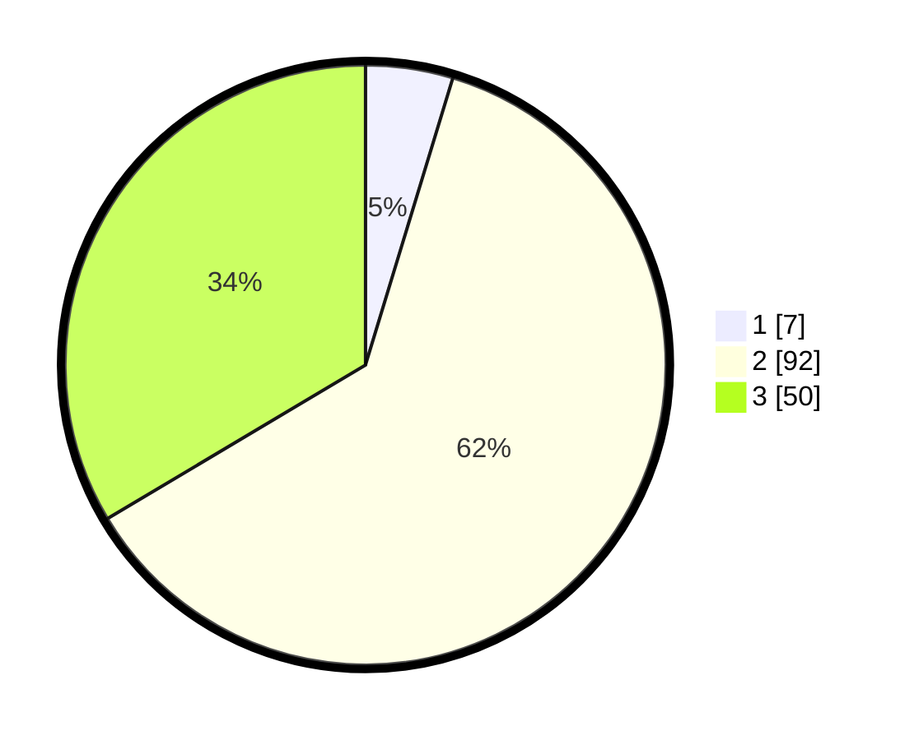

# Hasil

## Grafik

## Tabel

| No. | Nama Paslon    | Suara | Suara (raw) | Persentase |
|:--- |:-------------- | -----:| -----------:| ----------:|
| 1   | ANIES MUHAIMIN | 7     | [7][p-1]    | 4,70       |
| 2   | PRABOWO GIBRAN | 92    | [92][p-2]   | 61,74      |
| 3   | GANJAR MAHFUD  | 50    | [50][p-3]   | 33,56      |

[p-1]: https://github.com/gigit-pemilu/pemilu-2024-51-bali/blob/main/pilpres/hitung-suara/sub/51-bali/sub/71-kota-denpasar/sub/04-denpasar-utara/sub/2001-dangin-puri-kangin/sub/008-tps/sub/paslon-1.txt
[p-2]: https://github.com/gigit-pemilu/pemilu-2024-51-bali/blob/main/pilpres/hitung-suara/sub/51-bali/sub/71-kota-denpasar/sub/04-denpasar-utara/sub/2001-dangin-puri-kangin/sub/008-tps/sub/paslon-2.txt
[p-3]: https://github.com/gigit-pemilu/pemilu-2024-51-bali/blob/main/pilpres/hitung-suara/sub/51-bali/sub/71-kota-denpasar/sub/04-denpasar-utara/sub/2001-dangin-puri-kangin/sub/008-tps/sub/paslon-3.txt

## Foto C Plano

https://sirekap-obj-formc.kpu.go.id/da65/pemilu/ppwp/51/71/04/20/01/5171042001008-20240215-040640--c8f907ed-6319-4498-b031-56b9a963e6f5.jpg

https://sirekap-obj-formc.kpu.go.id/da65/pemilu/ppwp/51/71/04/20/01/5171042001008-20240215-040731--4e2e1a3a-919d-4030-8891-13ab3c1e76ff.jpg

https://sirekap-obj-formc.kpu.go.id/da65/pemilu/ppwp/51/71/04/20/01/5171042001008-20240215-040804--6b04c4e3-20f6-4d5a-aa16-7805f91e0185.jpg

## Metadata

| Key        | Value               |
| ---------- | ------------------- |
| Time Stamp | 2024-02-24 22:31:28 |

