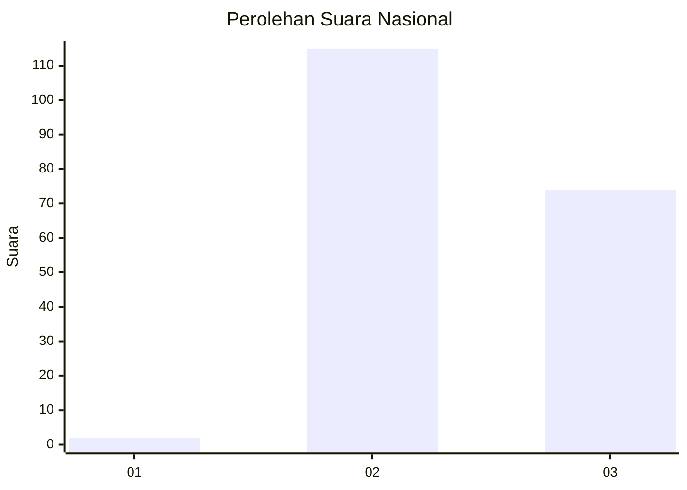
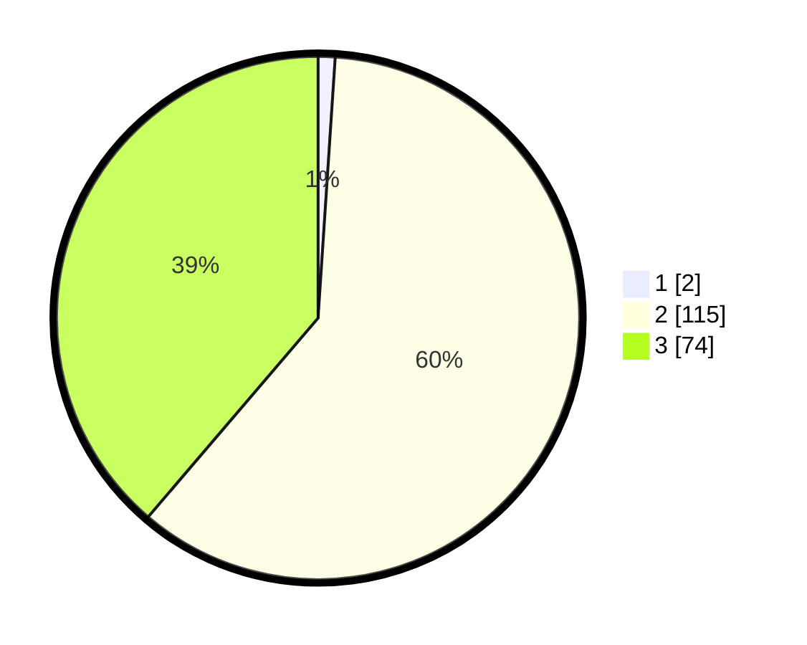

# Hasil

## Grafik

## Tabel

| No. | Nama Paslon    | Suara | Suara (raw) | Persentase |
|:--- |:-------------- | -----:| -----------:| ----------:|
| 1   | ANIES MUHAIMIN | 2     | [2][p-1]    | 1,05       |
| 2   | PRABOWO GIBRAN | 115   | [115][p-2]  | 60,21      |
| 3   | GANJAR MAHFUD  | 74    | [74][p-3]   | 38,74      |

[p-1]: https://github.com/gigit-pemilu/pemilu-2024/blob/main/pilpres/hitung-suara/sub/51-bali/sub/71-kota-denpasar/sub/04-denpasar-utara/sub/2002-dangin-puri-kauh/sub/004-tps/sub/paslon-1.txt
[p-2]: https://github.com/gigit-pemilu/pemilu-2024/blob/main/pilpres/hitung-suara/sub/51-bali/sub/71-kota-denpasar/sub/04-denpasar-utara/sub/2002-dangin-puri-kauh/sub/004-tps/sub/paslon-2.txt
[p-3]: https://github.com/gigit-pemilu/pemilu-2024/blob/main/pilpres/hitung-suara/sub/51-bali/sub/71-kota-denpasar/sub/04-denpasar-utara/sub/2002-dangin-puri-kauh/sub/004-tps/sub/paslon-3.txt

## Foto C Plano

https://sirekap-obj-formc.kpu.go.id/8ddb/pemilu/ppwp/51/71/04/20/02/5171042002004-20240214-233924--ef104f7d-43d3-40d8-ada6-69c3bf9cf0a8.jpg

https://sirekap-obj-formc.kpu.go.id/8ddb/pemilu/ppwp/51/71/04/20/02/5171042002004-20240214-234146--0f563281-7bc7-491a-8eb7-00163154c9bc.jpg

https://sirekap-obj-formc.kpu.go.id/8ddb/pemilu/ppwp/51/71/04/20/02/5171042002004-20240214-234210--53294674-e283-4cef-87de-1f351896d45a.jpg

## Metadata

| Key        | Value               |
| ---------- | ------------------- |
| Time Stamp | 2024-02-24 22:31:28 |

