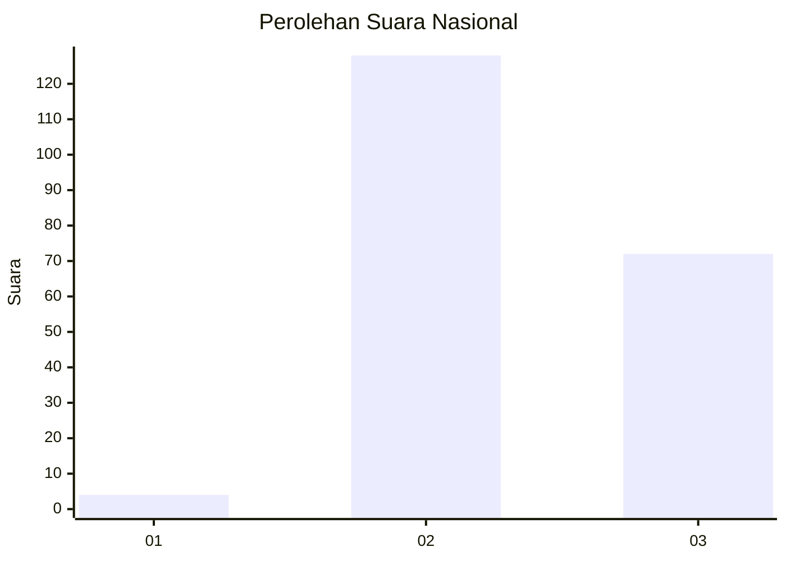
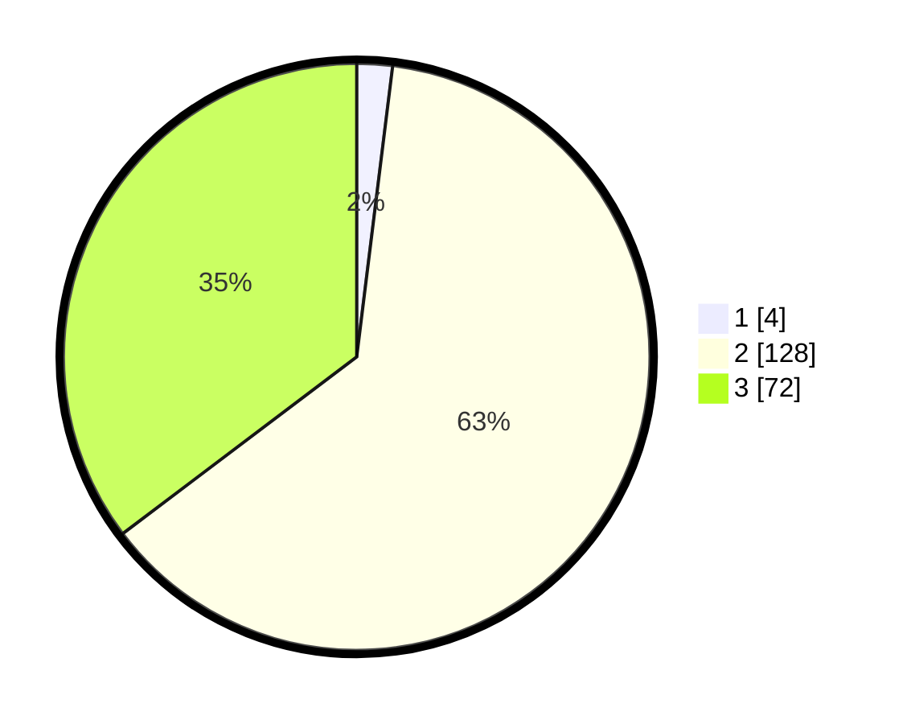

# Hasil

## Grafik

## Tabel

| No. | Nama Paslon    | Suara | Suara (raw) | Persentase |
|:--- |:-------------- | -----:| -----------:| ----------:|
| 1   | ANIES MUHAIMIN | 4     | [4][p-1]    | 1,96       |
| 2   | PRABOWO GIBRAN | 128   | [128][p-2]  | 62,75      |
| 3   | GANJAR MAHFUD  | 72    | [72][p-3]   | 35,29      |

[p-1]: https://github.com/gigit-pemilu/pemilu-2024/blob/main/pilpres/hitung-suara/sub/51-bali/sub/71-kota-denpasar/sub/04-denpasar-utara/sub/2002-dangin-puri-kauh/sub/005-tps/sub/paslon-1.txt
[p-2]: https://github.com/gigit-pemilu/pemilu-2024/blob/main/pilpres/hitung-suara/sub/51-bali/sub/71-kota-denpasar/sub/04-denpasar-utara/sub/2002-dangin-puri-kauh/sub/005-tps/sub/paslon-2.txt
[p-3]: https://github.com/gigit-pemilu/pemilu-2024/blob/main/pilpres/hitung-suara/sub/51-bali/sub/71-kota-denpasar/sub/04-denpasar-utara/sub/2002-dangin-puri-kauh/sub/005-tps/sub/paslon-3.txt

## Foto C Plano

https://sirekap-obj-formc.kpu.go.id/ca61/pemilu/ppwp/51/71/04/20/02/5171042002005-20240214-213909--3fbb9d32-be56-4ca9-ab63-fbfcbc3ef1d3.jpg

https://sirekap-obj-formc.kpu.go.id/ca61/pemilu/ppwp/51/71/04/20/02/5171042002005-20240214-214020--074f40e8-ad38-435e-baf3-3d168ed3c3ac.jpg

https://sirekap-obj-formc.kpu.go.id/ca61/pemilu/ppwp/51/71/04/20/02/5171042002005-20240214-214118--e297b102-ed82-45a5-9908-be66eb07be31.jpg

## Metadata

| Key        | Value               |
| ---------- | ------------------- |
| Time Stamp | 2024-02-24 22:31:28 |

