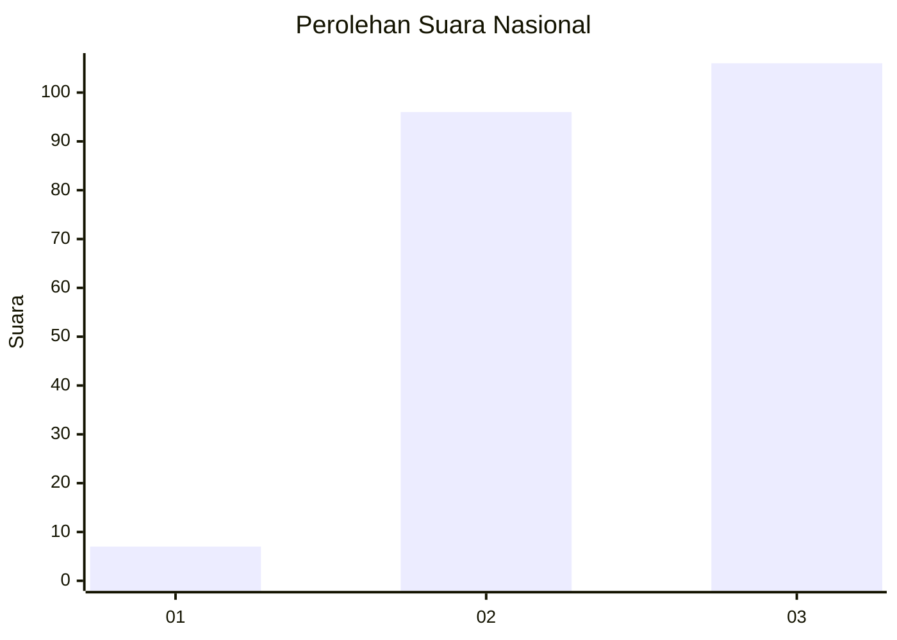
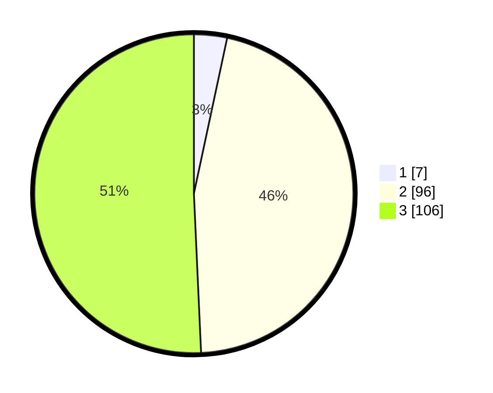

# Hasil

## Grafik

## Tabel

| No. | Nama Paslon    | Suara | Suara (raw) | Persentase |
|:--- |:-------------- | -----:| -----------:| ----------:|
| 1   | ANIES MUHAIMIN | 7     | [7][p-1]    | 3,35       |
| 2   | PRABOWO GIBRAN | 96    | [96][p-2]   | 45,93      |
| 3   | GANJAR MAHFUD  | 106   | [106][p-3]  | 50,72      |

[p-1]: https://github.com/gigit-pemilu/pemilu-2024/blob/main/pilpres/hitung-suara/sub/51-bali/sub/71-kota-denpasar/sub/04-denpasar-utara/sub/2002-dangin-puri-kauh/sub/020-tps/sub/paslon-1.txt
[p-2]: https://github.com/gigit-pemilu/pemilu-2024/blob/main/pilpres/hitung-suara/sub/51-bali/sub/71-kota-denpasar/sub/04-denpasar-utara/sub/2002-dangin-puri-kauh/sub/020-tps/sub/paslon-2.txt
[p-3]: https://github.com/gigit-pemilu/pemilu-2024/blob/main/pilpres/hitung-suara/sub/51-bali/sub/71-kota-denpasar/sub/04-denpasar-utara/sub/2002-dangin-puri-kauh/sub/020-tps/sub/paslon-3.txt

## Foto C Plano

https://sirekap-obj-formc.kpu.go.id/7cb8/pemilu/ppwp/51/71/04/20/02/5171042002020-20240216-025852--adc559ac-79fb-44fc-8def-c9f1427b1c61.jpg

https://sirekap-obj-formc.kpu.go.id/7cb8/pemilu/ppwp/51/71/04/20/02/5171042002020-20240216-025420--a008cba5-8a5d-45f9-874f-926980cdfa38.jpg

https://sirekap-obj-formc.kpu.go.id/7cb8/pemilu/ppwp/51/71/04/20/02/5171042002020-20240216-025411--c1c7c6f2-23fc-489f-b789-fbc7aa5d7b1d.jpg

## Metadata

| Key        | Value               |
| ---------- | ------------------- |
| Time Stamp | 2024-02-16 14:30:33 |

## DATA PEMILIH TETAP

Jumlah pemilih dalam DPT: **245**.
 * L: **120**.
 * P: **125**.

## DATA PENGGUNA HAK PILIH

Jumlah pengguna hak pilih dalam DPT: **203**.
 * L: **97**.
 * P: **106**.

Jumlah pengguna hak pilih dalam DPTb: **8**.
 * L: **5**.
 * P: **3**.

Jumlah pengguna hak pilih dalam DPK: **0**.
 * L: **0**.
 * P: **0**.

Jumlah pengguna hak pilih: **211**.
 * L: **102**.
 * P: **109**.

## JUMLAH SUARA SAH DAN TIDAK SAH

JUMLAH SELURUH SUARA SAH: **209**.

JUMLAH SUARA TIDAK SAH: **2**.

JUMLAH SELURUH SUARA SAH DAN SUARA TIDAK SAH: **211**.

