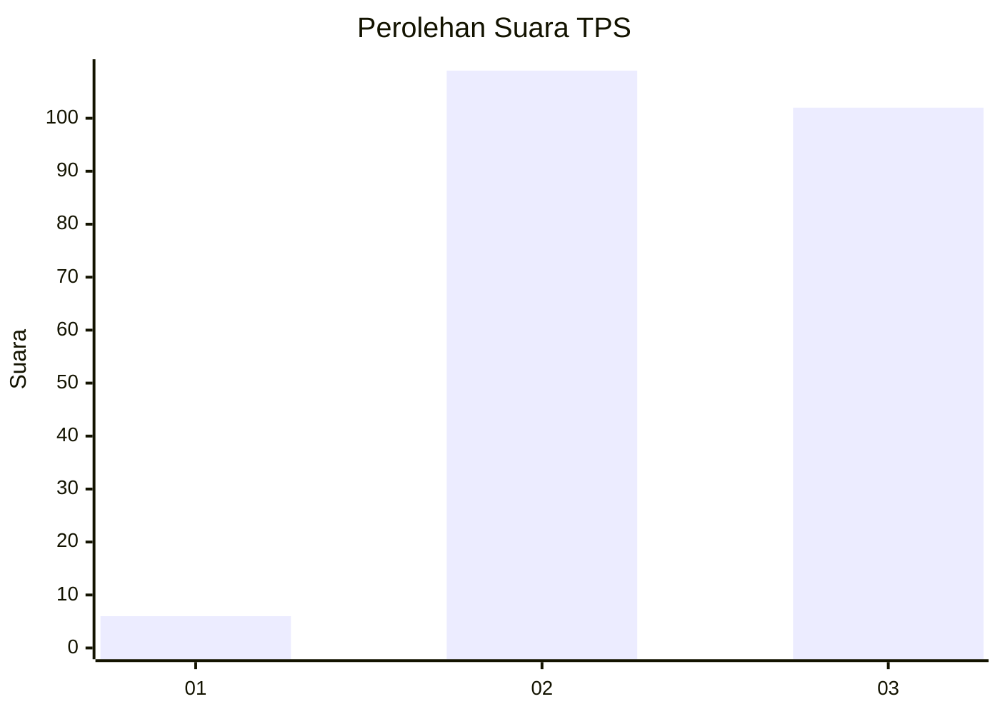
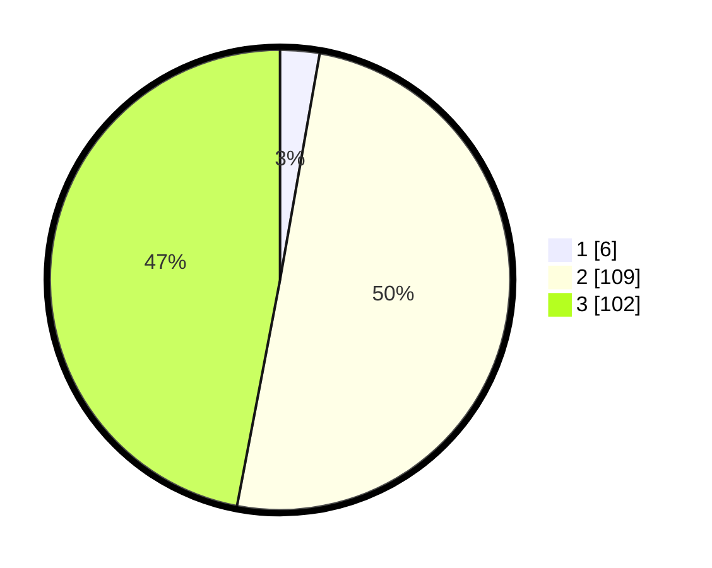

# Hasil

## Grafik

## Tabel

| No. | Nama Paslon    | Suara | Suara (raw) | Persentase |
|:--- |:-------------- | -----:| -----------:| ----------:|
| 1   | ANIES MUHAIMIN | 6     | [6][p-1]    | 2,76       |
| 2   | PRABOWO GIBRAN | 109   | [109][p-2]  | 50,23      |
| 3   | GANJAR MAHFUD  | 102   | [102][p-3]  | 47,00      |

[p-1]: https://github.com/gigit-pemilu/pemilu-2024-51-bali/blob/main/pilpres/hitung-suara/sub/51-bali/sub/71-kota-denpasar/sub/04-denpasar-utara/sub/2003-dangin-puri-kaja/sub/002-tps/sub/paslon-1.txt
[p-2]: https://github.com/gigit-pemilu/pemilu-2024-51-bali/blob/main/pilpres/hitung-suara/sub/51-bali/sub/71-kota-denpasar/sub/04-denpasar-utara/sub/2003-dangin-puri-kaja/sub/002-tps/sub/paslon-2.txt
[p-3]: https://github.com/gigit-pemilu/pemilu-2024-51-bali/blob/main/pilpres/hitung-suara/sub/51-bali/sub/71-kota-denpasar/sub/04-denpasar-utara/sub/2003-dangin-puri-kaja/sub/002-tps/sub/paslon-3.txt

## Foto C Plano

https://sirekap-obj-formc.kpu.go.id/bfc0/pemilu/ppwp/51/71/04/20/03/5171042003002-20240214-141037--527f7c02-c28d-4f2a-a350-b7174e3c18be.jpg

https://sirekap-obj-formc.kpu.go.id/bfc0/pemilu/ppwp/51/71/04/20/03/5171042003002-20240214-141123--5b7b15ad-ab12-428c-9ebe-f7c3ad19eb72.jpg

https://sirekap-obj-formc.kpu.go.id/bfc0/pemilu/ppwp/51/71/04/20/03/5171042003002-20240214-141030--d2ed5781-31ef-4b69-929a-dcf5718f9ad2.jpg

## Metadata

| Key        | Value               |
| ---------- | ------------------- |
| Time Stamp | 2024-02-24 22:31:28 |

