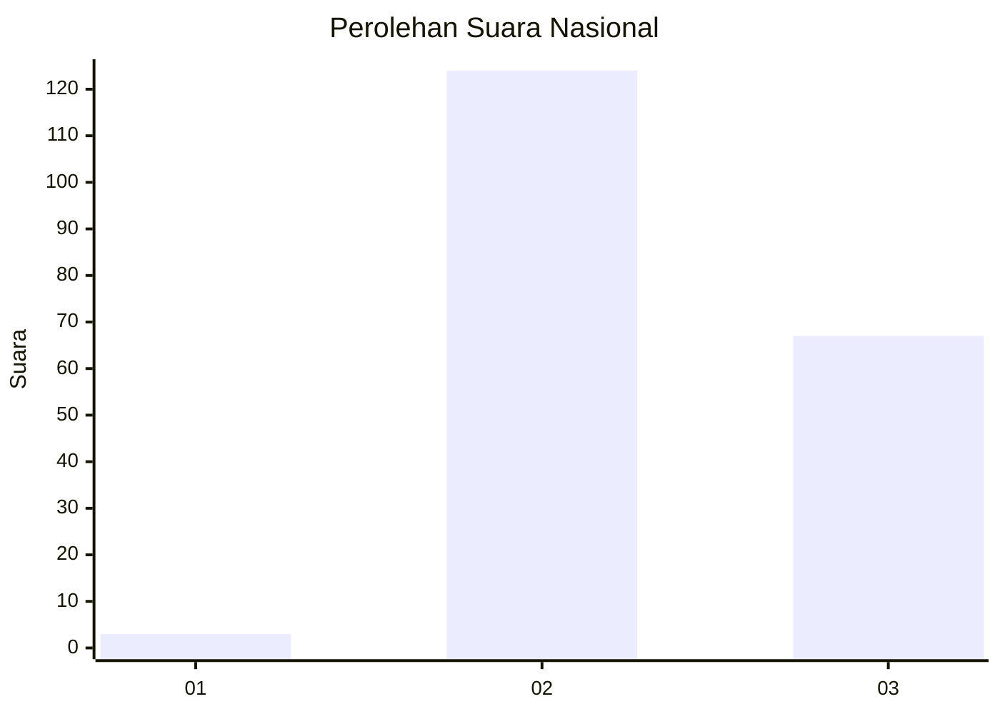
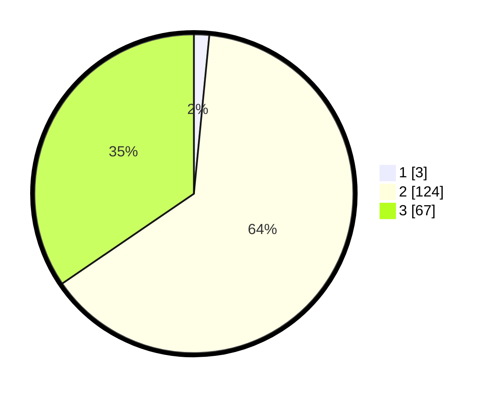

# Hasil

## Grafik

## Tabel

| No. | Nama Paslon    | Suara | Suara (raw) | Persentase |
|:--- |:-------------- | -----:| -----------:| ----------:|
| 1   | ANIES MUHAIMIN | 3     | [3][p-1]    | 1,55       |
| 2   | PRABOWO GIBRAN | 124   | [124][p-2]  | 63,92      |
| 3   | GANJAR MAHFUD  | 67    | [67][p-3]   | 34,54      |

[p-1]: https://github.com/gigit-pemilu/pemilu-2024/blob/main/pilpres/hitung-suara/sub/51-bali/sub/71-kota-denpasar/sub/04-denpasar-utara/sub/2003-dangin-puri-kaja/sub/005-tps/sub/paslon-1.txt
[p-2]: https://github.com/gigit-pemilu/pemilu-2024/blob/main/pilpres/hitung-suara/sub/51-bali/sub/71-kota-denpasar/sub/04-denpasar-utara/sub/2003-dangin-puri-kaja/sub/005-tps/sub/paslon-2.txt
[p-3]: https://github.com/gigit-pemilu/pemilu-2024/blob/main/pilpres/hitung-suara/sub/51-bali/sub/71-kota-denpasar/sub/04-denpasar-utara/sub/2003-dangin-puri-kaja/sub/005-tps/sub/paslon-3.txt

## Foto C Plano

https://sirekap-obj-formc.kpu.go.id/d59c/pemilu/ppwp/51/71/04/20/03/5171042003005-20240215-020348--c80db725-ba4e-415a-9621-1b9e1996e21e.jpg

https://sirekap-obj-formc.kpu.go.id/d59c/pemilu/ppwp/51/71/04/20/03/5171042003005-20240215-020444--d787f435-495b-4679-836e-2f20c7ec8c9b.jpg

https://sirekap-obj-formc.kpu.go.id/d59c/pemilu/ppwp/51/71/04/20/03/5171042003005-20240215-020512--ffd894c1-fd77-4517-be0c-969c807d03ed.jpg

## Metadata

| Key        | Value               |
| ---------- | ------------------- |
| Time Stamp | 2024-02-24 22:31:28 |

